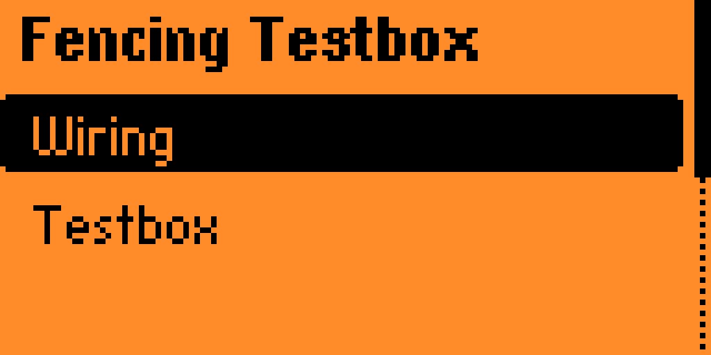
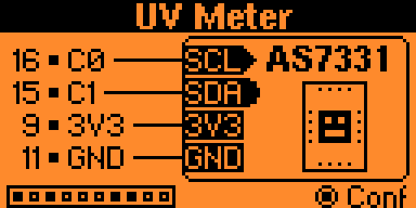

# Fencing Testbox
This is a simple emulator of a fencing testbox for the Flipper Zero.

## Main Menu
The main menu is shown below:

## Wiring
The wiring is simple, just connect the pins as follows (visible in-app by selecting the `Wiring` menu option):

Note that the numbers correspond to GPIO numbers on the Flipper Zero and that, of course, the corresponding pins on the
fencing wire will require some intermediary wire to connect to the GPIO. 
For example, one can use an alligator clip to connect the fencing wire to a jumper cable which can, in turn, then be 
connected to the corresponding GPIO pin.

## Test Box
Selecting the `Testbox` menu option will bring up the test box interface:

Here you can see two letters, `R` and `G`, corresponding to "red" and "green" respectively.
These act as would the red and green lights on a real fencing test box.
As the Flipper cannot display colours, however, we instead display the outline of a letter when the light 
is not lit and the filled letter when the light is lit.
