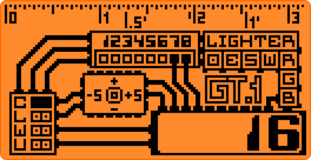

# GnomishTool 
Гномский армейский нож для владельцев Flipper Zero.
Версия для гражданского рынка! Очередной подгон от братишек из Гномрегана.

-----
<h2 align="left">Функции</h2>
 

   - <ins><b>Линейка :</b></ins> 3 см с разделением до 0.25мм(1пкс). Дюймовая и полдюймовая (0.50" или 1/2" и 1") отметки для владельцев неоткалиброванных глазомеров!
   - <ins><b>Счетчик:</b></ins> Считает количество импульсов от навиблока. Встроенный Х5 повторитель для ускорения!
   - <ins><b>Фонарик:</b></ins> Подсветка экраном, внешним эммитером, кристаллическим нотификатором, а также 3 встроенных светофильтра!
   - <ins><b>Детектор обрыва:</b></ins> 2.4кГц вой при замыкании (и тишина при обрыве) между 7 и 8 выходом (C3-Gnd).
   - <ins><b>Вольтметр:</b></ins> Измеряет напряжение между 7 и 8 выходами, предел 2048 мВ при постоянном токе.
 
