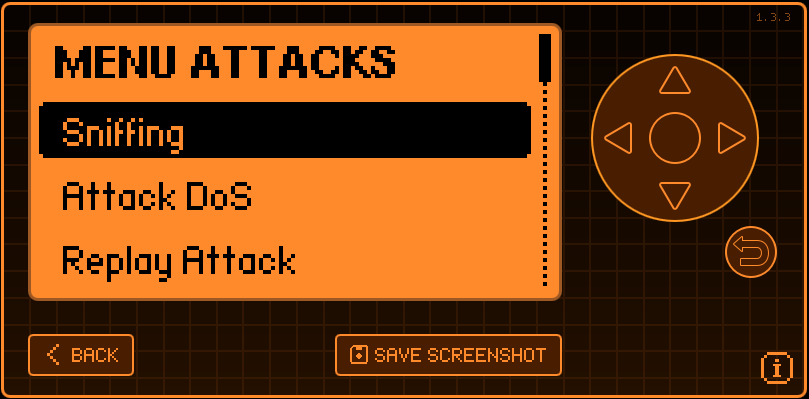
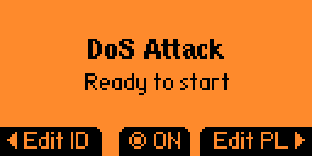
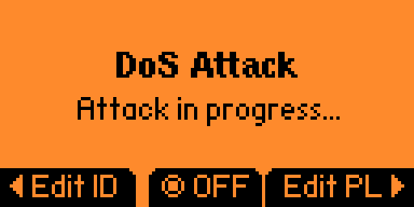

# CAN Bus Attack
This repository contains a custom Flipper Zero application for performing basic security testing on CAN Bus networks.  
It was developed as part of a university cybersecurity research project and is intended for educational and ethical use only.

---

# CAN-Bus Attack App (Flipper Zero)

<details>
<summary>🇪🇸 Español</summary>

# Flipper Zero CAN-Bus Attack App

## Manual de Instalación

Este manual describe dos procedimientos distintos: por un lado, la instalación directa de la aplicación en el dispositivo Flipper Zero para usuarios que solo deseen ejecutarla; por otro, la configuración del entorno de desarrollo para aquellos que deseen modificar el código fuente o extender sus funcionalidades.

### Instalación directa de la aplicación

Para utilizar la herramienta desarrollada no es necesario compilar el proyecto desde cero. El archivo ejecutable de la aplicación se encuentra disponible en formato `.fap`, listo para ser instalado en el Flipper Zero.

#### Pasos para la instalación

1. Descargar el archivo `.fap` desde el repositorio del proyecto (ver sección [Repositorio del proyecto](#repositorio-del-proyecto)).
2. Conectar el Flipper Zero por USB y abrir la herramienta oficial **qFlipper**.
3. Copiar el archivo descargado a la carpeta:
   ```bash
   /SD card/apps/
   ```
4. Desconectar el dispositivo y acceder a la aplicación desde el menú principal.

<p align="center"></p>

### Compilación y personalización del código

Los usuarios avanzados pueden modificar el comportamiento de la aplicación o extender su funcionalidad editando directamente el código fuente. Para ello es necesario clonar el firmware y configurar el entorno de desarrollo de Flipper Zero.

#### Requisitos previos
- Entorno Linux con Python 3 y herramientas de desarrollo instaladas.
- Proyecto descargado (ver sección [Repositorio del proyecto](#repositorio-del-proyecto)).
- Conexión a Internet para descargar dependencias.

#### Pasos para compilar
```bash
git clone https://github.com/DarkFlippers/unleashed-firmware
cd unleashed-firmware/applications_user

# Copiar aquí el código fuente/carpeta de la app

# Para compilar
cd .. # Volver a la carpeta unleashed-firmware
./fbt fap_canbus_attack_app
```

Una vez compilado, el archivo `.fap` se encuentra en la ruta:

```bash
/unleashed-firmware/build/f7-firmware-D/.extapps/canbus_attack_app.fap
```

Este archivo puede instalarse siguiendo los pasos descritos anteriormente.

### Configuración del módulo CAN

El módulo MCP2515 debe estar conectado al Flipper Zero mediante los pines GPIO, respetando las conexiones SPI (MOSI, MISO, SCK, CS, INT).

Más información: [ElectronicCats/flipper-MCP2515-CANBUS Wiki](https://github.com/ElectronicCats/flipper-MCP2515-CANBUS/wiki)

### Verificación

Si el módulo está bien conectado, la aplicación se inicializará mostrando el menú principal con las funciones (Sniffing, Replay, Modify, DoS).

<p align="center"></p>

---

## Guía de Usuario

### Requisitos previos
- Flipper Zero con firmware **Unleashed v0.81 (unlshd-081)** o compatible.  
- Módulo MCP2515 conectado al puerto GPIO.  
- Archivo `.fap` en `apps/`.  
- Red CAN activa (ICSim o física).

### Acceso a la aplicación
1. Enciende el Flipper Zero.  
2. Menú **Aplicaciones** → **CAN Bus Attacks**.  
3. Se mostrará el menú principal.  

<p align="center"> </p>

### Ataques disponibles

####  Sniffing
- Captura de tramas CAN.  
- Visualización de IDs y valores.  
<p align="center"> </p>

####  Replay Attack
Reenvía tramas guardadas (por defecto: `ID:0x123 Payload:00 01 02 03 04 05 06 07`).  
<p align="center"></p>

####  Modify Attack
Permite editar **ID** o **Payload** antes de enviar.  
<p align="center">  </p>

####  DoS Attack
Satura el bus con tramas dominantes (`0x001`).  
<p align="center">   </p>

### Precauciones
- Uso exclusivo educativo.  
- No en vehículos reales.  

###  Solución de problemas

| Problema              | Posible causa                                                   | Solución                                                       |
|------------------------|----------------------------------------------------------------|----------------------------------------------------------------|
| La app no aparece      | El archivo `.fap` no está en la carpeta correcta               | Asegúrate de copiarla en `apps/`                               |
| No se detecta tráfico  | El módulo MCP2515 no está conectado o la red está inactiva     | Verifica las conexiones físicas y la velocidad del bus         |
| El ataque no tiene efecto | La red no responde al ID utilizado                         | Prueba con otra trama o revisa el entorno simulado             |


---

## Repositorio del proyecto
[https://github.com/jorgepnaranjo25/CAN-Bus-Attack](https://github.com/jorgepnaranjo25/CAN-Bus-Attack)

Incluye:
- Código fuente  
- Archivos de configuración (`CMakeLists.txt`, `application.fam`)  
- Instrucciones de compilación e instalación  
- Capturas de pantalla y docs  

</details>

---

<details>
<summary>🇬🇧 English</summary>

# Flipper Zero CAN-Bus Attack App

## Installation Manual

Two procedures are described: direct installation for users who only want to run the app, and development setup for those wishing to modify the code.

### Direct installation

The `.fap` executable is provided ready to be installed.

#### Steps
1. Download the `.fap` from this repo.  
2. Connect Flipper Zero via USB and open **qFlipper**.  
3. Copy the file to:
   ```bash
   /SD card/apps/
   ```
4. Disconnect and run the app from the main menu.

<p align="center"></p>

### Build from source

#### Requirements
- Linux environment with Python 3 and dev tools.  
- Project downloaded.  
- Internet connection.

#### Steps
```bash
git clone https://github.com/DarkFlippers/unleashed-firmware
cd unleashed-firmware/applications_user
cp -r /path/CAN-Bus-Attack ./canbus_attack_app
cd ..
./fbt fap_canbus_attack_app
```

Compiled file will be at:
```bash
/unleashed-firmware/build/f7-firmware-D/.extapps/canbus_attack_app.fap
```

### CAN Module Configuration
MCP2515 must be connected to GPIO using SPI pins (MOSI, MISO, SCK, CS, INT).  

More info: [ElectronicCats Wiki](https://github.com/ElectronicCats/flipper-MCP2515-CANBUS/wiki)

### Verification
If connected properly, the app will show the main menu.  
<p align="center"></p>

---

## User Guide

### Requirements
- Flipper Zero with **Unleashed v0.81 (unlshd-081)**  
- MCP2515 connected via GPIO  
- `.fap` in `/apps/`  
- Active CAN network (ICSim or physical)

### Access
1. Power on device.  
2. Applications → CAN Bus Attacks.  
3. Main menu appears.  
<p align="center"> </p>

### Attacks

####  Sniffing
Passive capture of frames.  
<p align="center"> </p>

####  Replay
Replays stored frame (default `ID:0x123 Payload:00 01 02 03 04 05 06 07`).  
<p align="center"></p>

####  Modify
Edit **ID** or **Payload** before sending.  
<p align="center">  </p>

####  DoS
Floods bus with dominant frames.  
<p align="center">   </p>

### Precautions
- For educational purposes only.  
- Never on real vehicles.  

### Troubleshooting

| Issue                  | Possible Cause                                | Solution                                                |
|-------------------------|-----------------------------------------------|--------------------------------------------------------|
| App not showing         | The `.fap` file is not in the correct folder  | Make sure to copy it into `apps/`                      |
| No traffic detected     | MCP2515 module not connected or inactive bus  | Check physical connections and bus speed               |
| Attack has no effect    | The network is not responding to the used ID  | Try with another frame or review the simulated network |

---

## Project Repository
[https://github.com/jorgepnaranjo25/CAN-Bus-Attack](https://github.com/jorgepnaranjo25/CAN-Bus-Attack)

Includes:
- Source code  
- Config files (`CMakeLists.txt`, `application.fam`)  
- Build/install instructions  
- Screenshots & docs  

</details>
