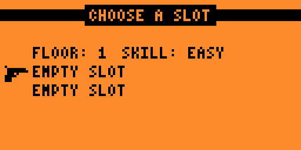
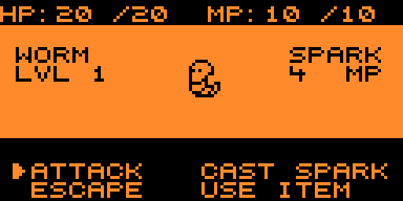
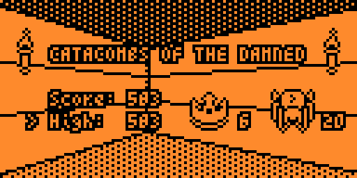
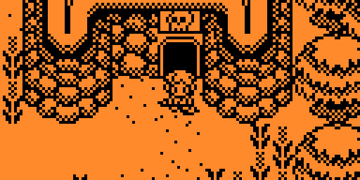
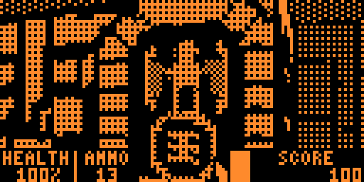
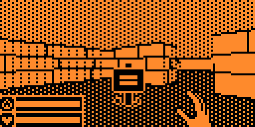

# Catacombs of the damned! 


**Проклятые катакомбы!** — это шутер от первого лица / данжен-кроулер для [миниатюрной игровой системы Arduboy](https://www.arduboy.com), в котором вы исследуете 10 этажей случайно генерируемого подземелья, уничтожаете монстров волшебными огненными шарами и собираете как можно больше добычи.

Игра частично вдохновлена серией игр [Catacomb 3D](https://www.gog.com/game/catacombs_pack).

### Особенности:


- Плавный 3D-геймплей!
- Звуковые эффекты!
- Случайно генерируемые уровни!
- Четыре различных типа монстров!
- Множество трофеев для сбора!

### О проекте

Данный репозиторий является **форком** оригинального проекта [Arduboy3D](https://github.com/jhhoward/Arduboy3D). Основная цель этого форка — портирование игры с консоли Arduboy на **Flipper Zero**.

| | |
|---|---|
|  |  |
|  |  |
|  |  |

### Инструкция по сборке

Для компиляции игры вам понадобится исходный код прошивки Flipper Zero и установленный набор инструментов для сборки.

#### 1. Клонирование исходного кода

Убедитесь, что у вас достаточно свободного места на диске, и выполните клонирование репозитория прошивки со всеми подмодулями:

```bash
git clone --recursive https://github.com/flipperdevices/flipperzero-firmware.git
```

#### 2. Подготовка окружения

Соберите базовую прошивку, используя Flipper Build Tool (fbt), чтобы убедиться в корректности окружения:

```bash
./fbt
```

#### 3. Установка и сборка игры

1. Скопируйте исходный код игры (папку с проектом) в директорию пользовательских приложений прошивки:
`./flipperzero-firmware/applications_user/`
2. Соберите приложение (FAP-файл) с помощью команды:

```bash
./fbt fap_apfx_catacombs && mv build/f7-firmware-D/.extapps/apfx_catacombs.fap ./applications_user/Arduboy3D/package
```

После успешного завершения сборки готовый файл приложения можно будет найти в папке `build/`, откуда его следует перенести на SD-карту вашего Flipper Zero в папку `apps/`.

## Обсуждение в сообществе (arduboy)
История разработки и комментарии доступны в [треде на форуме Arduboy](https://community.arduboy.com/t/another-fps-style-3d-demo/6565) (на английском языке).

## Оригинал
James Howard [Arduboy3D](https://github.com/jhhoward/Arduboy3D)