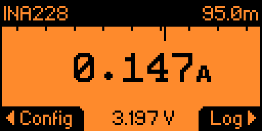
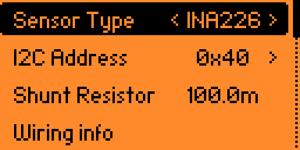

# TINA Gauge for Flipper Zero

TINA Gauge is an application for Flipper Zero that allows you to read I2C-connected current/power monitors from Texas Instruments.

## Supported Sensors:

- INA219
- INA226
- INA228

## Wiring

| Flipper pin  | INAxxx |
| ------------ | ------ |
| C0 (16)      | SCL    |
| C1 (15)      | SDA    |

## Instructions for Use:

- Launch the application and access the CONFIG menu by pressing the LEFT button
  
- Select the sensor type, configure its I2C address, and set the shunt resistance.
- Once the settings are complete, press the BACK button to return to the Gauge Screen.
- If the sensor is connected properly, the Gauge Screen will display the bus voltage and the current flowing through the shunt resistor.

