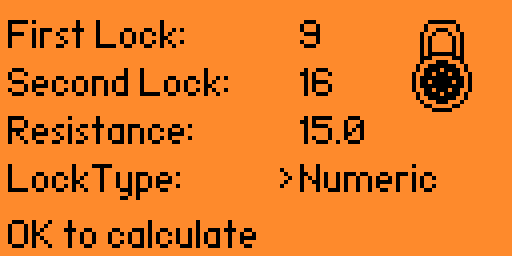

# LD2410 Human Detector for Flipper Zero

An application that turns your Flipper Zero into a sophisticated human presence detector using the **HLK-LD2410 mmWave sensor**.



## Features

*   **Real-time Detection**: Displays the current detection status (No Target, Moving, Static, or Both).
*   **Distance Metrics**: Shows the overall detection distance.
*   **Energy Analysis**: Displays component-level data for both moving and static targets (Distance + Energy).
*   **Plug & Play**: Works with the default LD2410 baud rate (256000 bps).

## Hardware Setup

Connect the LD2410 module to the Flipper Zero GPIO header as follows:

| LD2410 Pin | Flipper Zero Pin | Note |
| :--- | :--- | :--- |
| **VCC** | **5V** (Pin 1) | Check if your module supports 3.3V (Pin 9), but 5V is standard. |
| **GND** | **GND** (Pin 8) | Any GND pin works. |
| **TX** | **RX** (Pin 14) | Flipper GPIO 14 (USART RX). |
| **RX** | **TX** (Pin 13) | Flipper GPIO 13 (USART TX). |

**IMPORTANT: Power Requirements**

*   **On Battery:** You **MUST enable "5V on GPIO"** in the Flipper Zero settings (`GPIO -> 5V on GPIO -> ON`) manually.
*   **On USB:** If connected via USB, the 5V rail is active automatically, so this step is not required.

**Note:** The LD2410 default baud rate is **256000**. If you have changed it, you will need to modify the code (`UART_BAUDRATE` in `ld2410_human_detector_uart.c`) or reset the sensor.

## Installation

**Using UFBT (Recommended)**

1.  Clone this repository.
2.  Connect your Flipper Zero via USB.
3.  Run the following command in the project directory:

```bash
ufbt launch
```

This will compile the application and launch it immediately on your Flipper Zero.

## Troubleshooting

*   **UART INIT ERROR**: The Flipper failed to acquire the serial port usage. Restart your Flipper Zero.
*   **Waiting for data...**:
    *   Check your wiring (TX goes to RX, RX goes to TX).
    *   Ensure the sensor is powered.
    *   Verify the baud rate hasn't been changed from the factory default.

## License

This project is licensed under the MIT License - see the [LICENSE](LICENSE) file for details.
