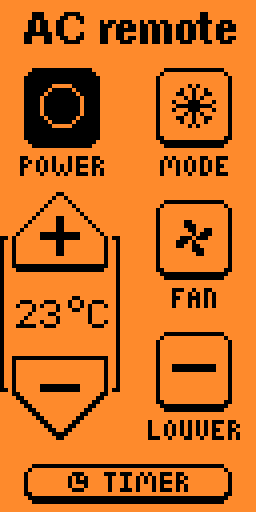

# Hitachi AC Remote

Hitachi AC remote control for Flipper Zero.

Emulates the PC-LHxx series remote controller.



## Building
```shell
# Clone repository
git clone https://github.com/dogtopus/flipperzero-hitachi-ac-remote.git
cd flipperzero-hitachi-ac-remote

# Build the application
ufbt build

# Build and launch the application
ufbt launch
```
