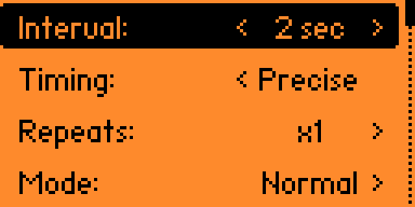
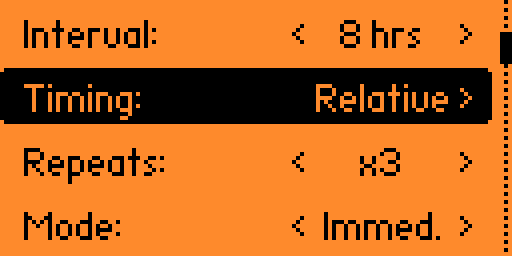
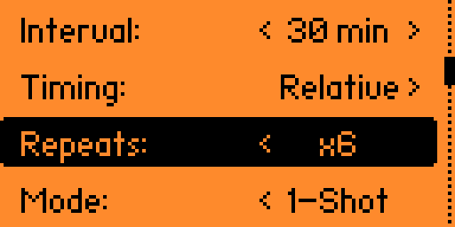
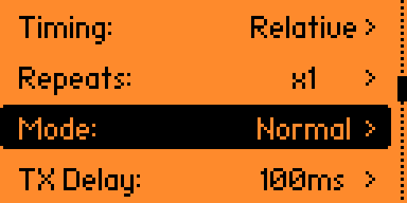
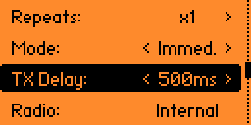
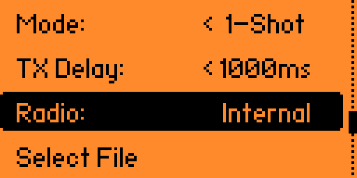
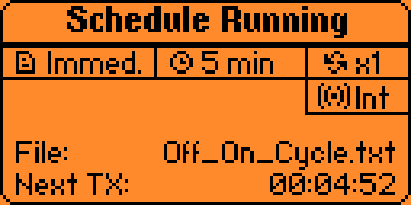

# SubGHz Scheduler

A Flipper Zero app to send SubGHz signals at a given interval. Individual `*.sub` or playlist `*.txt` files can be used. 


<table style="border:0px">
  <tr style="border:0px">
    <td style="border:0px" width="25%" align="left">
    Schedule intervals selectable: <br>
     <ul>
       <li>Seconds: 1, 2, 5, 10, 30</li>
       <li>Minutes: 1, 2, 5, 10, 20, 30, 45</li>
       <li>Hours: 1, 2, 4, 8, 12, 24</li>
     </ul>
    </td>
    <td style="border:0px" width="20%"></td>
  </tr>
  <tr style="border:0px">
    <td style="border:0px" width="25%" align="left">
    Interval timing modes: <br>
     <ul>
       <li>Relative: Interval is length of time from `END` of one transmission to `START` of next.</li>
       <li>Precise: Interval is length of time from `START` of one transmission to `START` of next.</li>
     </ul>
    </td>
    <td style="border:0px" width="20%"></td>
  </tr>
 <tr style="border:0px">
  <td style="border:0px" width="25%" align="left">
    Data Tx Repeats:<br>
  <ul>
  <li>x1, x2, x3, x4, x5, x6</li>
  </ul>
  </td>
  <td style="border:0px" width="20%"></td>
<tr style="border:0px">
  <td style="border:0px" width="25%" align="left">
    Transmission Modes:<br>
  <ul>
  <li>Normal: Transmit after intervals.</li>
  <li>Immediate: Counts start as interval.</li>
  <li>One-Shot: Wait interval and transmits once.</li>
  </ul>
  </td>
  <td style="border:0px" width="20%"></td>
 </tr>
<tr style="border:0px">
  <td style="border:0px" width="25%" align="left">
   Inter-transmission delay:<br>
   <ul>
    <li>100ms, 250ms, 500ms, 1 sec</li>
   </ul>
  </td>
   <td style="border:0px" width="20%"></td>
  </tr>
  <tr style="border:0px">
  <td style="border:0px" width="25%" align="left">
   Radio Selection:<br>
   <ul>
    <li>Internal</li>
    <li>External (When Present)</li>
   </ul>
  </td>
   <td style="border:0px" width="20%"></td>
  </tr>
  <tr style="border:0px">
  <td style="border:0px" width="25%" align="left">
   Run view displays:
    <ul>
      <li>TX mode</li>
      <li>TX interval</li>
      <li>TX Repeats</li>
      <li>Radio</li>
      <li>Selected file</li>
      <li>TX interval countdown</li>
    </ul>
  </td>
   <td style="border:0px" width="20%"></td>
  </tr>
</table>


## Requirements

This app is tested against the current `dev` and `release` branches of the [OFW](https://github.com/flipperdevices/flipperzero-firmware):

* Current OFW Version: 1.2.0
<br>[](https://github.com/shalebridge/flipper-subghz-scheduler/actions/workflows/build.yml)

It has also been tested against [Momentum 009](https://github.com/Next-Flip/Momentum-Firmware/releases/tag/mntm-009).

## Build

These apps are built using [ufbt](https://pypi.org/project/ufbt/) - a subset of the flipper build tool (fbt) targeted at building apps. Install it with:

```bash
pip install ufbt
```

For build only, run `ufbt` from the terminal in the project directory. To upload, make sure Flipper is connected to your computer and run `ufbt launch`.

The directory contains the following batch script(s) to simplify the upload process:
* `win_launch.bat` - Windows only. Invokes `ufbt` to deploy and launch the app on a flipper over USB, and resets terminal colors in case of error.

Build outputs are found in the `dist` directory for each application.


# To-Do
- [ ] Add 'alarm' mode, to set specific time for transmission.
- [ ] Enable interval delays for playlists. For example, turning on a light (playlist index 1), then 4 hours later turning it off (playlist index 2), and run that at another arbitrary interval. This can include custom playlist keys or custom app files.
- [ ] More visual feedback of current transmission (like `SubGHz Playlist`).
- [ ] Enable quitting from transmission. Currently, if back is pressed during playlist transmission, transmission will complete before exiting to main menu.
- [ ] Options to select notifications on transmit (vibro, backlight, etc).