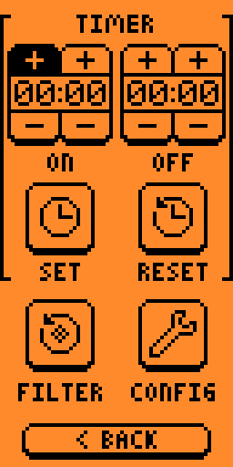

# Hitachi AC Remote

Hitachi AC remote control for Flipper Zero.

Emulates the PC-LHxx series remote controller.

Based on [Mitsubishi AC Remote](https://github.com/achistyakov/flipperzero-mitsubishi-ac-remote) by [@achistyakov](https://github.com/achistyakov) and [Midea AC Remote](https://github.com/xakep666/flipperzero-midea-ac-remote) by [@xakep666](https://github.com/xakep666).

 

## Building
```shell
# Clone repository
git clone https://github.com/dogtopus/flipperzero-hitachi-ac-remote.git
cd flipperzero-hitachi-ac-remote

# Build the application
ufbt build

# Build and launch the application
ufbt launch
```
