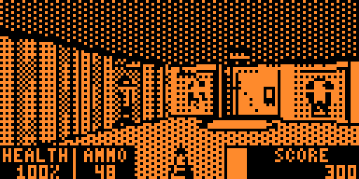

# Wolfenduino

Wolfenduino is a demake of id software's Wolfenstein 3D for the Arduboy FX. 

This project is a [port](https://github.com/apfxtech/FlipperWolfenstein.git) of the original [WolfenduinoFX](https://github.com/jhhoward/WolfenduinoFX.git) project. The main goal of this fork is to port the game from the Arduboy console to **Flipper Zero**.

## Features

* 10 Levels based on the shareware episode 'Escape from Wolfenstein'
* Enemies, weapons and secret push walls, all based on the original game
* Four difficulty levels
* An auto-save system that saves your progress at the end of each level
* A high score table

## Controls

* Use directional pad to move
* Press B to shoot
* Hold A to strafe
* Double tap A to switch between weapons

