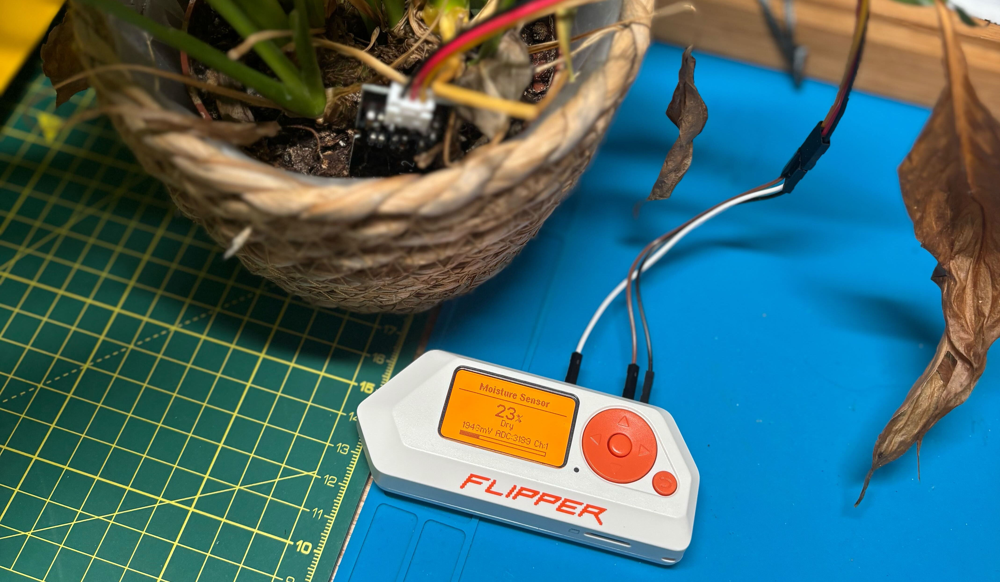

# Moisture Sensor App for Flipper Zero

A Flipper Zero application that reads values from a Capacitive Moisture Sensor v1.2.



## Features

- Real-time moisture percentage display (0-100%)
- Visual moisture bar indicator
- Status text (Very Dry, Dry, Moist, Wet, Very Wet)
- Millivolt and raw ADC value display for calibration
- Averaged readings for stability

## Hardware Requirements

- Flipper Zero
- Capacitive Moisture Sensor v1.2

## Wiring

Connect the sensor to the Flipper Zero GPIO header:

| Sensor Pin | Flipper Zero Pin |
|------------|------------------|
| VCC        | Pin 9 (3.3V)     |
| GND        | Pin 18 (GND)     |
| AOUT       | Pin 16 (PC3)     |

## Building

```bash
make build
```

## Installation

```bash
make install
```

Or build and launch directly:

```bash
make launch
```

## Development

```bash
make format   # Format code
make lint     # Lint code
make clean    # Clean build artifacts
```

## Usage

1. Connect the moisture sensor to your Flipper Zero
2. Navigate to Apps > GPIO > Moisture Sensor
3. The display shows:
   - Moisture percentage
   - Status indicator
   - Millivolt reading and raw ADC value
   - Visual bar graph
4. Press **Back** to exit

## Calibration

The default calibration values (raw ADC readings) are set for the Capacitive Moisture Sensor v1.2:

- `ADC_DRY_VALUE`: 3656 (sensor in dry air)
- `ADC_WET_VALUE`: 1700 (sensor submerged in water)

To calibrate for your sensor:

1. Run the app with the sensor in dry air, note the ADC value
2. Submerge the sensor in water (only up to the line), note the ADC value
3. Update the values in `moisture_sensor.c` and rebuild

## License

MIT
