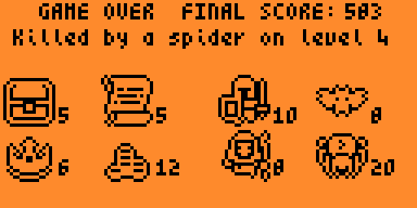
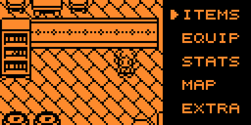
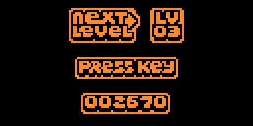

# ARDUVENTURE

This project is a [port](https://github.com/apfxtech/FlipperArduventure.git) of the original [Arduventure](https://github.com/Team-ARG-Museum/ID-46-Arduventure.git) project. The main goal of this fork is to port the game from the Arduboy console to **Flipper Zero**.

A lightweight retro RPG/adventure for Flipper Zero, based on the classic Arduventure for Arduboy. Explore a pixel world, fight enemies, and grow your character across multiple areas.

## Features

- Gameplay across 4 locations
- A large, beautiful world to explore
- 8-bit music
- Character progression
- Equipment system: amulets and weapons
- Random battles / encounters

## Screenshots

| | |
|---|---|
|  |  |
|  |  |
|  |  |
|  |  |
|  |  |

Arduventure : http://www.team-arg.org/ardu-manual.html  
**Download latest Arduboy version and source :** https://github.com/TEAMarg/ID-46-Arduventure/releases/latest  
MADE by TEAM a.r.g. : http://www.team-arg.org/more-about.html

2017 - 2018 JO3RI GANTOIS - GAVIN ATKIN - OLIVIER HUARD - SIEGFRIED CROES

Additional Level Design - Jace Atkin  
Game License: MIT : https://opensource.org/licenses/MIT  
Story, characters, sprites, tiles, design and art: copyrighted to TEAM a.r.g. NOT under MIT !

## Installation

### Option 1: Download a release
1. Go to the **Releases** page of this repository.
2. Download the latest build/package.
3. Copy it to your Flipper Zero (e.g., via qFlipper) into the appropriate apps/games folder.
4. Launch it from the Flipper menu.

### Option 2: Build from source

#### Build instructions

To compile the game you need:
- Flipper Zero firmware source code
- The Flipper build toolchain set up on your system

##### 1) Clone the firmware source

Make sure you have enough free disk space, then clone the Flipper Zero firmware repository with submodules:

```bash
git clone --recursive https://github.com/flipperdevices/flipperzero-firmware.git
```

##### 2) Prepare the environment

Build the base firmware once using Flipper Build Tool (`fbt`) to ensure your environment is correct:

```bash
./fbt
```

##### 3) Install and build the game

1. Copy the game source folder into the firmware’s user applications directory:

`./flipperzero-firmware/applications_user/`

2. Build the application (FAP file) with:

```bash
./fbt fap_apfx_arduventure && mv build/f7-firmware-D/.extapps/apfx_arduventure.fap ./
```

After a successful build, the resulting `.fap` can be found under the `build/` directory. Copy it to your Flipper Zero SD card into the `apps/` folder.

## Game map
