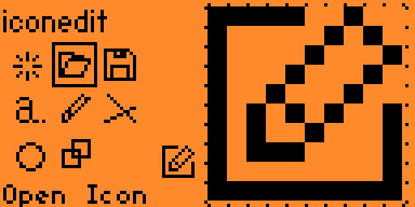
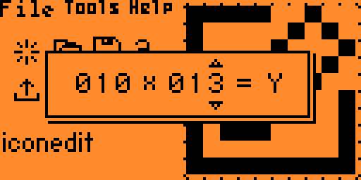
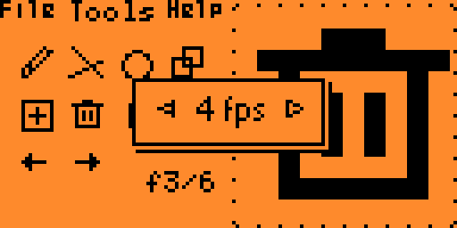
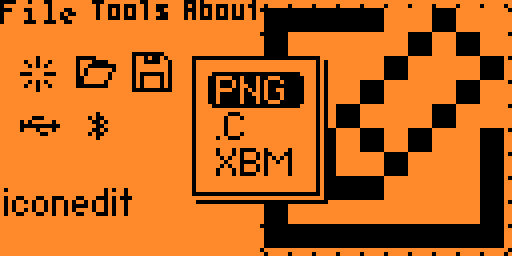
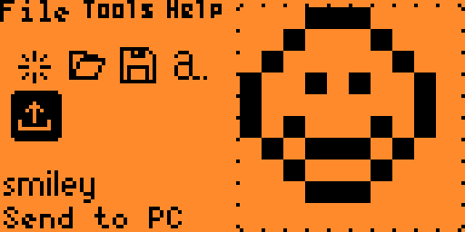

# IconEdit


## Icon editor for the FlipperZero

Create images and animated icons up to 128x64 in size directly on the Flipper! Easily preview how your images, icons, and animations will look directly on the device. Send your images to your PC without swapping the SDCard! Significantly improves your development workflow by eliminating the need to copy images to your build folders, rebuild, and re-launching your app after every image edit.

| Edit mode | Create new icon with custom size |
:-----:|:-----:
 | 
Change animation frame rate | Save as PNG, .C, or XBM
 | 

> All in-app icons were created with IconEdit!

## Features

* Pixel level editing
* Draw lines, circles, and rectangles
* Scrollable canvas (if image has a dimension greater than 32px)
* Create animated icons: insert/duplicate and delete frames, change frame rates
* Open `.png` and `.bmx` files
* Save your icons as `.png`, `.bmx`, `.xbm`, and even in the `.c` source file format generated by **fbt**/**ufbt** for direct use in your code!
  * Files are saved in the `apps_data/iconedit` folder on the SD card
  * Animations (`.png` or `.xbm`) are saved as numbered files in a new/existing directory. (bmx files are not yet supported for animations)
  * Simply copy the saved `.png` files or directory from your SD card to your application's `images` folder to be included in your next `.fap` build
* **Even better**, directly transfer `.c` source file representations of the icons over USB to your IDE! Or use the supplied Python script to receive PNG and BMX files in binary! Edit images, Send images to PC, Rebuild/Launch, Repeat! **Without removing your SDCard!**
* Preview of your icon, including animation playback
  * Play / pause animations
  * Change Zoom level during playback
  * Frame by Frame control while paused

## Menu Overview

* File
  * New Icon - Prompts to select icon dimensions (max size 128x64)
  * Open Icon - Select existing PNG or BMX file from SDCard for editing
  * Save Icon - Save as PNG, .C source file, BMX, or XBM formats. Multiple files are created for PNG and XBM for each frame. the .C source files support multiple frames in a single file.
  * Rename Icon - Change the name used for filenames and C source variable names
  * Send to PC - Choose the format to send: PNG, .C, BMX. C source code will be inserted at your cursor location in your IDE. Binary formats require the use of the supplied script `scripts/image_bin_receive.py`. See below for more details.
* Tools
  * Draw pixel - Draw/erase individual pixels
  * Draw line - Click to start a line, move cursor to end, click to commit. Back to cancel.
  * Draw circle - Click to mark circle center, move cursor to expand circle, click to commit. Back to cancel.
  * Draw rectangle - Click to mark a corner, move cursor to define rect, click to commit. Back to cancel.
  * Duplicate frame - Duplicates the current frame and inserts it immediately after current frame
  * Delete frame - Deletes the current frame
  * Play/View - Plays the current animation or views the current single frame
    * Up/Down scales the view
    * OK pauses animations
    * Left/Right steps through frames when paused
    * Back returns to editing
  * FPS - Change the Frame Rate for the animation (Default = 4fps)
  * Left/Right - Navigate between frames of animation
* Settings
  * Canvas Scale - Changes the canvas scaling factor in the editor
  * Cursor Guides - Toggles the drawing of the cursor guides on the edge of the editor
* Help
* About

## Send to PC

IconEdit lets you send your images to your PC in two ways: pure text (used for .C source code) and hex text (for binary formats: PNG and BMX). Just follow the prompts to get your file transferred. Sending pure text is the easiest, as it mimics typing on your keyboard in your editor. Simply place your cursor where you want the C source to show up, and send it!

### Sending .C Source code
This is the easiest way to send your icons for immediate use in your Flipper application code.

<details>
<summary>C source code example</summary>
For this example, let's use this smiley face image. Note the name is `smiley`, which will be used as the variable name.



Click **Send to PC** and select `.C` to send as C source code. Click ok when your cursor is in the right spot in your code editor and you see "Ready to send?" on the Flipper. Press OK when ready to send.

```c
#include <gui/icon_i.h>
const uint8_t _I_smiley_0[] = { 0x00, 0x38, 0x00, 0x44, 0x00, 0x82, 0x00, 0x29, 0x01, 0x01, 0x01, 0x45, 0x01, 0xba, 0x00, 0x44, 0x00, 0x38, 0x00, 0x00, 0x00};
const uint8_t* const _I_smiley[] = {_I_smiley_0};
const Icon I_smiley = {.width=10,.height=10,.frame_count=1,.frame_rate=4,.frames=_I_smiley};
```

Then, in your application code, you would use the Icon as normal:

```c
canvas_draw_icon(canvas, x, y, &I_smiley);
```

</details>

### Sending binary formats (PNG and BMX)

In order for your PC to receive the binary data, we need a way to convert the hex codes into a binary format. For that, we'll need to run the script `scripts/image_receive.py`. This script will receive the hex codes as text, convert them to binary, and write the file(s) to disk.

<details>
<summary>Binary format example</summary>
Using the same smiley image as before, let's send it as PNG. We'll need to run the provided script in order to convert the hex text into binary.

Run the script and enter `receive bin` (or `rb` for short) and then select Send to PC \ PNG in the IconEdit app. Press OK when you're ready to continue.

```
$ python3 ./scripts/image_receive.py
Welcome to IconEdit Image Receive. Type ? or help for available commands.
Visit https://github.com/rdefeo/iconedit for more information
>> receive bin
Ready to receive filename!
smiley.png

Ready to receive data!
89504e470d0a1a0a0000000d494844520000000a0000000a08060000008d32cfbd000001d24944415478da002900d6ff00ffffff00ffffff00ffffff00000000
ff000000ff000000ffffffff00ffffff00ffffff00ffffff00002900d6ff00ffffff00ffffff00000000ffffffff00ffffff00ffffff00000000ffffffff00ff
ffff00ffffff00002900d6ff00ffffff00000000ffffffff00ffffff00ffffff00ffffff00ffffff00000000ffffffff00ffffff00002900d6ff00000000ffff
ffff00ffffff00000000ffffffff00000000ffffffff00ffffff00000000ffffffff00002900d6ff00000000ffffffff00ffffff00ffffff00ffffff00ffffff
00ffffff00ffffff00000000ffffffff00002900d6ff00000000ffffffff00000000ffffffff00ffffff00ffffff00000000ffffffff00000000ffffffff0000
2900d6ff00ffffff00000000ffffffff00000000ff000000ff000000ffffffff00000000ffffffff00ffffff00002900d6ff00ffffff00ffffff00000000ffff
ffff00ffffff00ffffff00000000ffffffff00ffffff00ffffff00002900d6ff00ffffff00ffffff00ffffff00000000ff000000ff000000ffffffff00ffffff
00ffffff00ffffff00012900d6ff00ffffff00ffffff00ffffff00ffffff00ffffff00ffffff00ffffff00ffffff00ffffff00ffffff00ba79f50b72bda34200
00000049454e44ae426082

>>
```

You can provide your own filename to the script (e.g. `receive bin smiley.png`). If you do, when the Flipper prompts you to "Send filename?", hit Right to skip the sending of the filename. The Flipper will then send data immediately.
</details>

## Planned (or not) features

* Add more user feedback/status/error indicators
* Pen size / Line Width
* Fill Tool
* Copy/Paste region
* Open / Save more file types?
* Asset Pack creation?

## Copyright / Licensing

This project would not be possible without the efforts and source from the following projects:

* [pngle](https://github.com/kikuchan/pngle) - reads and uncompresses PNG files using miniz
* [png](https://github.com/dangee1705/png) - write uncompressed png files

<a href="https://www.buymeacoffee.com/rdefeo" target="_blank"></a>
