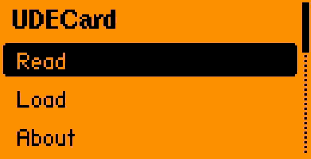

# 🪪🔍 UDECard

Flipper Zero application to analyse student ID cards from the University of Duisburg-Essen (Intercard)



## Motivation

The University of Duisburg-Essen utilises a system known as [Intercard](https://intercard.org/de/) for the purposes of payment and authentication within the library.
These are MIFARE Classic 1K cards, whose keys are readily available in the Flippers dictionary.
However, the Flipper lacks any support for useful information extraction.
This application enables parsing of such cards.

Should you have any Intercards from other institutions, you may find the [Technical Details](#technical-details) section at the bottom of this document helpful.


## Properties this app supports

- KS-Nr.
- Member type (Student/Employee)
- Student number (Matrikelnummer)
- Balance
- Transaction count


## Build/Install

Running `ufbt` / `ufbt launch` is sufficient.

A release to the *Flipper Application Catalog* is in preparation.
In the meantime, you can take a look at the release section on the right and download it there.


## Usage

### Reading directly from the card

- Select **Read**.
- Place the card on the back of the flipper.


### Loading previously made dump

- Use the Flipper’s built-in NFC App to create a dump of your card.
- Open UDECard and select **Load**.
- Select the previously created dump.


## Technical Details

Intercards are MIFARE Classic 1K cards with a 4 Byte UID.
They are divided into 16 sectors (0 to 15) with each sector containing four blocks (0 to 3).

The details below pertain to cards issued by the University of Duisburg-Essen.
I do not have details on other Intercards, but feel free to open an issue or submit a pull request if you have one and are ready to collaborate.


### Identification

The app utilizes Block 1 and 2 of Sector 0 to determine the authenticity of the card, as they (or so I assume) contain the necessary identification data for the University of Duisburg-Essen:
```c
    {0x55, 0x06, 0x38, 0x2a, 0x38, 0x2a, 0x38, 0x2a, 0x38, 0x2a, 0x38, 0x2a, 0x38, 0x2a, 0x38, 0x2a},
    {0x38, 0x2a, 0x38, 0x2a, 0x00, 0x00, 0x00, 0x00, 0x00, 0x00, 0x00, 0x00, 0x00, 0x00, 0x00, 0x00}
```
If these bytes are present, this card is recognized as a UDECard.


### KS-Nr. / UID

The KS-Nr. is a decimal representation of the UID.
It is the decimal value of the UID bytes if they were written in reverse order (see `uid_to_ksnr()` in `udecard.c` for the implementation).


### Member type

The member type is stored at Sector 1, in the first and third byte of Block 2.
For students it is set to `0x02`, and for employees it is set to `0x03`.
Given that the university also issues cash cards and library cards, it is possible that there are additional member types.


### Balance

The balance is saved as three bytes (`byte[0]`,`byte[1]`,`byte[2]`), with the bytes located in Sector 3 Block 0 at positions 2,3 and 4 and at Sector 3 Block 1 at positions 7,8,9.
The balance is stored as euro cents and can be calculated by `byte[0] << 8 + byte[1]`.
The third byte `byte[2]` is a check byte, which is simply the XOR of `byte[0]` and `byte[1]`.


### Transaction Count

The transaction count is calculated in the same way as the [Balance](#balance) and can be found in Sector 2 Block 2, at bytes 13,14 and 15 and as well as in Sector 3 Block 0 at bytes 10, 11 and 12.


### Student / Employee number

The student/employee number is saved four times.
It is likely that this is due to the use of different applications, such as the Library.
This clarifies the reason for the different values for KeyA for each sector in which it is saved.

The member number locations are as follows:
- Sector 5 Block 0
- Sector 6 Block 0
- Sector 8 Block 0
- Sector 9 Block 0

The member number has a length of 12 Bytes.
It is saved in reversed order, is '0'-padded and ASCII encoded.

This application examines all four occurrences and assumes that the parsing of this number was successful if all four instances are identical.
If this is not the case, the first occurrence is used.


### Keys

The keys (only KeyA, read only) used in this application are all widely available and therefore cannot be considered private.
You can find them in in `udecard.h`.
The functionality of the keys found in this application is limited to reading the contents of the card.
No modifications are possible.


### Can I perform modifications to my card with this application?

Short answer: No you can’t and it won’t be supported.
This would not only be illegal, it would also raise ethical questions.

If you lack a strong moral compass: Changes to the balance are most likely traceable, since every card has a KS-Nummer (which is a decimal representation of the UID, see `uid_to_ksnr()` in `udecard.c`). It is tracked at every checkout.
Consequently, inconsistencies with the balance will very likely ring some alarm bells.
I believe this has to be the primary reason, why the university has not yet discontinued the use of this card type.


## Acknowledgements

### Copyright

- `images/ApplyFlipperToUDE_60x50.png` is based on `NFC_manual_60x50.png` from the [Flipper Zero Firmware](https://github.com/flipperdevices/flipperzero-firmware)
- `images/loading_24x24.png` is taken from `Loading_24` from the [Flipper Zero Firmware](https://github.com/flipperdevices/flipperzero-firmware)
- `images/Nfc_10x10.png` is taken from `Nfc_10px.png` from the [Flipper Zero Firmware](https://github.com/flipperdevices/flipperzero-firmware)