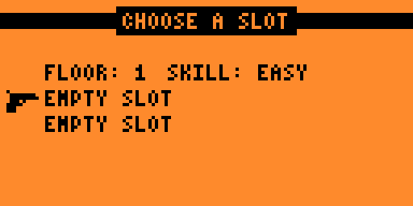
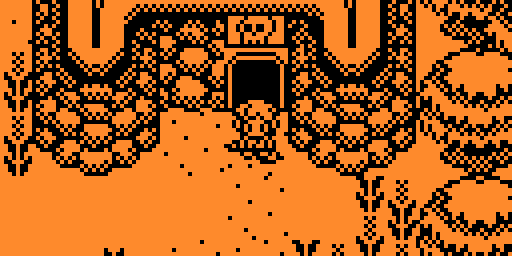
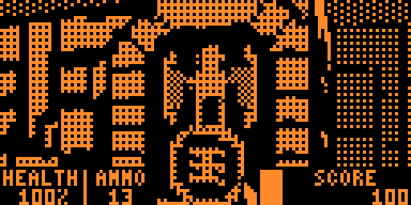
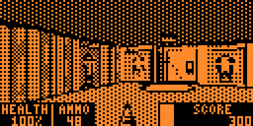
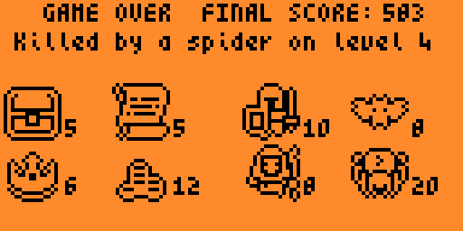
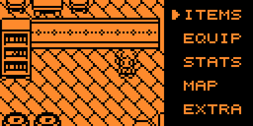
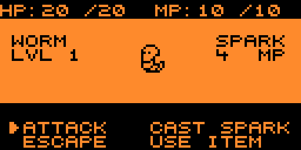
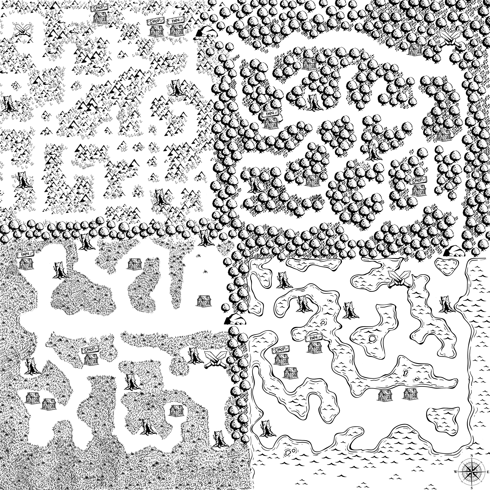

# Arduventure

This project is a [port](https://github.com/apfxtech/FlipperArduventure.git) of the original [Arduventure](https://github.com/Team-ARG-Museum/ID-46-Arduventure.git) project. The main goal of this fork is to port the game from the Arduboy console to **Flipper Zero**.

A lightweight retro RPG/adventure for Flipper Zero, based on the classic Arduventure for Arduboy. Explore a pixel world, fight enemies, and grow your character across multiple areas.

## Features

- Gameplay across 4 locations
- A large, beautiful world to explore
- 8-bit music
- Character progression
- Equipment system: amulets and weapons
- Random battles / encounters

## Screenshots

| | |
|---|---|
|  |  |
|  |  |
|  |  |
|  |  |
|  |  |

Arduventure : http://www.team-arg.org/ardu-manual.html  
**Download latest Arduboy version and source :** https://github.com/TEAMarg/ID-46-Arduventure/releases/latest  
MADE by TEAM a.r.g. : http://www.team-arg.org/more-about.html

2017 - 2018 JO3RI GANTOIS - GAVIN ATKIN - OLIVIER HUARD - SIEGFRIED CROES

Additional Level Design - Jace Atkin  
Game License: MIT : https://opensource.org/licenses/MIT  
Story, characters, sprites, tiles, design and art: copyrighted to TEAM a.r.g. NOT under MIT !

## Installation

### Option 1: Flipper Lab (Recommended)

Install the stable build directly from Flipper Lab:

**https://lab.flipper.net/apps/arduventure**

This is the most reliable way to get the latest stable version.

### Option 2: Download a Release

1. Go to the **Releases** page of this repository.
2. Download the latest build/package.
3. Copy it to your Flipper Zero (e.g., via qFlipper) into the appropriate apps/games folder.
4. Launch it from the Flipper menu.

### Option 3: Build from Source (Dev Build)

Clone this repository into your firmware's `applications_user` directory and run:

```bash
./fbt launch APPSRC=arduventure
```

This builds and launches the latest development version directly on your Flipper Zero.

## Original
**Team A.R.G. Museum**
[ID-46-Arduventure](https://github.com/Team-ARG-Museum/ID-46-Arduventure.git)

## Game map
