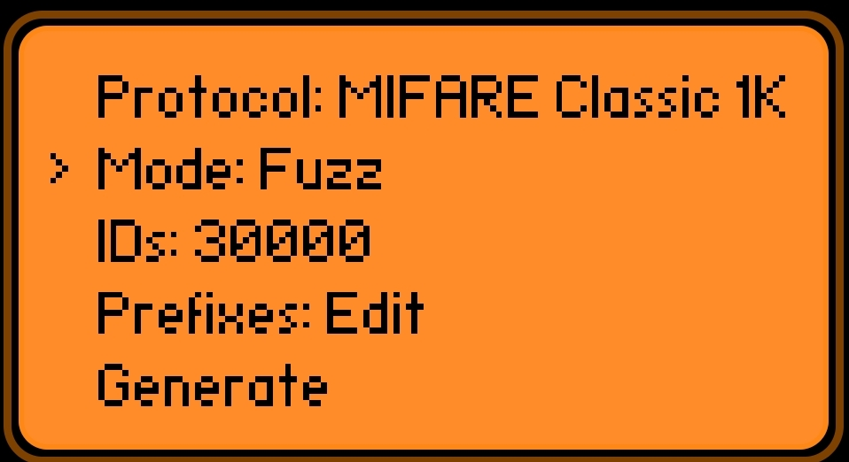
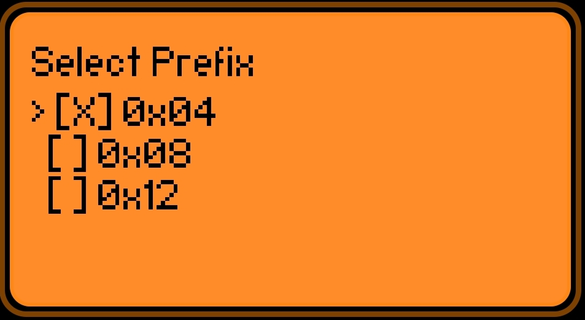
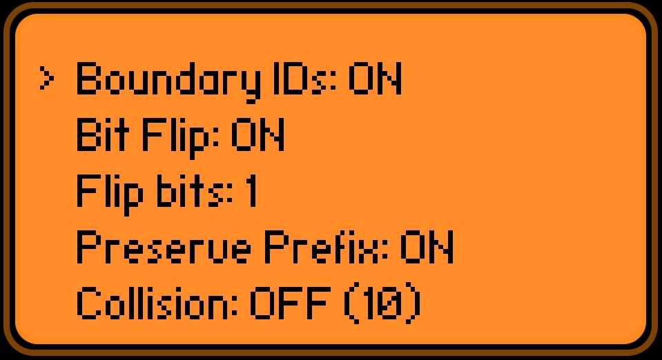
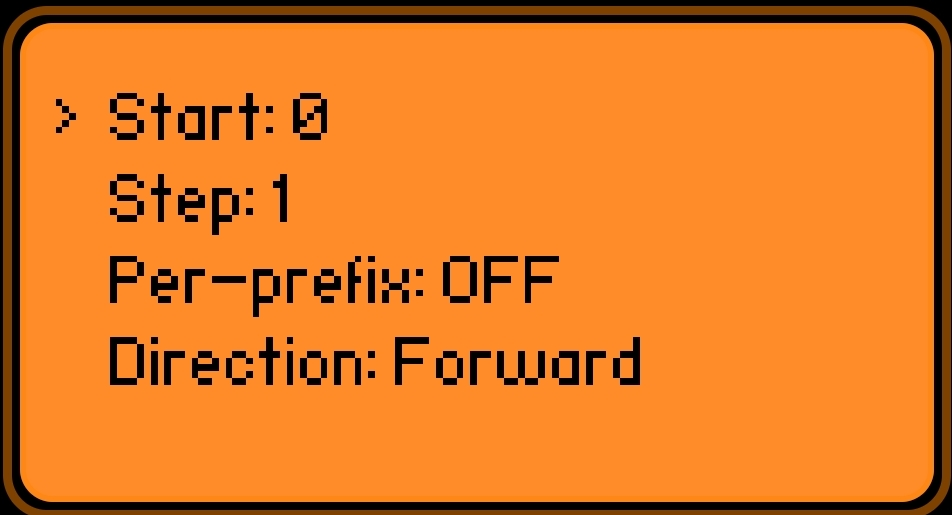

# 📟 ListEM — Advanced UID List Generator for Flipper Zero

**ListEM** is a Flipper Zero application that generates large, customizable UID dictionaries for **RFID**, **NFC**, and **iButton** protocols **directly on your Flipper!**.

I decided to build it as a native Flipper app for **flexibility, portability, and ease of use on the GO!**.  
ListEM brings advanced list generating features (previously done via my Python scripts) straight onto the Flipper Zero.
Now with **Fuzzing Mode / Bit-Mutation engine!** A real, usable reader testing FuZZ engine!


---

## 📸 Screenshots

<p align="center">
  
  
  
  
  
</p>

---

## ✨ Features

### 🔌 Protocol Support (28 total)

**RFID**
- EM4100, HID Prox, Indala, IoProx, PAC/Stanley, Paradox, Viking, Pyramid, Keri, Nexwatch, H10301, Jablotron, Electra, IDTeck, Gallagher

**NFC**
- MIFARE Classic 1K, MIFARE Classic 4K, MIFARE Ultralight, DESFire EV1, iCLASS, FeliCa

**iButton**
- Dallas DS1990, Cyfral, Metacom, Maxim iButton, Keypad/Access Control, Temperature iButton, Custom iButton

---

### 🧬 Manufacturer Prefix Support

- Generate IDs:
  - With **no prefix** (fully randomized)
  - With **one or multiple selected prefix**
  - If **no prefix is selected** → IDs are fully random
  - If **one or more prefixes are selected** → only those prefixes are used
  - Selected prefixes are:
    Applied correctly to all generating modes

---

### 🎛️ Generating Modes

#### 🎲 Random Mode
- Fully random ID generation
- Optional manufacturer prefix injection
- Ideal for discovery and bruteforce testing

#### 🔢 Sequential Mode
- Configurable **start value**
- Configurable **step size**
- Optional manufacturer prefix injection
- Useful for ordered UID ranges and predictable badge patterns

#### 🧪 Fuzz Mode (Advanced lists for Fuzzing) 🔥
Designed for **reader fuzzing and robustness testing**

Fuzz Mode can generate:
- Boundary values (all zeros, all ones, AA / 55 patterns)
- Bit flip mutations (configurable bit count)
- Prefix preserving fuzzing (optional)

Ideal for:
- Parser robustness testing
- Reader edge case discovery
- Unexpected behavior detection


**✔ Configurable via submenu**

-> Boundary on/off
-> Bit flip on/off
-> Flip count adjustable
-> Prefix preserve on/off

**This is legitimate fuzzing, not just “random junk”!**

---

## 📁 Output Structure

Generated files are saved automatically to corresponding folder:

- `/ext/lfrfid_fuzzer/ListEM`
- `/ext/mifare_fuzzer/ListEM`
- `/ext/ibutton_fuzzer/ListEM`

### 📄 Output filenames include:
- Protocol name
- Generation mode (`random`, `sequential`, `fuzz`)
- Selected prefixes (or `noprefix`)

Example:
```
EM4100_fuzz_A0-C0.txt
```

---

## 🕹️ Controls

| Button | Action |
|------|------|
| ⬆️ / ⬇️ | Navigate menu |
| ⬅️ / ➡️ | Change values (hold for fast scroll) |
| **OK** | Select / Enter submenu |
| **Generate** | Start list generation |
| **Back** | Go back / Exit app |
  
  - Click or Hold **⬅️ / ➡️** to change:
  - Sequential start / step
  - Fuzz bit count
  - Toggle submenu options with **OK**

---

## ⚠️ Disclaimer

**USE ONLY ON AUTHORIZED EQUIPMENT**  
This tool is intended for **testing, research, and educational purposes**.

---

## 🔗 Source

https://github.com/Clawzman/Flipper_ListEM
