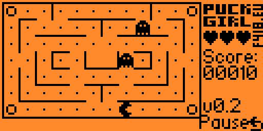

# mitzi-guido
A Guido musical notation reader for Flipper Zero

## Usage
* **OK** opens file browser if no file is loaded. Otherwise starts/stops playback
* **Up** opens file browser to load a different file
* **Back** Short: Normal exit. Long: Force exit even during playback.

## References
* https://guidodoc.grame.fr/refs/gmnf/

## Version history
See [changelog.md](changelog.md)

