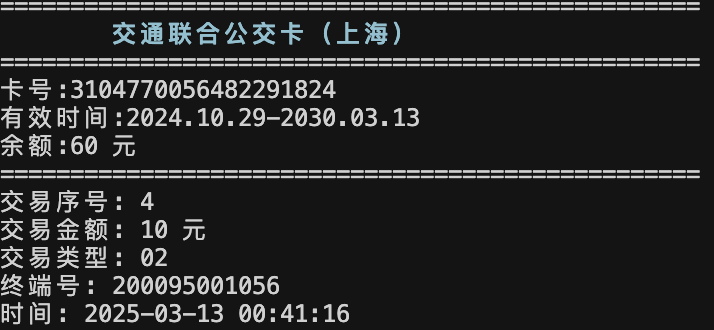

# NFC APDU Runner

[中文](./README_CN.md)

NFC APDU Runner is a Flipper Zero application for reading and executing APDU commands on NFC cards. This application allows users to load APDU commands from script files, send them to NFC cards, and view the response results. It also includes NARD (NFC APDU Runner Response Decoder) for parsing and analyzing APDU responses using customizable format templates, and TLV data extraction capabilities. The project now supports a Web interface analysis platform for more comprehensive NFC data analysis and visualization.

<div align="center">

[](https://youtu.be/u8o0eTmCCew)

</div>

<div align="center">
  
  
</div>

<div align="center">
  
  
</div>

## Features

- Support for loading APDU commands from script files
- Web interface analysis platform for comprehensive NFC data analysis and visualization
- Support for multiple card types (ISO14443-4A and ISO14443-4B implemented)
- User-friendly interface with operation prompts
- Execution logging for debugging
- Ability to save execution results to files
- NARD (NFC APDU Runner Response Decoder) for parsing and analyzing APDU responses
- Template-based decoding of APDU responses with custom format templates
- TLV data extraction and parsing capabilities

## Installation

1. Download the latest release from the [Releases](https://github.com/SpenserCai/nfc_apdu_runner/releases) page
2. Extract the zip file
3. Copy the `nfc_apdu_runner.fap` file to the `/ext/apps/NFC/` directory on your Flipper Zero
4. Copy the files from `apdu_script` directory to the `/ext/apps_data/nfc_apdu_runner/` directory on your Flipper Zero(If not exist, create it)


## Tools

This project includes additional tools to enhance functionality:

- [nfc_analysis_platform](tools/nfc_analysis_platform/README.md) - A comprehensive platform for NFC data analysis, including:
  - **NARD (NFC APDU Runner Response Decoder)** - Parse and decode `.apdures` files using customizable format templates
  - **TLV Parser** - Extract and analyze Tag-Length-Value data structures from NFC communications
  - **Web API Server** - Access NFC analysis functionality through a RESTful API interface

## Supported Card Types

- ISO14443-4A (implemented)
- ISO14443-4B (implemented)
- ISO14443-3A (APDU commands not supported)
- ISO14443-3B (APDU commands not supported)

## Script File Format

Script files use the `.apduscr` extension with the following format:

```
Filetype: APDU Script
Version: 1
CardType: iso14443_4a
Data: ["00A4040007A0000002471001", "00B0000000"]
```

Where:
- `Filetype`: Fixed as "APDU Script"
- `Version`: Current version is 1
- `CardType`: Card type, can be iso14443_4a, iso14443_4b, iso14443_3a, or iso14443_3b
- `Data`: List of APDU commands, each command as a hexadecimal string

## Response File Format

Execution results will be saved as files with the `.apdures` extension in the following format:

```
Filetype: APDU Script Response
Response:
In: 00A4040007A0000002471001
Out: 9000
In: 00B0000000
Out: 6A82
```

## Usage

1. Launch the NFC APDU Runner application on Flipper Zero
2. Select "Load Script" to load an APDU script file
3. Place the NFC card on the back of the Flipper Zero
4. Click "Run" to execute APDU commands
5. View the execution results
6. Choose to save or discard the results

## File Storage Location

- Script files are stored in the `/ext/apps_data/nfc_apdu_runner/` directory
- Response files will also be saved in the same directory, with the same filename but with the `.apdures` extension

## Development Information

- Author: SpenserCai
- Version: 0.3
- License: GNU General Public License v3.0

## Notes

- The application requires NFC cards that support APDU commands
- ISO14443-3A and ISO14443-3B cards do not support APDU commands
- Ensure the card is placed correctly so that Flipper Zero can read it

## Troubleshooting

If you encounter issues:
1. Make sure the card type matches the type specified in the script file
2. Ensure the card is placed correctly
3. Check if the APDU command format is correct
4. View the execution logs for detailed information

## Example Scripts

### ISO14443-4A Example

```
Filetype: APDU Script
Version: 1
CardType: iso14443_4a
Data: ["00A4040007A0000002471001", "00B0000000"]
```

This example script will select the application with AID A0000002471001 and then read data.

### ISO14443-4B Example

```
Filetype: APDU Script
Version: 1
CardType: iso14443_4b
Data: ["00A4040007A0000002471001", "00B0000000"]
```

This example script will execute the same commands on an ISO14443-4B card.

## License

This project is licensed under the GNU General Public License v3.0 - see the LICENSE file for details. 