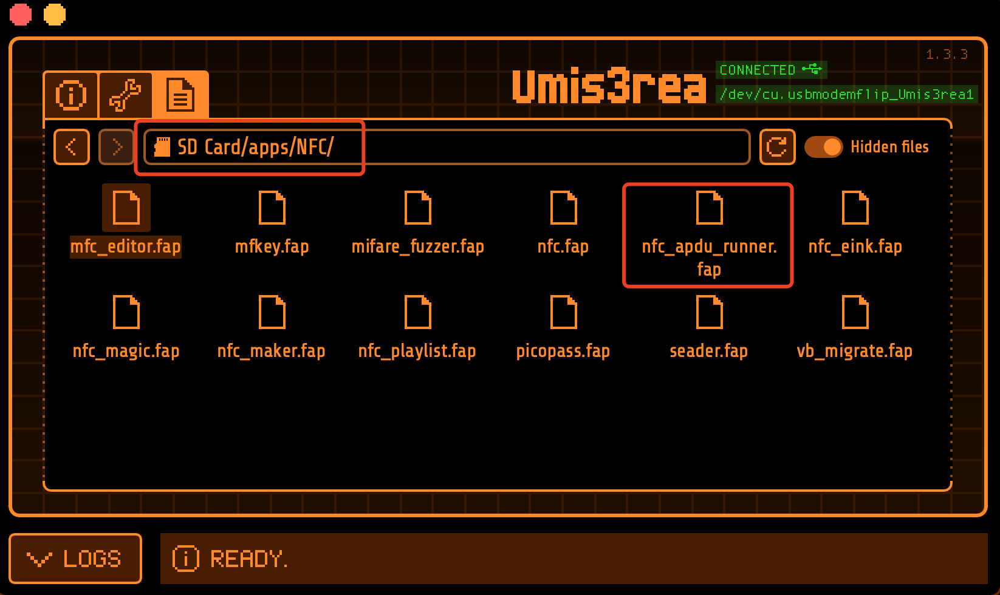
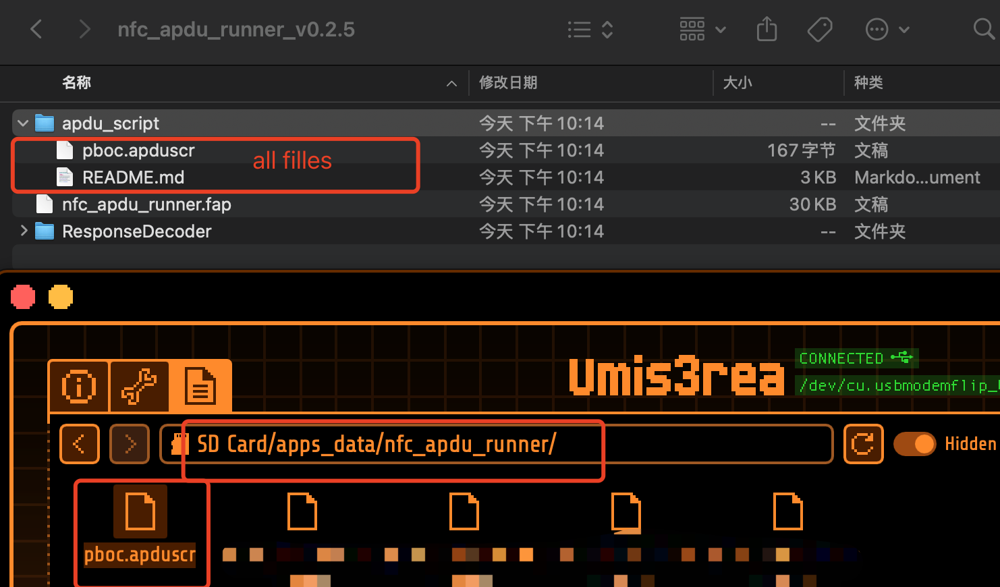

# NFC APDU Runner

NFC APDU Runner是一个Flipper Zero应用程序，用于读取和执行NFC卡片的APDU命令。该应用程序允许用户从脚本文件中加载APDU命令，并将其发送到NFC卡片，然后查看响应结果。它还包含NARD（NFC APDU Runner响应解码器）功能，可使用自定义格式模板解析和分析APDU响应，以及TLV数据提取功能。项目现已支持Web界面分析平台，用于更全面的NFC数据分析和可视化。

<div align="center">

[](https://youtu.be/u8o0eTmCCew)

</div>

<div align="center">
  
  
</div>

<div align="center">
  
  
</div>

## 功能特点

- 支持从脚本文件加载APDU命令
- 支持Web界面分析平台，用于全面的NFC数据分析和可视化
- 支持多种卡类型（已实现ISO14443-4A和ISO14443-4B）
- 用户友好的界面，提供操作提示
- 执行日志记录，方便调试
- 可以保存执行结果到文件
- NARD（NFC APDU Runner响应解码器）用于解析和分析APDU响应
- 基于模板的APDU响应解码，支持自定义格式模板
- TLV数据提取和解析功能

##安装

1. 从[Release](https://github.com/SpenserCai/nfc_apdu_runner/releases)页面下载最新版本
2. 解压缩zip文件
3. 将`nfc_apdu_runner.fap`文件复制到Flipper Zero上的`/ext/apps/NFC/`目录中
   
4. 将`apdu_script`目录目录中的文件复制到Flipper Zero上的`/ext/apps_data/nfc_apdu_runner/`目录（如果`/ext/apps_data/nfc_apdu_runner/`不存在，请创建它）
   

## 工具

本项目包含额外的工具以增强功能：

- [nfc_analysis_platform](tools/nfc_analysis_platform/README.md) - 一个综合性的NFC数据分析平台，包括：
  - **NARD（NFC APDU Runner响应解码器）** - 使用可自定义的格式模板解析和解码`.apdures`文件
  - **TLV解析器** - 从NFC通信中提取和分析Tag-Length-Value数据结构
  - **Web API服务器** - 通过RESTful API接口访问NFC分析功能

## 支持的卡类型

- ISO14443-4A（已实现）
- ISO14443-4B（已实现）
- ISO14443-3A（不支持APDU命令）
- ISO14443-3B（不支持APDU命令）

## 脚本文件格式

脚本文件使用`.apduscr`扩展名，格式如下：

```
Filetype: APDU Script
Version: 1
CardType: iso14443_4a
Data: ["00A4040007A0000002471001", "00B0000000"]
```

其中：
- `Filetype`：固定为"APDU Script"
- `Version`：当前版本为1
- `CardType`：卡类型，可以是iso14443_4a、iso14443_4b、iso14443_3a或iso14443_3b
- `Data`：APDU命令列表，每个命令为十六进制字符串

## 响应文件格式

执行结果将保存为`.apdures`扩展名的文件，格式如下：

```
Filetype: APDU Script Response
Response:
In: 00A4040007A0000002471001
Out: 9000
In: 00B0000000
Out: 6A82
```

## 使用方法

1. 在Flipper Zero上启动NFC APDU Runner应用程序
2. 选择"加载脚本"加载APDU脚本文件
3. 将NFC卡片放在Flipper Zero背面
4. 点击"运行"执行APDU命令
5. 查看执行结果
6. 选择保存或放弃结果

## 文件存储位置

- 脚本文件存储在`/ext/apps_data/nfc_apdu_runner/`目录下
- 响应文件也将保存在同一目录下，文件名与脚本文件相同，但扩展名为`.apdures`

## 开发信息

- 作者：SpenserCai
- 版本：0.3
- 许可证：GNU通用公共许可证v3.0

## 注意事项

- 应用程序需要NFC卡片支持APDU命令
- ISO14443-3A和ISO14443-3B卡片不支持APDU命令
- 确保卡片放置正确，以便Flipper Zero能够读取到卡片

## 故障排除

如果遇到问题：
1. 确保卡片类型与脚本文件中指定的类型匹配
2. 确保卡片放置正确
3. 检查APDU命令格式是否正确
4. 查看执行日志以获取详细信息

## 示例脚本

### ISO14443-4A示例

```
Filetype: APDU Script
Version: 1
CardType: iso14443_4a
Data: ["00A4040007A0000002471001", "00B0000000"]
```

这个示例脚本将选择AID为A0000002471001的应用，然后读取数据。

### ISO14443-4B示例

```
Filetype: APDU Script
Version: 1
CardType: iso14443_4b
Data: ["00A4040007A0000002471001", "00B0000000"]
```

这个示例脚本将在ISO14443-4B卡上执行相同的命令。

## 许可证

本项目采用GNU通用公共许可证v3.0授权 - 详情请参阅LICENSE文件。 