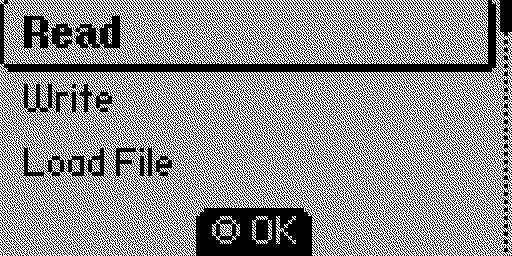
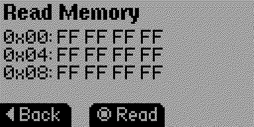

# 🔧 24cxxprog - EEPROM 24Cxx Programmer

<h2 align="center">A Comprehensive EEPROM Programmer for Flipper Zero</h2>

<div align="center">
    <table style="width:100%; border:none;">
        <tr style="border:none;">
            <td style="border:none; padding:10px;">
                
                <br>
                <em>Menu główne z operacjami (Odczyt, Zapis, Kasowanie)</em>
            </td>
            <td style="border:none; padding:10px;">
                
                <br>
                <em>Menu konfiguracji (Adres I2C, Rozmiar pamięci)</em>
            </td>
            <td style="border:none; padding:10px;">
                
                <br>
                <em>Wyświetlanie zawartości EEPROM (Dane heksadecymalne)</em>
            </td>
        </tr>
    </table>
</div>

---

This is a **comprehensive EEPROM programmer application** designed for the **Flipper Zero** that interfaces with the **24Cxx series I2C memory chips**. The application provides a complete suite of tools for reading, writing, erasing, and managing EEPROM memory with a user-friendly interface on the Flipper's screen.

## ✨ Features Overview

### 📝 EEPROM Operations

Complete toolset for memory management:

* **Read Operations:** View complete EEPROM contents with address and hexadecimal data display.
* **Write Operations:** Program custom data into specific memory addresses.
* **Erase Functions:** Clear individual bytes, pages, or entire memory sections.
* **Dump to Storage:** Export EEPROM contents to Flipper SD card for backup and analysis.
* **Restore from Backup:** Load previously saved EEPROM data back into the chip.

### 🎨 User Interface & Experience

Intuitive interface optimized for Flipper Zero's display:

* **Main Menu:** Clear operation selection with visual feedback.
* **Data Viewer:** Scrollable hex display showing actual EEPROM contents.
* **Configuration Menu:** Easy access to sensor parameters and device settings.
* **Address Navigation:** Precise control over memory location selection.
* **Progress Indicator:** Real-time feedback during long operations.

### ⚙️ Configuration Options

Customize the programmer for your specific hardware:

* **I2C Address Selection:** Choose between multiple I2C addresses (**0x50-0x57**) for different chip variants.
* **Memory Size Selection:** Automatically detect or manually set chip capacity (**1KB to 64KB** and larger).
* **Page Size Configuration:** Adapt to different chip architectures (**8 bytes to 256 bytes per page**).
* **Persistent Settings:** Configurations are automatically saved for quick access.

### 💻 Technical Features & Robustness

Built for reliability on the Flipper Zero platform:

* **I2C Protocol Support:** Robust communication with error checking.
* **Address Validation:** Prevents out-of-bounds memory access.
* **Timeout Protection:** Safeguards against communication errors.
* **Error Handling:** Comprehensive error messages for troubleshooting.
* **Non-blocking Operations:** Responsive UI that doesn't freeze during I2C transactions.
* **Data Verification:** Verify written data integrity after programming.

## 🔋 Supported 24Cxx Chips

Comprehensive support for the entire 24Cxx family:

<table style="width:100%; border:1px solid #ddd; border-collapse: collapse; text-align: left;">
    <thead style="background-color: #f8f8f8;">
        <tr>
            <th style="padding: 8px; border:1px solid #ddd;">Chip Model</th>
            <th style="padding: 8px; border:1px solid #ddd;">Memory Size</th>
            <th style="padding: 8px; border:1px solid #ddd;">Page Size</th>
            <th style="padding: 8px; border:1px solid #ddd;">Address Range</th>
        </tr>
    </thead>
    <tbody>
        <tr>
            <td style="padding: 8px; border:1px solid #ddd;"><strong>24C01</strong></td>
            <td style="padding: 8px; border:1px solid #ddd;">128 Bytes</td>
            <td style="padding: 8px; border:1px solid #ddd;">8 Bytes</td>
            <td style="padding: 8px; border:1px solid #ddd;">0x00 - 0x7F</td>
        </tr>
        <tr>
            <td style="padding: 8px; border:1px solid #ddd;"><strong>24C02</strong></td>
            <td style="padding: 8px; border:1px solid #ddd;">256 Bytes</td>
            <td style="padding: 8px; border:1px solid #ddd;">8 Bytes</td>
            <td style="padding: 8px; border:1px solid #ddd;">0x00 - 0xFF</td>
        </tr>
        <tr>
            <td style="padding: 8px; border:1px solid #ddd;"><strong>24C04 - 24C16</strong></td>
            <td style="padding: 8px; border:1px solid #ddd;">512B - 2KB</td>
            <td style="padding: 8px; border:1px solid #ddd;">16 Bytes</td>
            <td style="padding: 8px; border:1px solid #ddd;">0x00 - 0xFFFF</td>
        </tr>
        <tr>
            <td style="padding: 8px; border:1px solid #ddd;"><strong>24C32 - 24C64</strong></td>
            <td style="padding: 8px; border:1px solid #ddd;">4KB - 8KB</td>
            <td style="padding: 8px; border:1px solid #ddd;">32 Bytes</td>
            <td style="padding: 8px; border:1px solid #ddd;">0x0000 - 0x1FFF</td>
        </tr>
        <tr>
            <td style="padding: 8px; border:1px solid #ddd;"><strong>24C128 - 24C512</strong></td>
            <td style="padding: 8px; border:1px solid #ddd;">16KB - 64KB</td>
            <td style="padding: 8px; border:1px solid #ddd;">64 Bytes</td>
            <td style="padding: 8px; border:1px solid #ddd;">0x0000 - 0xFFFF</td>
        </tr>
    </tbody>
</table>

---

## 🕹️ Navigation Guide

<table style="width:100%; border:1px solid #ddd; border-collapse: collapse; text-align: left;">
    <thead style="background-color: #f8f8f8;">
        <tr>
            <th style="padding: 8px; border:1px solid #ddd;">Screen</th>
            <th style="padding: 8px; border:1px solid #ddd;">D-Pad Up/Down</th>
            <th style="padding: 8px; border:1px solid #ddd;">D-Pad Left/Right</th>
            <th style="padding: 8px; border:1px solid #ddd;">OK Button</th>
            <th style="padding: 8px; border:1px solid #ddd;">Back Button</th>
        </tr>
    </thead>
    <tbody>
        <tr>
            <td style="padding: 8px; border:1px solid #ddd;"><strong>Main Menu</strong></td>
            <td style="padding: 8px; border:1px solid #ddd;">Browse operations (Read, Write, Erase, Dump, Restore)</td>
            <td style="padding: 8px; border:1px solid #ddd;">-</td>
            <td style="padding: 8px; border:1px solid #ddd;">Select operation</td>
            <td style="padding: 8px; border:1px solid #ddd;"><strong>Exit</strong> application</td>
        </tr>
        <tr>
            <td style="padding: 8px; border:1px solid #ddd;"><strong>Read/Write</strong></td>
            <td style="padding: 8px; border:1px solid #ddd;">Navigate through addresses</td>
            <td style="padding: 8px; border:1px solid #ddd;">Adjust byte values (Write mode)</td>
            <td style="padding: 8px; border:1px solid #ddd;">Confirm operation</td>
            <td style="padding: 8px; border:1px solid #ddd;">Return to Main Menu</td>
        </tr>
        <tr>
            <td style="padding: 8px; border:1px solid #ddd;"><strong>Configuration</strong></td>
            <td style="padding: 8px; border:1px solid #ddd;">Navigate between settings</td>
            <td style="padding: 8px; border:1px solid #ddd;">Adjust parameter values</td>
            <td style="padding: 8px; border:1px solid #ddd;">Apply settings</td>
            <td style="padding: 8px; border:1px solid #ddd;">Cancel and return</td>
        </tr>
        <tr>
            <td style="padding: 8px; border:1px solid #ddd;"><strong>Data View</strong></td>
            <td style="padding: 8px; border:1px solid #ddd;">Scroll data up/down</td>
            <td style="padding: 8px; border:1px solid #ddd;">Jump to address</td>
            <td style="padding: 8px; border:1px solid #ddd;">Show hex/ASCII toggle</td>
            <td style="padding: 8px; border:1px solid #ddd;">Exit data view</td>
        </tr>
    </tbody>
</table>

## 🔌 Hardware Connections

Standard I2C pinout for Flipper Zero GPIO:

```
24Cxx EEPROM Module      Flipper Zero GPIO
─────────────────        ─────────────────
SDA (Pin 5)       ───→   GPIO_SDA (Pin 16)
SCL (Pin 6)       ───→   GPIO_SCL (Pin 15)
GND (Pin 4)       ───→   GND (Pin 8)
VCC (Pin 8)       ───→   3.3V (Pin 9)

Optional Pull-ups: 4.7kΩ from SDA and SCL to 3.3V
```

## 📋 Operation Details

### Read
- Displays EEPROM contents in hexadecimal format
- Shows address, data bytes, and ASCII representation
- Scrollable for chips larger than display capacity

### Write
- Enter target address and data values
- Supports single byte or page programming
- Automatic write cycle delay handling

### Erase
- Clear individual bytes to 0xFF
- Erase entire pages
- Full chip erase with confirmation

### Dump
- Export EEPROM to **`/ext/apps_data/24cxxprog/`** directory
- Creates timestamped backup files
- Preserves complete memory state

### Restore
- Load previously dumped EEPROM data
- Verify before writing
- Restore to specified starting address

---

## 👨‍💻 Developer

This application was created by **Dr. Mosfet** for the Flipper Zero community.

**Repository:** [kamylwnb/24cxxprog](https://github.com/kamylwnb/24cxxprog)

**Version:** 1.0  
**Category:** GPIO / Tools  
**Platform:** Flipper Zero F7

---

**Happy EEPROM programming! 🔧**
