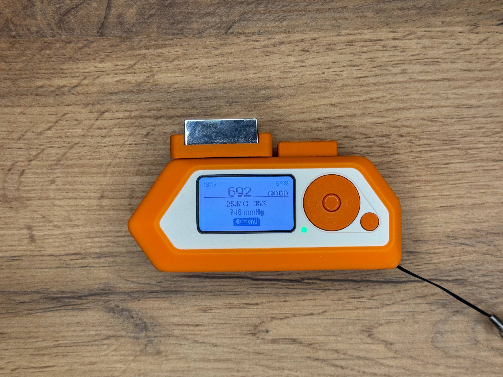
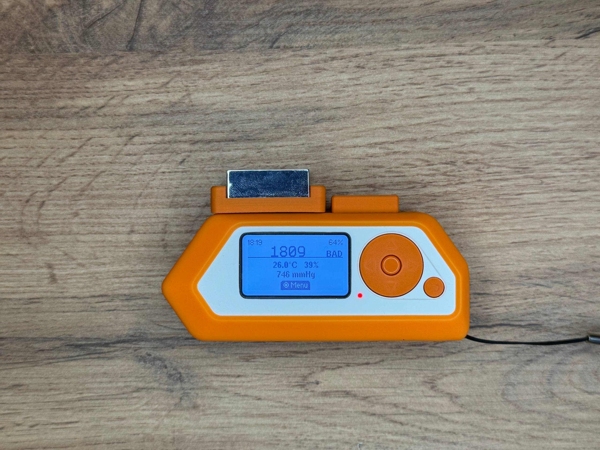
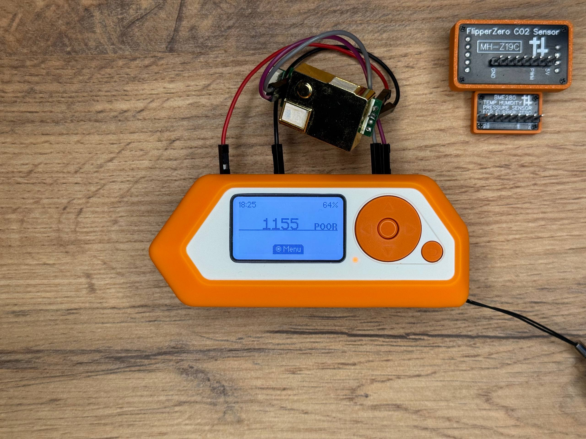
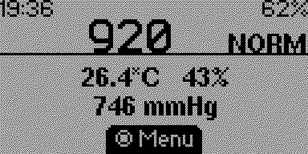
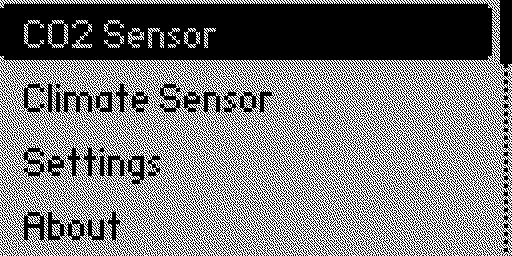
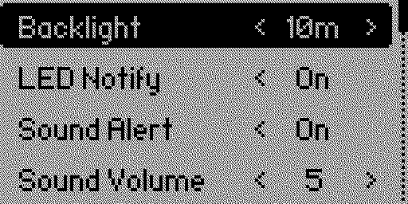

CO2 + climate monitor for Flipper Zero. Reads CO2 (MH-Z19B/C) and temperature/humidity/pressure (BME280, DHT22, etc.) through GPIO. Two sensors at once.

| PWM + BME280 (good air) | PWM + BME280 (bad air) | UART |
|:-:|:-:|:-:|
|  |  |  |

| Main screen | Menu | Menu |
|:-:|:-:|:-:|
|  |  |  |

# Sensors

## Tested

| Sensor | Interface | Measures |
|--------|-----------|----------|
| MH-Z19B | PWM / UART | CO2 |
| MH-Z19C | PWM / UART | CO2 |
| BME280 | I2C | Temperature, humidity, pressure |

## Supported (not tested)

Inherited from [unitemp](https://github.com/quen0n/unitemp-flipperzero). Should work — report issues if not.

| Sensor | Interface | Measures |
|--------|-----------|----------|
| BMP280 | I2C | Temperature, pressure |
| BME680 | I2C | Temperature, humidity, pressure |
| BMP180 | I2C | Temperature, pressure |
| DHT11 | Single wire | Temperature, humidity |
| DHT12 | Single wire | Temperature, humidity |
| DHT20 / AM2108 / AHT10 | I2C | Temperature, humidity |
| DHT21 / AM2301 | Single wire | Temperature, humidity |
| DHT22 / AM2302 | Single wire | Temperature, humidity |
| AM2320 | I2C / Single wire | Temperature, humidity |
| HTU21x / SI70xx / SHT2x | I2C | Temperature, humidity |
| SHT30 / SHT31 / SHT35 | I2C | Temperature, humidity |
| GXHT30 / GXHT31 / GXHT35 | I2C | Temperature, humidity |
| HDC1080 | I2C | Temperature, humidity |
| LM75 | I2C | Temperature |
| MAX31725 | I2C | Temperature |
| MAX6675 | SPI | Temperature (thermocouple) |
| MAX31855 | SPI | Temperature (thermocouple) |
| Dallas DS18x2x | 1-Wire | Temperature |
| SCD30 | I2C | CO2, temperature, humidity |
| SCD40 | I2C | CO2, temperature, humidity |

## Based on

- [flipper-zero-mh-z19](https://github.com/meshchaninov/flipper-zero-mh-z19) — PWM CO2 algorithm
- [flipperzero_mhz19_uart](https://github.com/skotopes/flipperzero_mhz19_uart) — UART CO2 protocol
- [unitemp-flipperzero](https://github.com/quen0n/unitemp-flipperzero) — climate sensor drivers

# Wiring

## MH-Z19 — PWM mode (3 wires)

```
Flipper PA6 (pin 3)  → sensor PWM (pin 1)
Flipper 5V  (pin 1)  → sensor Vin (pin 4)
Flipper GND (pin 8)  → sensor GND (pin 5)
```

## MH-Z19 — UART mode (4 wires)

```
Flipper C1  (pin 15) → sensor RXD (pin 3)
Flipper C0  (pin 16) → sensor TXD (pin 2)
Flipper 5V  (pin 1)  → sensor Vin (pin 4)
Flipper GND (pin 8)  → sensor GND (pin 5)
```

## BME280 (I2C, addr 0x76)

```
Flipper C1  (pin 15) → sensor SCL
Flipper C0  (pin 16) → sensor SDA
Flipper 3.3V (pin 9) → sensor VCC
Flipper GND (pin 8)  → sensor GND
```

PWM CO2 + I2C climate work together. UART CO2 and I2C share pins 15/16, so can't run at the same time — UART mode disables I2C automatically.

# Settings

## CO2 sensor (Edit menu)

- **CO2 Type** — PWM or UART
- **CO2 offset** — manual correction ±1000 ppm, step 50
- **CO2 Alert** — sound alert threshold, 800–5000 ppm
- **Avg points** (PWM) — averaging window 1–30 readings (1 = raw, no smoothing)
- **CO2 Range** (PWM) — sensor's measurement scale, 2000–10000. See [PWM Range](#pwm-range) below
- **Eject** (PWM) — clears current reading and resets the buffer. Sensor picks up fresh data if still connected. Use when the reading is frozen or after unplugging

## Climate sensor (Edit menu)

- Sensor type (BME280, BME680, DHT22, etc.)
- Temp offset ±10 °C, step 0.1
- Units: temperature, pressure, humidity
- Heat index on/off

## General (Settings menu)

- Backlight — 5s, Auto, 1m, 5m, 10m, 20m, 60m, Inf. The app takes direct control of the display backlight, bypassing the system backlight service. **5s** keeps the screen dark — the system may briefly flash it on button press, but the app turns it back off within 5 seconds. **Auto** hands control to the system (default ~30s timeout). **1m–60m** keep the screen on, then turn it off after the set period of inactivity on the main screen; any button press resets the timer. **Inf** keeps the screen always on
- LED Notify — on/off
- Sound Alert — on/off
- Sound Volume — 1–10
- Debug Mode — shows raw PWM data on screen

# LED colors

| CO2 | Color |
|-----|-------|
| < 800 ppm | Green |
| 800–999 | Yellow |
| 1000–1399 | Orange |
| 1400+ | Red |

# Sound alerts

- CO2 crosses threshold up → two rising notes
- CO2 drops back (with 50 ppm hysteresis) → two falling notes
- Cooldown: max once per minute
- LED and sound can be turned off separately

# PWM Range

The sensor has a built-in scale — the maximum CO2 it can report. MH-Z19B and MH-Z19C usually ship set to 5000 ppm.

The **CO2 Range** setting must match the sensor's actual scale. If it doesn't, readings will be proportionally wrong. For example: if the sensor is set to 5000 internally but you pick 2000 in the app, all values will show 2.5x lower.

With PWM wiring you can't read the sensor's range — pick the value that gives correct readings. The actual range can only be checked or changed via UART.

Tradeoff — wider range covers more but reads rougher:

| Range | Precision | Max CO2 |
|-------|-----------|---------|
| 2000 | ~40 ppm | 2000 |
| 5000 | ~100 ppm | 5000 |
| 10000 | ~200 ppm | 10000 |

# Freeze indicator

If the PWM sensor stops sending fresh data for 5+ seconds, a **freeze** label appears next to the CO2 number. The last value stays on screen but marked as stale.

This happens when:
- CO2 hits the sensor's range limit (signal maxes out, nothing to measure)
- Sensor is physically disconnected

To clear a frozen reading — use **Eject** in sensor settings. If the sensor is still connected, it picks up new data automatically.

# Signal processing

**PWM:** rolling buffer of N readings (1–30, default 5). Sorted, min and max dropped, middle values averaged (trimmed mean). Below 3 readings — median instead. Poll interval: 20 ms.

**UART:** raw reading from sensor, no averaging. Poll interval: 5 s.

CO2 offset is applied after averaging.

# Tested on

- Official firmware 1.4.2
- Unleashed unlshd-086
- Momentum mntm-012

# Battery drain

Screen off, 24h: ~ -40% battery

# Known issues

- **Unleashed + RGB backlight mod**: timed backlight modes (5s, 1m–60m) may not turn off the screen. The RGB rainbow timer in Unleashed notification service overrides backlight off commands. This is a firmware-level limitation, not an app bug
- **One-time backlight flicker (~30s after launch)**: the system backlight timer may briefly turn off the screen about 30 seconds after app start or after a button press. The app re-enables it within a few seconds. This is a one-time event per input — not a recurring bug

