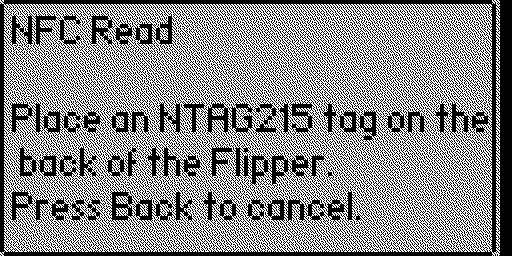
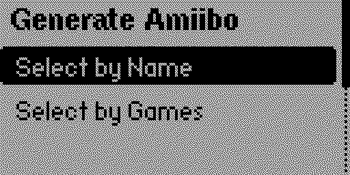
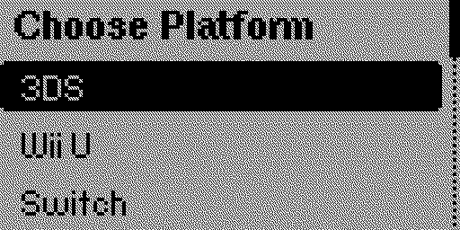
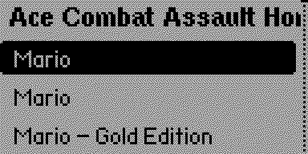
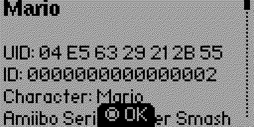
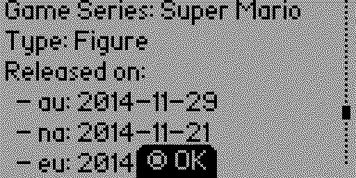
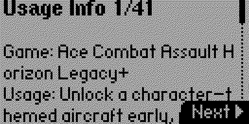
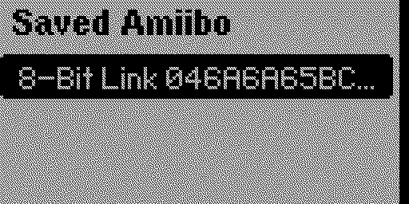

# Flippper Amiibo Toolkit

An Amiibo toolkit app for Flipper Zero.

This project is usable but still in development. Ensure you back up all important data and avoid using it with another experimental setup, like Amiibo Link writing, to prevent damage or data loss.

## Features

Designed as a general-purpose Amiibo toolkit for Flipper Zero, this app aims to provide the following features:

- **Reading Amiibo NFC tags**: Read data from physical Amiibo NFC tags and store it on the Flipper Zero.
- **Reading Amiibo data files**: Load Amiibo data files (in Flipper Zero's `.nfc` format) from the Flipper Zero's storage.
- **Displaying Amiibo information**: Show detailed information about the Amiibo, including character name, series, type, usage, and other metadata. This information is sourced from the AmiiboAPI (https://amiiboapi.com/).
- **Emulating Amiibo NFC tags**: Emulate the loaded Amiibo data, allowing the Flipper Zero to function as the corresponding Amiibo NFC tag.
- **Writing Amiibo data to NFC tags**: Write currently loaded Amiibo data to blank NTAG 215 tags compatible with Amiibo.
- **Generating Amiibo data**: Create a synthetic Amiibo data structure based on selected character.  The result would be a blank Amiibo data file that can be written to a blank NTAG 215 tag.
- **Randomising the unique identifier (UID)**: Modify the UID of the loaded Amiibo data to a random valid value, allowing one tag to be used as multiple different Amiibo.

And other combinations of the above features.

## Installation

This app is not yet available in the official Flipper Zero app store. Instead, you can install it manually by following these steps:

- Download the latest release from the [Releases](https://github.com/Firefox2100/flipper-amiibo-toolkit/releases) page.
- Copy the `ami_tool.fap` file to the NFC apps directory on your Flipper Zero's storage (usually located at `/apps/NFC/` in SD card).
- Restart your Flipper Zero to load the new app.

## Usage

To use the generation and UID randomisation features, you will need to have a `key_retail.bin` file available in the app data directory (`/apps_data/ami_tool`). This file contains the necessary cryptographic keys to encrypt/decrypt and sign Amiibo data. It is legally Nintendo's intellectual property, and cannot be distributed with this project. You will need to obtain it yourself, for example by dumping it from a console you own that supports Amiibo functionality, or by finding it from other sources. We will not provide instructions on how to obtain this file, as doing so may violate Nintendo's terms of service or local laws.

Following are some screenshots of the app in action, all the steps of usage are guided within the app itself.

**Main Menu**

**Read Amiibo Tag**

**Generate Amiibo Data**

**Select Which Platform to Generate For**

**Select Game Series**

**Select Character**

**Amiibo Information Display**

**More Amiibo Information Display**

**Emulate Amiibo Tag**

**Usage Info Display**

**View Saved Amiibo Files**

## Acknowledgments

- Thanks to the Flipper Zero community and developers for their continuous support and inspiration.
- The data used in this project comes from AmiiboAPI (https://amiiboapi.com/).
- The algorighms and methods for Amiibo data manipulation are based on research and contributions from various online communities dedicated to Amiibo reverse engineering. Including but not limited to:
  * [Reverse Engineering Nintendo Amiibo (NFC Toy)](https://kevinbrewster.github.io/Amiibo-Reverse-Engineering/), containing a very detailed analysis of the Amiibo data structure.
  * [amiitool](https://github.com/socram8888/amiitool), a command-line tool for manipulating Amiibo data.
  * [weebo](https://github.com/bettse/weebo), another flipper zero amiibo tool, which uses amiitool, confirming (for me personally) that the flipper zero can handle the cryptography involved in Amiibo data manipulation.

## License and Disclaimer

This project and its source code is licensed under the GNU General Public License v3.0 (GPL-3.0). See the [LICENSE](LICENSE) file for details. By using this project, you agree to comply with the terms of the GPL-3.0 license.

The data files used in this project are sourced from AmiiboAPI (https://amiiboapi.com/), which is licensed under the [MIT License](https://github.com/N3evin/AmiiboAPI/blob/master/LICENSE). A copy of it is included in the files directory for inclusion in the release package.

This project is not affiliated with or endorsed by Nintendo, AmiiboAPI, or any other tools or libraries used or mentioned herein. The developers of this project do not encourage or condone the use of this project for any illegal activities, including but not limited to copyright infringement or unauthorized duplication of Amiibo data. This project is intended for educational, research, and personal use only. Users are responsible for ensuring that their use of this project complies with all applicable laws and regulations.

In some jurisdictions, the use of radio equipment like the Flipper Zero may be subject to specific regulations. Users are responsible for ensuring that their use of the Flipper Zero and this project complies with all applicable laws and regulations in their jurisdiction.
