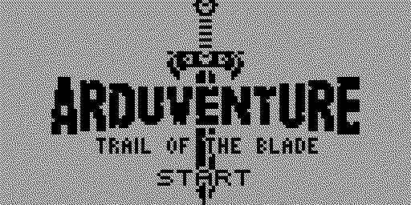
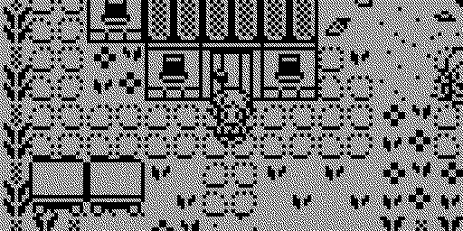
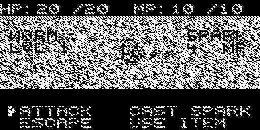
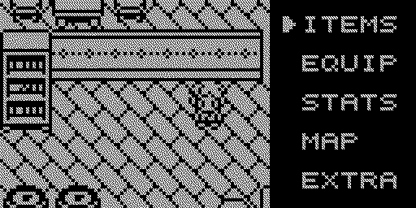
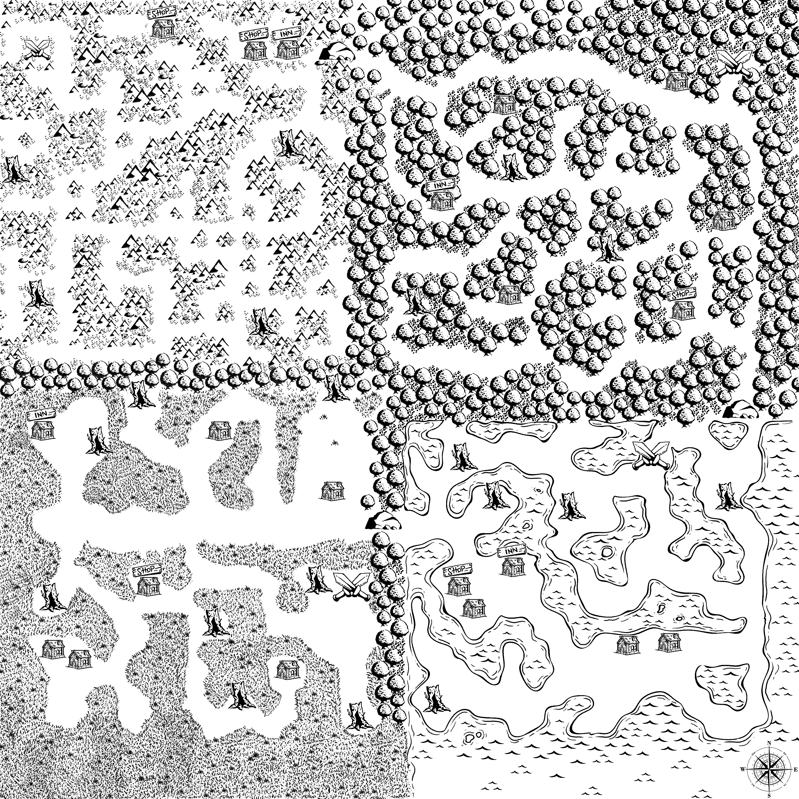

# ARDUVENTURE

This project is a [port](https://github.com/apfxtech/FlipperArduventure.git) of the original [Mystic Balloon](https://github.com/Team-ARG-Museum/ID-46-Arduventure.git) project. The main goal of this fork is to port the game from the Arduboy console to **Flipper Zero**.

# Screenshots

Arduventure : http://www.team-arg.org/ardu-manual.html  
**Download latest Arduboy version and source :** https://github.com/TEAMarg/ID-46-Arduventure/releases/latest  
MADE by TEAM a.r.g. : http://www.team-arg.org/more-about.html

2017 - 2018 JO3RI GANTOIS - GAVIN ATKIN - OLIVIER HUARD - SIEGFRIED CROES 

Additional Level Design - Jace Atkin
Game License: MIT : https://opensource.org/licenses/MIT
Story, characters, sprites, tiles, design and art: copyrighted to TEAM a.r.g. NOT under MIT !

## Game map
