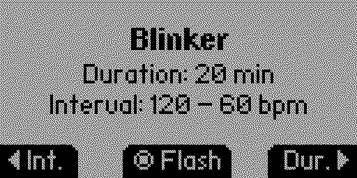
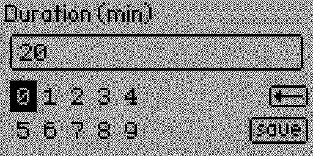
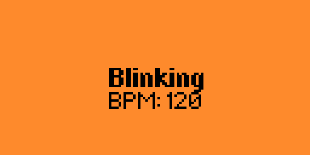

# Blinker

A Flipper Zero application that blinks LEDs with a decreasing frequency over time. Unlike traditional Pomodoro timers, it provides visual feedback through LED blinks that gradually slow down.

This project was inspired by a discussion in this [Hacker News thread](https://news.ycombinator.com/item?id=38274782).

## Main Screen

## Configuration

The following parameters can be configured:
* `Max interval`: Starting cadence in beats per minute (BPM)
* `Min interval`: Target ending cadence in BPM
* `Duration`: Time period (in minutes) over which the cadence gradually changes from max to min

## Operation

When running, all three LEDs (red, green, and blue) blink simultaneously, creating a white flash. The display shows the current BPM, which gradually decreases from max to min interval over the set duration.

## Installation
1. Clone this repository
2. Install [ufbt](https://github.com/flipperdevices/flipperzero-ufbt)
3. Run `ufbt` to build or `ufbt launch` to build and launch on your Flipper - this will install the app on your Flipper

## Development
For testing purposes, you can use [moodlight.org](https://www.moodlight.org/#0) to visually verify the blinking frequency matches your configured BPM.