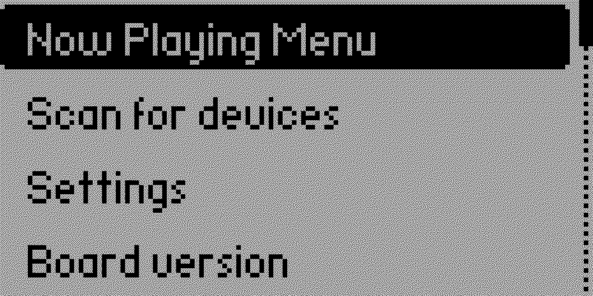
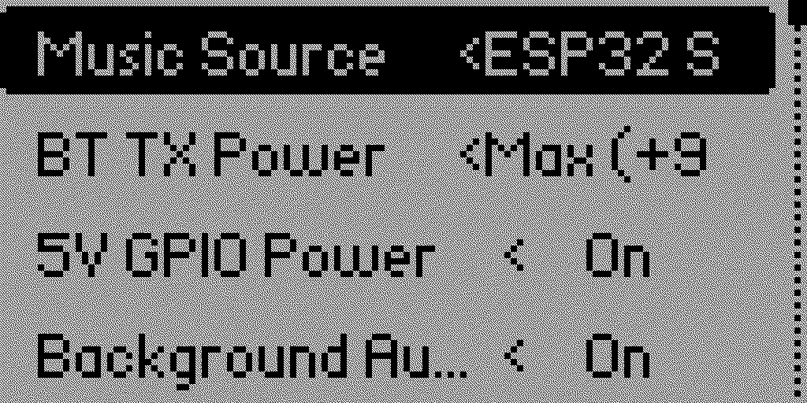
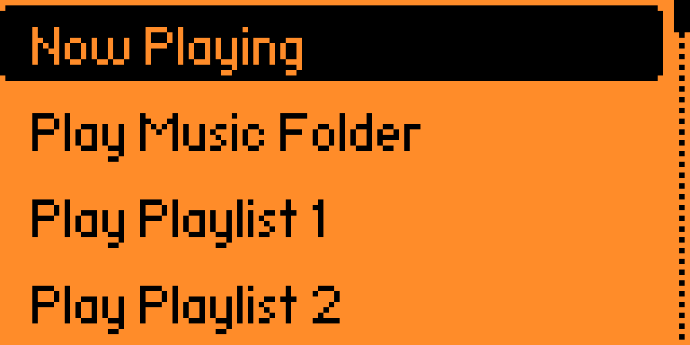
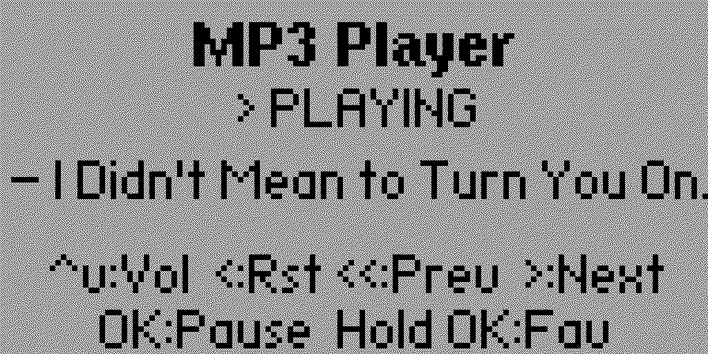

# BT Audio - Bluetooth Audio Player for Flipper Zero

A Flipper Zero application that plays MP3 audio (Bluetooth A2DP audio streaming) by controlling ESP32-based boards over UART. The ESP32 acts as an **A2DP source** by default, streaming audio TO Bluetooth headphones and speakers.

## License

This project is licensed under the **MIT License** - see the [LICENSE](LICENSE) file for details.

## Documentation map
- **Quick start + flashing from Flipper**: This README
- **Step-by-step flashing reference**: [FLASHING_GUIDE.md](FLASHING_GUIDE.md)
- **ESP32 firmware build details**: [esp32_firmware/README.md](esp32_firmware/README.md)
- **Developer notes (implementation, testing, release artifacts)**: [`developerNotes/`](developerNotes/)

## Important: ESP32 Firmware Required

**This app requires an ESP32 board with compatible bt_audio firmware (included in repo).** On first launch, the app will attempt to detect if the ESP32 is present and running the correct firmware. If the check doesn't see your board, you can still proceed to scanning—follow the setup guide below if connections fail.

### Firmware Detection

The app automatically checks for ESP32 presence by sending a `VERSION` command when you open it. The ESP32 firmware should respond with `BT_AUDIO_READY` or `ESP32` to confirm it's running the correct firmware. This check is best-effort and no longer blocks scanning or connection attempts. You can also choose **Board version** from the main menu to trigger the check manually and view the response text.

## Quick Start (flash + run) using Mayhem Board

1. **Flash the ESP32 firmware**
   - CLI: run `./flash_bt_audio.sh` (Linux/macOS) or `flash_bt_audio.bat` (Windows) from `esp32_firmware/`.
   - (Possibly in the future DOES NOT WORK NOW): use the Web Installer at [flipper.ried.cl/webinstaller_1.4.4](https://flipper.ried.cl/webinstaller_1.4.4/). Chrome/Edge will show an **Install** button; if it is missing, your browser does not support Web Serial. *CURRENTLY ONLY GOOD FOR PUTTING MARAUDER BACK ON, AND NOT bt_audio FIRMWARE*
2. **Put ESP32-CAM into bootloader**: jumper **IO0 → GND** and tap **RESET**. On camera-style boards, you can also momentarily short the two gold pads above the camera while holding IO0 and GND (as shown in the linked video).
3. **Wire to Flipper GPIO**: TX (pin 13) → ESP32 RX, RX (pin 14) → ESP32 TX, GND → GND. Disconnect ESP32 USB power before plugging into Flipper.
4. **Launch the app**: Apps → GPIO → BT Audio → Scan → Connect → Play Test Tone.

## Compatible Hardware

This app works with any ESP32-based board connected to Flipper Zero's UART, including:
- **Mayhem Board** (100% Supported) - Multi-board with ESP32, Camera, onboard SD Card, NRF24, CC1101 & more. *RECOMMENDED*
- **ESP32-CAM** (tested via Mayhem board) - ESP32 with camera and built-in SD card slot
- **Generic ESP32** (Untested) - Any ESP32/ESP32-C3 with UART connection
- **WiFi Dev Board** (untested, only has BLE, WIP) - Official Flipper Zero WiFi development board (ESP32-S2-WROVER) - No A2DP support due to BLE-only

The app uses a simple line-based UART protocol, so any ESP32 board that implements the protocol (see below) will work. If you can use the WiFi Marauder app with your board, this app should work too.

### Multi-Board Compatibility (Mayhem Board, etc.)

**Important:** Flashing the BT Audio firmware to the ESP32 **only affects the ESP32 chip itself**. Other radio modules on multi-boards remain fully functional:

| Module | Status When ESP32 Has BT Audio Firmware |
|--------|----------------------------------------|
| **nRF24L01** | ✅ **Works** - Connects directly to Flipper GPIO, independent of ESP32 |
| **CC1101** | ✅ **Works** - Connects directly to Flipper GPIO, independent of ESP32 |
| **ESP32-CAM Camera** | ⚠️ **Not used by BT Audio** - Camera module is independent; can be used by other ESP32 firmware |

**Why this works:** On multi-boards like Mayhem, the ESP32, nRF24, and CC1101 are separate chips that each have their own connections to the Flipper. The ESP32 handles WiFi/Bluetooth tasks, while the nRF24 and CC1101 connect through different GPIO pins. Flashing the ESP32 doesn't change anything about the other modules.

**To switch between firmwares:** You can flash different ESP32 firmware (BT Audio, Marauder, etc.) at any time using the flash scripts or web installer. The nRF24 and CC1101 will continue working regardless of which ESP32 firmware is installed.

### ESP32 Firmware Name

The ESP32 firmware for this app is called **"BT Audio Firmware"** (or `bt_audio` for short). It implements the BT Audio UART protocol for A2DP audio streaming.

## Features

- **A2DP Source Mode** (Default): Stream audio TO Bluetooth headphones/speakers
- **Connect to Any Bluetooth Audio Device**: Works with headphones, speakers, laptops, desktop PCs with Bluetooth
- Optional A2DP Sink Mode: Receive audio FROM phones/PCs (see ESP32 firmware docs)
- Scan for Bluetooth devices via ESP32
- Connect to Bluetooth headphones/speakers
- **MP3 Playback from ESP32 SD card** - Plays MP3 files from `/music` folder (case-insensitive)
  - **M3U Playlist Support**: Use `/music/playlist1.m3u` or `/music/playlist2.m3u` to control playback order
  - **Play Music Folder**: Plays base files first (alphabetically), then folders (alphabetically)
- **Improved Now Playing Controls**:
  - Up/Down: Volume control (via AVRCP)
  - Left: Restart track (double-tap within 2s: previous track)
  - Right: Next track
  - OK: Pause/Resume playback
- Play test tones through connected device:
  - 440Hz sine wave (2 seconds)
  - "Mary Had a Little Lamb" jingle (~3.5 seconds)
- **Configurable Bluetooth TX Power**: Adjust transmit power for better range through obstacles
- **Automatic 5V GPIO Power**: Auto-enables 5V for ESP32 power (configurable in settings)
- **Custom Bluetooth Device Name**: Choose how your device appears when connecting to speakers/laptops (works on some devices, not all. WIP)
- Quick reconnect to last paired device from Settings
- Settings menu with multiple options
- Configuration persistence across app restarts
- Simple UI with scene navigation
- **Keep Backlight On**: Option to prevent screen timeout while actively playing (auto-disables on pause/stop/disconnect)
- **Configurable Initial Volume**: Set starting volume (default 75%) to prevent loud playback
- **3-Band Equalizer**: Adjust Bass, Mid, and Treble levels (-10 to +10 dB)
- **Background Audio**: Keep music playing while using other Flipper apps
- **WiFi Streaming (DISABLED)**: ESP32 BT/WiFi coexistence limitation - see [WiFi Streaming](#wifi-streaming-disabled) section

## MP3 Playback (ESP32 SD Card)

The recommended setup for audio playback uses the **ESP32's onboard SD card slot** (like ESP32-CAM) for better bandwidth and simpler implementation. While the flipper SD card is used for saving settings, using it for music is a *WIP* and currently only good for 128kbps or lower mp3s. Also due to asyncrhonous behavior, you will not be able to use the app (navigate windows etc) while music plays from the flipper SD card.

### Setup
1. Insert an SD card into your ESP32 (ESP32-CAM or ESP32 with SD card module)
2. Format the SD card as FAT32
3. Create a `/music` folder on the SD card
4. Copy MP3 files to the `/music` folder
5. (Optional) Create `/music/playlist1.m3u` to control playback order for Playlist 1
6. (Optional) Create `/music/playlist2.m3u` to control playback order for Playlist 2
7. Connect to a Bluetooth speaker/headphones via the app
8. Select "Play Music Folder", "Play Playlist 1", or "Play Playlist 2" from the control menu

### M3U Playlist Support

Create playlist files in the `/music` folder to control playback order:
- **playlist1.m3u** - Used by "Play Playlist 1" menu option
- **playlist2.m3u** - Used by "Play Playlist 2" menu option

Example `playlist1.m3u`:
```
# Example playlist1.m3u
song1.mp3
song2.mp3
subfolder/song3.mp3
# Comments start with #
favorite_song.mp3
```

- **One filename per line** (relative to `/music/` folder)
- Lines starting with `#` are comments (ignored)
- Empty lines are ignored
- Both relative paths (`song.mp3`) and full paths (`/music/song.mp3`) are supported

### Play Music Folder Behavior

When you select **"Play Music Folder"**, files are played in this order:
1. **Base MP3 files first** - Files directly in `/music` folder, sorted alphabetically
2. **Then subdirectory files** - Files from each subfolder, sorted alphabetically within each folder, folders processed in alphabetical order

This allows you to have individual songs play first, followed by albums or mix folders.

### Filename Best Practices

Filenames with spaces and numbers work fine! However, for maximum compatibility:

✅ **WORKS FINE:**
- Spaces in filenames: `my song.mp3`
- Numbers: `01 Artist - Title.mp3`
- Hyphens and underscores: `artist-title.mp3`, `my_song.mp3`

⚠️ **BEST AVOIDED:**
- Special characters: `& # % $ ! @ * ( ) [ ] { }`
- Very long filenames (>64 characters)
- Non-ASCII characters (accents, non-Latin scripts)

**Note:** The `/music` folder name is case-insensitive - `/music`, `/Music`, and `/MUSIC` all work.

### Troubleshooting MP3 Playback
- **SD Card not initialized**: 
  - ESP32-CAM: Ensure SD card is properly inserted and formatted as FAT32
  - Generic ESP32: Check SPI wiring (CS=GPIO5, SCK=GPIO18, MISO=GPIO19, MOSI=GPIO23)
  - The firmware will automatically retry SD initialization when PLAY_MP3 is called
- **File naming**: Follow filename best practices above
- **File format**: Use standard MP3 files (44.1kHz, 128-320kbps recommended)
- **SD Card**: Must be FAT32 format (exFAT and NTFS are not supported)
- **Playlist not working**: Check that `playlist1.m3u` or `playlist2.m3u` is in `/music/` folder and filenames match exactly
- **Track navigation issues**: Use Left/Right buttons to navigate, previous/next will wrap around
- **Check logs**: ESP32 outputs debug info via serial (115200 baud)

### Why ESP32 SD Card?
- **Better Bandwidth**: Direct SD access vs. UART bottleneck
- **Lower Latency**: No serial communication delays
- **Simpler**: ESP32 handles everything locally
- **Recommended Hardware**: ESP32-CAM (has built-in SD slot)
- **Dual Mode Support**: Works with both SD_MMC (ESP32-CAM) and SPI SD modules

### Supported Formats
- MP3 files (44.1kHz, 128-320kbps, stereo or mono)
- ID3 tags are automatically skipped
- Sample rates: 44.1kHz recommended (32kHz and 48kHz also work)

### Experimental: Flipper SD Support
Flipper SD card playback is marked as "Flipper SD (WIP)" in settings and is **experimental**:
- Limited by UART bandwidth (~115200 baud = ~11KB/s)
- Marginal for 128kbps MP3 (requires 16KB/s)
- May result in audio quality issues or stuttering
- **Recommendation**: Use ESP32 SD card for best results

## WiFi Streaming (DISABLED)

⚠️ **WiFi streaming is currently DISABLED due to ESP32 hardware limitations.**

The ESP32 (original) cannot reliably run WiFi and Bluetooth A2DP (Classic Bluetooth audio) simultaneously because they share the same 2.4GHz radio hardware. When Bluetooth A2DP is actively streaming audio, WiFi initialization consistently fails with errors like `esp_wifi_init 257` and `STA enable failed!`.

This is a fundamental hardware limitation, not a software bug. The code remains in the repository for future ESP32-S3 support (whenever I purchase a ESP32-S3 & throw it on a spare Mayhem devboard to develop on) but the menu option is hidden.

### Alternatives for Streaming Audio

1. **Use SD Card Playback**: Copy MP3 files to the ESP32's SD card for reliable offline playback
2. **Use ESP32-S3**: Has improved WiFi/BT coexistence hardware (future support planned)
3. **Download before playing**: Use a computer to download streams, then transfer to SD card

### Technical Details

The original WiFi streaming implementation includes:
- WiFi connection management with retries
- HTTP/HTTPS stream fetching
- Pre-buffering to prevent audio dropouts
- MP3 decoding from network stream

See [WIFI_STREAMING_IMPLEMENTATION.md](WIFI_STREAMING_IMPLEMENTATION.md) for full technical details.

### WiFi Config (For Future Use)

If you want to test WiFi streaming when BT is disconnected, or prepare for future ESP32-S3 support:

1. Create `/ext/apps_data/bt_audio/wifi.config`:
   ```
   wifi_enabled=1
   ssid=YourWiFiNetworkName
   password=YourWiFiPassword
   stream_url=http://ice1.somafm.com/groovesalad-128-mp3
   ```

2. The settings will be saved but the "Stream Audio (WiFi)" menu option will not appear.
- Reduce distance between ESP32 and Bluetooth headphones
- **ESP32 Coexistence**: This is a known limitation of running WiFi+Bluetooth simultaneously on ESP32. For stable audio, consider using SD card-based MP3 playback instead

### Experimental: Flipper SD Support
Flipper SD card playback is marked as "Flipper SD (WIP)" in settings and is **experimental**:
- Limited by UART bandwidth (~115200 baud = ~11KB/s)
- Marginal for 128kbps MP3 (requires 16KB/s)
- May result in audio quality issues or stuttering
- **Recommendation**: Use ESP32 SD card for best results

## App Screenshots

<!-- TODO: Add menu screenshots using qFlipper -->

### Main Menu

*Main menu showing Scan, Settings, Board version, Diagnostics, and About options*

### Settings Menu

*Settings menu with Audio Source SD selector (Flipper SD / ESP32 SD)*

### Device List

*List of discovered Bluetooth devices*

### Control Menu (Connected)

*Control menu after connecting: Now Playing, Play Music Folder, Play Playlist 1, Play Playlist2, Play Favorites (#), Play Test Tone, Play Jingle, Stop Playback, Reconnect, Disconnect*

### Now Playing Scene

*Now playing screen where you can: Volume Up/Down (Up and down arrows), Pause (center button), Favorite (hold center button), Restart Track (left arrow once), Previous Track (left arrow twice), Next Track (right arrow once).

### Playing Test Tone

*Test tone playback screen (returns to menu after ~3 seconds)*

## Settings & Configuration

The app stores settings in `/ext/apps_data/bt_audio/config.txt` on the Flipper's SD card.

**Important:** The config directory and file are **created automatically** when needed:
- On first app launch, default settings are used (no file required)
- The directory `/ext/apps_data/bt_audio/` is created automatically when saving settings
- The config file is created/updated when you exit the app or leave the Settings menu

### Available Settings

**Music Source:**
- **ESP32 SD** (default): Play MP3s from ESP32's SD card (recommended)
- **Flipper SD (WIP)**: Experimental streaming from Flipper's SD card

**BT TX Power:**
- **Max (+9dBm)** (default): Maximum transmit power for best range
- **High (+6dBm)**: High power, good range
- **Medium (0dBm)**: Medium power, moderate range
- **Low (-12dBm)**: Low power, short range

Use higher power settings to improve audio quality through barriers (walls, doors, around metal etc.). Note: Higher power = more battery drain.

**5V GPIO Power:**
- **On** (default): Automatically enable 5V on GPIO pin 1 for ESP32 power
- **Off**: Manual control (use GPIO app or external power)

If automatic 5V doesn't work for your setup, try:
1. Manually enable via Flipper's GPIO app → "5V on GPIO" → Enable
2. Or use external 5V power supply for the ESP32

**Background Audio:**
- **Off** (default): Audio stops when app exits
- **On**: Audio continues playing when you exit the app

When Background Audio is enabled:
- You can use other Flipper apps while music plays
- The ESP32 continues streaming audio independently
- 5V GPIO stays enabled (higher battery usage)
- UART pins (13/14) remain in use
- Re-opening the app detects if audio is still playing
- Note: some apps may disconnect the GPIO connection causing audio to stop and the BT connection to drop. Example: when closing the sub-ghz playlist app

**Backlight:**
- **Auto (Timeout)** (default): Screen dims after normal timeout
- **Always On**: Keeps backlight on while app is running - useful for seeing current track without pressing buttons

**Initial Volume:**
- Set the starting volume for MP3 playback (0% - 100%)
- **Default: 75%** - prevents ear-blasting volume on first play
- Volume is set automatically when you start playing MP3s

**Equalizer (EQ) Settings:**
- **EQ Bass**: Adjust bass frequencies at ~200Hz (-10 dB to +10 dB)
- **EQ Mid**: Adjust mid frequencies at ~1kHz (-10 dB to +10 dB)
- **EQ Treble**: Adjust treble frequencies at ~4kHz (-10 dB to +10 dB)
- Default: 0 dB (flat/neutral) for all bands
- EQ is applied in real-time using biquad IIR filters during MP3 playback
- Changes take effect immediately when adjusted in settings

**BT Device Name:**
- Choose how your Flipper appears when connecting to Bluetooth devices
- Options: FlipperAudio (default), Audio Stream, BT Audio, Flipper Zero, Media Player, Music Box, My Speaker, Party Mode
- Useful when connecting to laptops/PCs to identify your device
- Note: Name change requires ESP32 restart to take effect
- Note: Still WIP as the name change isn't read by all (if any) devices.
- Note: When the name isn't changed, the name comes up as "ESP32_A2DP_SRC"

**Last Device:**
- Shows the MAC address of the last successfully connected device
- Click to quickly reconnect without scanning

### Config File Format
```
sd_source=1
tx_power=3
enable_5v=1
background=0
backlight=0
init_vol=96
eq_bass=0
eq_mid=0
eq_treble=0
last_mac=AA:BB:CC:DD:EE:FF
bt_name=FlipperAudio
```

- `sd_source`: Audio source (0 = Flipper SD, 1 = ESP32 SD)
- `tx_power`: Bluetooth transmit power (0=Low, 1=Medium, 2=High, 3=Max)
- `enable_5v`: Auto-enable 5V GPIO (0 = Off, 1 = On)
- `background`: Background audio mode (0 = Off, 1 = On)
- `backlight`: Keep backlight on (0 = Auto timeout, 1 = Always on)
- `init_vol`: Initial volume level (0-127, default 96 = ~75%)
- `eq_bass`: Bass EQ adjustment (-10 to +10 dB)
- `eq_mid`: Mid EQ adjustment (-10 to +10 dB)
- `eq_treble`: Treble EQ adjustment (-10 to +10 dB)
- `last_mac`: Last successfully connected device MAC address (for quick reconnect)
- `bt_name`: Bluetooth device name (shown when connecting to speakers/laptops)

## Now Playing Controls

When playing MP3 files from SD card, the Now Playing screen shows the current track and provides intuitive controls:

### Button Controls

**Navigation:**
- **Left Button**: Restart current track (press twice within 2 seconds: go to previous track)
- **Right Button**: Next track (wraps to first track if at end)

**Volume:**
- **Up Button**: Volume up (increases via AVRCP)
- **Down Button**: Volume down (decreases via AVRCP)

**Playback:**
- **OK Button**: Pause/Resume playback (toggles)
- **Hold OK**: Toggle favorite for current track

**Exit:**
- **Back Button**: Return to menu (audio keeps playing)
- **Stop Playback** (from menu): Stop audio completely

### On-Screen Display

The player shows:
- Current track filename (scrolls if too long)
- Playback status (> PLAYING or || PAUSED)
- Control hints: `^v:Vol  </>:Prev/Next` and `OK:Pause  BACK:Menu`

### Track Navigation Notes

- **Play Playlist 1/2**: Tracks play in order specified in `playlist1.m3u` or `playlist2.m3u`
- **Play Music Folder**: Base files first (alphabetically), then subfolders (alphabetically)
- **Smart Previous**: First Left press restarts current track; second press within 2 seconds goes to previous track (like most music players)
- Pressing Next on last track goes to first track
- Track order is consistent and sequential

## Important: A2DP vs BLE

This app uses **Bluetooth Classic A2DP** for audio streaming:
- **A2DP** (Advanced Audio Distribution Profile) - Used for high-quality audio streaming
- **BLE** (Bluetooth Low Energy) - Does NOT support audio streaming

**Why this matters:**
- BLE is designed for low-power data transfer (sensors, fitness trackers)
- A2DP is specifically for audio and requires Bluetooth Classic
- Your ESP32 must support Bluetooth Classic (ESP32, ESP32-C3, ESP32-S3)
- ESP32-S2 only has BLE and **cannot** stream audio

## UART Protocol

The app communicates with the ESP32 using a line-based protocol at 115200 baud:

### Commands (Flipper → ESP32):
- `VERSION\n` - Request firmware version/presence check
- `STATUS\n` - Query current playback state (for background mode re-entry)
- `SCAN\n` - Start scanning for Bluetooth devices
- `CONNECT <MAC>\n` - Connect to device with specified MAC address
- `PLAY\n` - Play test tone (440Hz, 2 seconds)
- `PLAY_JINGLE\n` - Play "Mary Had a Little Lamb" jingle (~3.5 seconds)
- `PLAY_MP3\n` - Play all MP3 files from ESP32 SD card /music folder
- `PAUSE\n` - Pause current playback
- `RESUME\n` - Resume paused playback
- `VOL_UP\n` - Increase volume by one step (~6%)
- `VOL_DOWN\n` - Decrease volume by one step (~6%)
- `SET_INIT_VOL:<0-127>\n` - Set initial volume for first playback
- `EQ_BASS:<-10 to +10>\n` - Set bass EQ gain in dB
- `EQ_MID:<-10 to +10>\n` - Set mid EQ gain in dB
- `EQ_TREBLE:<-10 to +10>\n` - Set treble EQ gain in dB
- `NEXT\n` - Skip to next track
- `PREV\n` - Go to previous track
- `RESTART\n` - Restart current track from beginning
- `SEEK_FWD\n` - Seek forward ~5 seconds
- `SEEK_BACK\n` - Seek backward ~5 seconds
- `STOP\n` - Stop current playback
- `TX_POWER:<LEVEL>\n` - Set Bluetooth transmit power (LOW, MEDIUM, HIGH, MAX)
- `DISCONNECT\n` - Disconnect from current device
- `DEBUG\n` - Run diagnostics and get troubleshooting info
- `WIFI_CONNECT:<ssid>:<password>\n` - Connect ESP32 to WiFi network
- `WIFI_STATUS\n` - Check WiFi connection status
- `WIFI_DISCONNECT\n` - Disconnect from WiFi
- `STREAM_URL:<url>\n` - Set stream URL for WiFi streaming
- `STREAM_START\n` - Start streaming audio from WiFi URL
- `STREAM_STOP\n` - Stop WiFi streaming

### Responses (ESP32 → Flipper):
- `BT_AUDIO_READY\n` or `ESP32\n` - Firmware present and ready (response to VERSION)
- `STATUS_CONNECTED:YES/NO\n` - Connection state (response to STATUS)
- `STATUS_PLAYING:YES/NO\n` - Playback state (response to STATUS)
- `STATUS_PAUSED:YES/NO\n` - Pause state (response to STATUS)
- `STATUS_FILE:<filename>\n` - Current file (response to STATUS, if playing)
- `STATUS_COMPLETE\n` - End of STATUS response
- `DEVICE:<MAC>,<Name>\n` - Found device during scan
- `SCAN_COMPLETE\n` - Scanning finished
- `CONNECTED\n` - Successfully connected
- `FAILED\n` - Connection failed
- `PLAYING\n` - Started playing audio
- `PLAYING_FILE:<filename>\n` - Currently playing specific file
- `INIT_VOLUME_APPLIED:<level>\n` - Initial volume was set
- `PLAY_COMPLETE\n` - Playback finished
- `STOPPED\n` - Playback stopped
- `VOLUME:<level>\n` - Current volume level (0-127)
- `INIT_VOL_SET:<level>\n` - Initial volume setting confirmed
- `EQ_BASS_SET:<level>\n` - Bass EQ confirmed
- `EQ_MID_SET:<level>\n` - Mid EQ confirmed
- `EQ_TREBLE_SET:<level>\n` - Treble EQ confirmed
- `TX_POWER:SET:<LEVEL>\n` - TX power level set confirmation
- `SD_ERROR\n` - SD card error
- `NO_FILES\n` - No MP3 files found in /music
- `DIAG_COMPLETE\n` - Diagnostic output finished
- `WIFI_CONNECTED:<IP>\n` - WiFi connected successfully with IP address
- `WIFI_FAILED\n` - WiFi connection failed
- `WIFI_DISCONNECTED\n` - WiFi disconnected
- `WIFI_STATUS:CONNECTED:<IP>\n` - WiFi status query response (connected)
- `WIFI_STATUS:DISCONNECTED\n` - WiFi status query response (disconnected)
- `STREAM_URL_SET:<url>\n` - Stream URL confirmed
- `STREAM_STARTED\n` - Stream playback started
- `STREAM_STOPPED\n` - Stream playback stopped
- `STREAM_ERROR:<code>\n` - Stream error with HTTP error code

## Troubleshooting

### Bluetooth only works with USB connected?

**The app now automatically enables 5V on GPIO!** Make sure your ESP32 VIN is wired to Flipper pin 1 (5V). See the [Power Requirements](#️-power-requirements-important) section for wiring details.

If you still have issues:
1. Verify ESP32 VIN is connected to Flipper 5V (pin 1)
2. Try the manual workaround: GPIO app → "5V on GPIO" → Enable, then open BT Audio
3. Or connect Flipper to any USB power source

### "Scan timed out - No devices" or "No ESP32 Response"

1. **Check POWER first**: Ensure ESP32 VIN is wired to Flipper 5V (pin 1). The app enables 5V automatically.

2. **Run Diagnostics**: Select "Diagnostics" from the main menu to check:
   - UART communication status
   - ESP32 Bluetooth status
   - Connection state
   - Detailed troubleshooting hints

3. **Check wiring**: 
   - Flipper 5V (pin 1) → ESP32 VIN (**required for power!**)
   - Flipper TX (pin 13) → ESP32 RX
   - Flipper RX (pin 14) → ESP32 TX  
   - Common GND connection

4. **Verify ESP32 firmware**:
   - Use "Board version" to confirm ESP32 responds
   - Re-flash firmware if needed using the flash scripts

5. **Bluetooth device tips**:
   - Put headphones/speakers in **pairing mode** (usually hold power button)
   - Move devices closer together (< 5 meters)
   - Some devices require manual pairing first via phone
   - Try restarting the ESP32 (press reset button)

6. **ESP32-CAM specific**:
   - Remove IO0-GND jumper after flashing
   - Press reset button after removing jumper
   - The camera module is not used; it's the ESP32 chip we need

### "No ESP32 Response" specifically

This means the Flipper isn't receiving any UART data from the ESP32:
- **Check power**: Is the ESP32 LED lit? Connect Flipper to USB!
- Check firmware: Was it flashed successfully?
- Check TX/RX: Are they swapped? Try swapping the wires
- Check baud rate: Should be 115200

## ⚠️ Power Requirements (IMPORTANT!)

**The ESP32 requires significantly more power than the Flipper Zero battery alone can provide!**

### Automatic 5V GPIO Power

**Good news!** The BT Audio app **automatically enables 5V on GPIO pin 1** when it starts. This is the same as manually selecting "5V on GPIO" in the Flipper's GPIO app.

**For this to work, your ESP32 must be wired to receive power from pin 1:**
```
Flipper Zero          ESP32
-----------          ------
5V (pin 1)   ──────> VIN (or 5V pin)
TX (pin 13)  ──────> RX
RX (pin 14)  <────── TX
GND          ──────> GND
```

When the app exits, 5V is automatically disabled to conserve power.

### Why 5V is Required

ESP32 Bluetooth operations (scanning, connecting, streaming audio) require **100-250mA** of current. The Flipper's 3.3V pin cannot supply this much current reliably.

**Symptoms of insufficient power:**
- Bluetooth scan finds no devices
- Connection drops immediately
- Playback stops unexpectedly
- ESP32 resets randomly during BT operations

### Power Options

| Option | Setup | Notes |
|--------|-------|-------|
| **Automatic (Recommended)** | Wire ESP32 VIN to Flipper 5V (pin 1) | App enables 5V automatically |
| **USB Power Bank** | Connect Flipper to power bank | Works with any wiring |
| **Separate ESP32 Power** | Use external 5V supply to ESP32 | Most portable option |

### If Automatic 5V Doesn't Work

If you still have power issues after wiring to pin 1:
1. **Check your wiring** - Ensure ESP32 VIN is connected to Flipper pin 1 (5V)
2. **Manual fallback** - Go to Flipper's GPIO app → "5V on GPIO" → Enable, then open BT Audio
3. **External power** - Use a separate 5V supply for the ESP32

### Quick Test

If you're unsure whether power is the issue:
1. Connect Flipper to any USB power source (computer, phone charger, power bank)
2. Try scanning - if it works, power was the issue
3. For portable use, add a small 5V battery pack to power the ESP32 directly

## Hardware Setup

### Mayhem Board
- Connect Mayhem ESP32 UART to Flipper Zero GPIO pins:
  - TX (pin 13) → Flipper RX (pin 14)
  - RX (pin 14) → Flipper TX (pin 13)
  - GND → GND
- **Power**: Mayhem boards typically have their own power management; check your board's documentation

### WiFi Dev Board
- The official Flipper Zero WiFi Dev Board connects via the GPIO header
- UART is automatically routed through pins 13/14 when the board is attached
- No additional wiring needed - just plug it in
- **Power**: Dev board has built-in power regulation from Flipper's 5V line

### Generic ESP32 Modules
- Connect ESP32 UART to Flipper Zero GPIO pins:
  - Flipper TX (pin 13) → ESP32 RX
  - Flipper RX (pin 14) → ESP32 TX
  - Flipper GND → ESP32 GND
- **Power**: Use external 5V supply OR connect Flipper to USB power

## Flashing from Flipper Zero (USB-UART Bridge)

You can flash the ESP32 directly through Flipper Zero without a separate USB-to-UART adapter:

1. **Enter bootloader on ESP32-CAM**  
   - Jumper **IO0 → GND**, tap **RESET**, and keep IO0 held while connecting.  
   - Alternate method (shown in the [demo video](https://www.youtube.com/watch?v=FATi5LiDsE0)): hold IO0 and GND, then briefly short the two gold pads above the camera module while plugging into Flipper.
2. **Wire to Flipper GPIO**  
   - Flipper TX (pin 13) → ESP32 RX  
   - Flipper RX (pin 14) → ESP32 TX  
   - Flipper GND → ESP32 GND
3. **Open Flipper USB-UART Bridge**  
   Apps → GPIO → **USB-UART Bridge**, then use:
   - USB channel: **0 (CLI)**
   - Baudrate: **115200** (Host). Higher speeds up to 921600 may work, but 115200 is the tested default and matches the scripts.
   - UART pins: **13 / 14**
   - RTS/DTR pins: **none**
   - DE/RE pin: **none**
4. **Flash from your computer/phone**  
   - With Flipper connected over USB, run the `flash_bt_audio` script. The same installer can restore Marauder firmware when you pick the Marauder image (or use the Web Installer at [flipper.ried.cl/webinstaller_1.4.4/](https://flipper.ried.cl/webinstaller_1.4.4/) to flash the Marauder firmware back).
5. **Reset after upload**  
   Press the ESP32 reset button or unplug/replug the module. Unplug the Flipper USB-C cable before testing wireless apps on the board.

Grab the precompiled `bt_audio.fap` from the firmware build or build it yourself with `./fbt fap_bt_audio`.
Flash scripts set the baud rate automatically; keep the Flipper bridge at 115200 unless you explicitly pass a higher baud to your flashing tool.

## Usage

1. **Flash ESP32 firmware** (see ESP32 Firmware section above)
2. **Connect ESP32 to Flipper Zero** (see Hardware Setup below)
3. Launch "BT Audio" from GPIO/ESP32 category
4. Select "Scan for devices"
5. Wait for scan to complete
6. Select a Bluetooth headphone/speaker from the list
7. Wait for connection
8. Select "Play Test Tone" (440Hz) or "Play Jingle" (Mary Had a Little Lamb)

**Quick Reconnect:** After connecting once, go to Settings and click "Saved Devices (#)" and then the first device (labeled "LAST: <device name>") to reconnect without scanning.

**Note:** In source mode (default), the ESP32 streams audio TO headphones. The Flipper triggers the test tone, which plays through your Bluetooth headphones/speakers.

### Firmware Requirements

This repository includes a complete ESP32 firmware implementation in the `esp32_firmware/` directory.

### Features
- **ESP32-A2DP Library**: Vendored fork from https://github.com/FatherDivine/ESP32-A2DP
- **A2DP Sink Mode**: Configured for Bluetooth headphones/speakers (audio receiver mode)
- **SBC Codec**: Default codec with 44.1kHz sample rate
- **I2S Output**: Configurable I2S pins for external DACs or amplifiers
- **Test Tone Generation**: Built-in 440Hz test tone
- **UART Protocol**: Implements the complete protocol for Flipper communication

### Building and Flashing

See the complete build guide in [`esp32_firmware/README.md`](esp32_firmware/README.md).

**Quick Start with PlatformIO:**
```bash
cd applications/external/bt_audio/esp32_firmware
pio run -e esp32dev            # Build for ESP32
pio run -e esp32dev -t upload  # Flash to board
```

### Hardware Support
- ✅ **ESP32 (original)**: Full Bluetooth Classic A2DP support (recommended)
- ✅ **ESP32-C3**: Full Bluetooth Classic A2DP support
- ⚠️ **ESP32-S2**: BLE only - no A2DP support (not recommended for this app)

### Library Integration
The ESP32-A2DP library is vendored in `lib/ESP32-A2DP/` and includes:
- Bluetooth A2DP sink and source implementations
- SBC codec support
- Audio stream handling
- Connection management
- Volume control

## Repository Structure

```
applications/external/bt_audio/
├── bt_audio.c              # Main Flipper app entry point
├── bt_audio.h              # App header and types
├── bt_audio_uart.c         # UART communication layer
├── scenes/                 # UI scenes (scan, connect, control)
├── esp32_firmware/         # ESP32 firmware (PlatformIO project)
│   ├── src/main.cpp        # ESP32 firmware implementation
│   ├── platformio.ini      # Build configuration
│   └── README.md           # ESP32 build and flash guide
├── lib/
│   └── ESP32-A2DP/         # Vendored ESP32-A2DP library
│       ├── BluetoothA2DPSink.h/cpp
│       ├── BluetoothA2DPSource.h/cpp
│       └── ...             # Library sources
├── README.md               # User guide and quick start
├── FLASHING_GUIDE.md       # Step-by-step flashing instructions
├── LICENSE                 # MIT License
└── developerNotes/         # Implementation, testing, and release artifacts
```

## Building the Flipper App

Build the Flipper Zero application:
```bash
./fbt fap_bt_audio
```

The compiled FAP will be in: `build/f7-C/.ext apps/bt_audio.fap` or wherever your firmware compiles to (example is RM)

## Building the ESP32 Firmware

See [`esp32_firmware/README.md`](esp32_firmware/README.md) for complete ESP32 build instructions.

## Author

FatherDivine

## Version

1.0 - Release Candidate
- Reset app version to 1.0 for release
- **Fixed: "Play Music Folder"** - Now properly scans directory structure (base files first, then subfolders) instead of using playlist1.m3u
- **Fixed: Playlist mode switching** - Each music source (Music Folder, Playlist 1, Playlist 2, Favorites) now properly restarts from track 1 when selected
- **Improved: Reconnect feature** - Now uses the same reliable workflow as "Last devices" (disconnect-then-connect)
- **Changed: Device history** - Increased from 5 to 10 saved devices
- Marked "Reconnect" as (WIP) - still being improved

Previous versions (2.x branch):

2.4 - Working EQ, Auto-Reconnect & Smart Navigation
- **Fixed: EQ now works in real-time** - Uses biquad IIR filters for live audio processing
  - Bass: Low-shelf filter at 200Hz
  - Mid: Peaking filter at 1kHz
  - Treble: High-shelf filter at 4kHz
- Added: Auto-reconnect feature - ESP32 attempts to reconnect on brief disconnections
- **Changed: Smart previous track behavior** - First press restarts current track, second press within 2 seconds goes to previous track (like most music players)
- Fixed: Settings (initial volume, EQ, TX power) are now sent to ESP32 immediately on connection
- Fixed: Device names now in alphabetical order with "FlipperAudio" as default
- Updated: ESP32 firmware to v1.8

2.3 - Audio Improvements, Favorites & Settings Enhancements
- Added: MIT License
- Added: Configurable initial volume (default 75%) - prevents ear-blasting first play
- Fixed: Volume down no longer jumps to 0 on first press
- Added: "Keep Backlight On" setting - screen stays on while playing
- Added: "Now Playing" menu auto-selection when returning to menus
- Added: 3-band Equalizer (Bass, Mid, Treble) settings (-10 to +10 dB)
- Added: Favorites system - long-press OK to favorite/unfavorite tracks
- Added: "Play Favorites" menu option
- Added: "Play Playlist" menu option (plays only from playlist.m3u)
- Added: Robust file validation - missing favorites/playlist files are skipped gracefully
- Updated: ESP32 firmware to v1.6 with all new features
- WIP: Browse Music feature (file browser for selecting individual songs)
- WIP: Party Mode (multi-device streaming)

2.2 - Navigation and Settings Improvements
- Fixed: Back button from control menu now returns to start menu, allowing access to Settings and Disconnect while audio plays
- Removed: Redundant "Connected" status from Settings (always showed "No" since settings is only accessible before connecting)
- Added: Background Audio mode - keeps audio playing when app exits
- Added: STATUS command to ESP32 firmware for state recovery on app re-entry
- Fixed: Navigation flow - can now reach all menu options while music plays

2.1 - Beta release with improved tone options
- Fixed: Back button in About screen now returns to main menu instead of exiting app
- Changed: Replaced Star Trek theme with "Mary Had a Little Lamb" jingle
- Added: Simple 3-tone beep sequence option
- Improved: MP3 playback stability (still WIP)
- Updated: Documentation with new features and troubleshooting

2.0 - Added A2DP source mode with ESP32 firmware and flasher scripts

## FAQ / Known Issues

### Audio stops when USB is disconnected

**This is expected behavior** due to hardware limitations. When you disconnect the USB cable:
- The 5V power from USB is cut
- This interrupts power to the ESP32 (even briefly)
- The Bluetooth connection drops
- Audio playback stops

**Workarounds:**
- Use a battery pack or keep USB connected for uninterrupted playback
- In a future version, Background Audio mode may help when properly powered

### Multiple connection attempts needed

It may take 2-3 attempts to successfully connect to some Bluetooth devices. This is normal Bluetooth behavior and varies by device quality:
- **High-quality devices** (Sony, Bose, etc.): Usually connect on 1st or 2nd attempt
- **Budget devices**: May require 3+ attempts

**Tips for better connections:**
- Ensure the device is in **pairing mode** (not just powered on)
- Move devices closer together (within 1-2 meters for initial pairing)
- Increase TX Power in Settings to Max (+9dBm) for better range
- Reduce obstacles between Flipper and the audio device

### Audio cutouts or dropouts

Bluetooth signal can be affected by:
- **Distance**: Keep within 3-5 meters for best results
- **Obstacles**: Metal objects (server racks, walls) block signal
- **Body blocking**: Signal may need to pass through you to reach headphones
- **TX Power setting**: Try increasing to Max (+9dBm) in Settings

**The TX Power setting IS working** - you can verify by watching the logs which show `TX_POWER:SET:` and `TX_POWER:OK` confirmations.

### Background Audio Mode

The "Background Audio" setting in Settings allows audio to continue playing when you exit the app. This lets you use other Flipper apps while music plays.

**Notes:**
- UART pins (13/14) remain in use - other GPIO apps using these pins won't work
- 5V GPIO stays enabled - slightly higher battery drain
- On app re-entry, the app queries ESP32 for current state
- Requires ESP32 firmware v1.6+ with STATUS command support
