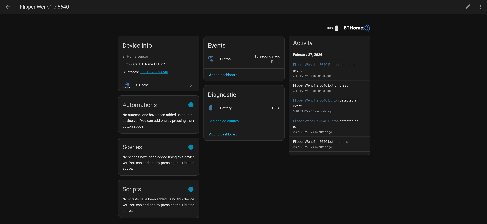

This application turns the Flipper Zero into a [BTHome](https://bthome.io)
beacon, and can be used to integrate the Flipper with home automation systems
that support BTHome, such as Home Assistant.

[BTHome](https://bthome.io) is an open standard for broadcasting sensor data
over Bluetooth Low Energy (BLE). It allows devices to transmit sensor readings
(temperature, humidity, battery level, button events, etc.) without requiring
pairing or an active connection.

The BTHome beacon is triggered when pressing the Flipper Zero "OK" button
and currently includes the Flipper's battery percentage as a sensor.

Unfortunately, due to the limited size of BLE packets the Flipper Zero can send
there isn't much room left to add more sensors without removing the existing
one.

### Home Assistant setup

The first step is setting up the [BTHome](https://www.home-assistant.io/integrations/bthome/) integration in Home Assistant.

Once setup, the Flipper should be automatically discovered after pressing the
center button once:

The device's page will then show the current battery status and its events:

