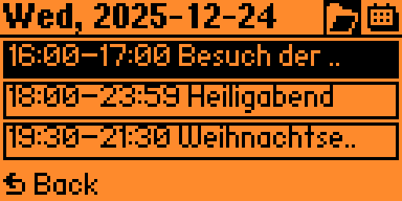
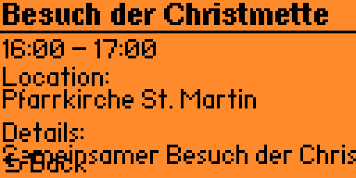

# mitzi-cal-weeks
This **Calendar of week** is an application for the Flipper Zero that displays a weekly view of dates &mdash;  the current week along with the previous and next week. Today's date is highlighted with inverted colors. Monday is the first day of the week. On the left bottom, you can also see the week number of the current week. The user can choose a day with **OK** and then reaches the *day-view*. Here, using the folder-menu, she can load a `*.ics` file (for instance [xmas.ics](data/xmas.ics)) from a file within the application folder `/ext/apps_data/cal_weeks`. If there are events in that file taking place on the currently chosen day, we can see them. If the user chooses the calendar icon, **OK** allows to view details on the specific event.

&nbsp;&nbsp;

## Background
We are using [Zeller's congruence algorithm](https://en.wikipedia.org/wiki/Zeller%27s_congruence) to calculate the day of the week for any given date. It properly handles:
- Month and year boundaries
- Leap years (including century rules)
- ISO 8601 week numbering

## Version history
See [changelog.md](changelog.md)
