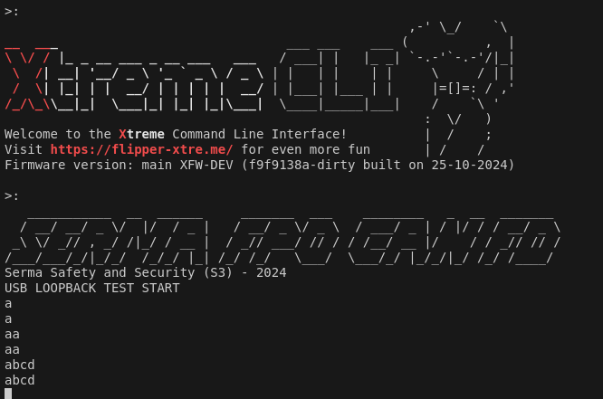
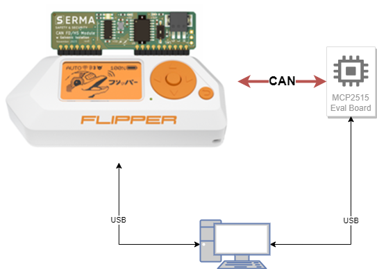

# Flipper Zero CAN FD HS SW

This software implements an USB to CAN bridge compatible with **Linux [can-utils](https://github.com/linux-can/can-utils) and slcan driver.**  
This software application is designed to run on flipper zero device and needs SERMA CAN FD board to be plugged in GPIOs ports. 

## Prerequisite
You need :
- Windows machine to install the driver of the MPC2515 Board
- Linux Machine to launch the USB-CAN Bridge. We recommand to install a VM Linux (Ubuntu or Kali linux for example) and use VirtualBox to make it easy

## Usage
When entering the application (by selecting can-fd-hs) from main menu or by selecting Apps/USB-CAN, a list appears with 3 choices which represent the 3 modes of the application detailled in next sections :
- **USB-CAN Bridge :** This is the **main mode** which is used as a bridge between can-utils and a CAN device under test. 
- TEST USB LOOPBACK : This mode is used to test connectivity between host computer and flipper zero.
- CAN TEST : This mode is used to test CAN connectivity. This send "CANALIVE" through CAN.

### USB-CAN Bridge
In your Windows machine :
1. Connect the MCP2515 Board
2. Launch the software "MCP2515 Bus Monitor"
3. Connect the MCP2515 : Device > Connect
4. Wait until debug is finish

Your MCP2515 is ready to monitor data. Now you have to configure your Linux Machine.

In your VM Linux : 
1. Connect the Flipper Zero to your PC via USB cable. 
2. Connect the FLipper Zero to your VM : Périphérique > USB > Select the Flipper Zero [add image]
3. Launch the command : dmesg  and verify that the FZ is connected to the VM
5. Create a CAN network interface through USB Virtual com port (VCP) :`sudo slcand -s<X> <options> ttyACM<Y> can<Z>`. [add image]
6. enable your created network interface `sudo ifconfig can<X> up`.
7. Verify that the can0 is up `ip a | grep can<X>`.
8. operate normally your can interface by using `cansend can<X> <iii>#<dddddddd>` and `candump can<X>` commands.

Please refer to [can-utils](https://github.com/linux-can/can-utils) for more details. 
If issues are encountered, you can get more informations by connecting directly to vcp with tool like putty :
- serial modeca
- 8 data bits
- no parity
- no hardware control flow

You can see the following screenshot for more informations.
**This mode can also be used to configure connection in flexible datarate ("S9" command).** 

**NB1 : beware of command line termination. It must be a carriage return '\r'. For more convenience newline '\n' characters located after carriage returns are ignored.**  
**NB2 : for compatibility reason (with can-utils)  newline character is not appended after CAN RX frames.As a consequence display of these frames is impacted.**  
**NB3 : beware of usb cdc buffer length. Max size is 64. So command number that can be sent in one frame is limited.**  

### TEST USB LOOPBACK

This mode is used to test VCP (USB cdc) connectivity. To use this mode, you have to :
1. connect to the VCP with any VCP tool like putty :
    - serial mode
    - 8 data bits
    - no parity
    - no hardware control flow
2. Once the connection is established message USB loopback is displayed, the user can test connection by sending characters on serial line and checking the content sent is sent back on serial line by the flipper device.

### TEST CAN

This mode is used to test CAN connection (to verify wiring between CAN device under test and flipper zero board).
No user action is required before using this mode (except the obvious wiring step). 
The frame sent shall by the device shall be the following :
- 007E5TCA:43414E4C49564500 (IIIIIIII:DDDDDDDDDDDDDDDD with \<III..\> the extended identifier "TESTCA" and \<DDD..\> the data "CANLIVE").

**Note:** received and sent bytes count (on the flipper screen) is not functionnal.

## Development

### documentation

Documentation can be found [here](./Documentation/html/index.html).\
To re-generate documentation you have to install `doxygen` before running `Documentation/generate_doc.sh [--open]` (--open is used to open documentation after the generation). 

### architecture overview

This application is based on:
- XTREME firmware USB-UART bridge application : It has been modified to send data on CAN (via SPI) and not on UART.
- Longan Labs [Longan_CANFD](https://github.com/Longan-Labs/Longan_CANFD) library : this is the driver for the MCP 2518 CAN transceiver.

Application is built as an external app using standard fbt commands. Please refer to flipper documentation for more information.

### Test status
Applications has been tested with a MCP2515 evaluation board. As a consequence, only the following datarates are tested :
- 125 Kbaud
- 250 Kbaud
- 500 Kbaud
- 1 MBaud

**Note the flexible datarate is not tested yet.**

### Known bugs

Multiple exit and enters in application and its submode produce instable behaviour.

