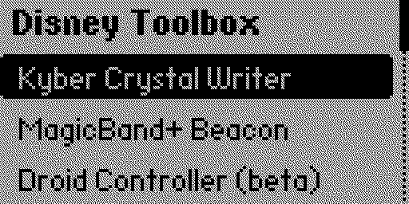

# flipper-disn3y-toolbox

A Flipper Zero app for interacting with Disn3y park technology. Write custom kyber crystal identities for Savi's Workshop lightsabers, broadcast MagicBand+ BLE beacon packets, and control Galaxy's Edge droids with personality and location beacons.

<table>
  <tr>
    <td></td>
    <td></td>
  </tr>
  <tr>
    <td></td>
    <td></td>
  </tr>
</table>

- [Features](#features)
  - [Kyber Crystal Writer](#kyber-crystal-writer)
  - [MagicBand+ Beacon](#magicband-beacon)
  - [Droid Controller](#droid-controller)
- [Installation](#installation)
  - [Flipper Mobile App](#flipper-mobile-app)
  - [Pre-built FAP](#pre-built-fap)
  - [Build from source](#build-from-source)
    - [Using ufbt (standalone)](#using-ufbt-standalone)
    - [Using the firmware tree](#using-the-firmware-tree)
- [Usage](#usage)
  - [Writing a Kyber Crystal](#writing-a-kyber-crystal)
  - [Broadcasting a MagicBand+ Beacon](#broadcasting-a-magicband-beacon)
  - [Broadcasting Droid Beacons](#broadcasting-droid-beacons)
    - [Personality Broadcaster](#personality-broadcaster)
    - [Location Broadcaster](#location-broadcaster)

## Features

### Kyber Crystal Writer

<table>
  <tr>
    <td></td>
    <td></td>
  </tr>
</table>

- Write Series 1 and Series 2 kyber crystal identities to RFID tags using the EM4100 protocol
- Browse all available crystals with details including blade color, hilt color, Jedi/Sith voices, and wayfinder locations
- Crystal Checker — read an unknown crystal to identify it

### MagicBand+ Beacon

<table>
  <tr>
    <td></td>
    <td></td>
  </tr>
</table>

- Broadcast BLE advertisement packets that trigger light and vibration effects on MagicBand+ wristbands
- Multiple code types with configurable colors, vibration patterns, timing, and fade settings
- Pre-built presets for common Disn3y park interactions

### Droid Controller

<table>
  <tr>
    <td></td>
    <td></td>
  </tr>
  <tr>
    <td></td>
    <td></td>
  </tr>
</table>

- Broadcast BLE beacons that Galaxy's Edge astromech droids react to
- Emulate any droid personality chip (color, affiliation, paired/unpaired) to trigger reactions from nearby droids
- Simulate Galaxy's Edge points of interest (Marketplace, Droid Depot, Oga's Cantina, etc.) with configurable reaction interval and distance threshold

## Installation

### Flipper Mobile App

1. Open the Flipper mobile app and connect to your Flipper Zero
2. Go to the **Apps** tab
3. Search for **Disn3y Toolbox**
4. Tap **Install**

### Pre-built FAP

Download the latest `.fap` file from the [Releases](https://gitlab.com/Nathaniel.Belles/flipper-disn3y-toolbox/-/releases) page and copy it to your Flipper Zero's SD card under `apps/Tools/`.


### Build from source

#### Using ufbt (standalone)

You can build without the full firmware source using the [ufbt](https://pypi.org/project/ufbt/) Python package:

```bash
pip install ufbt
ufbt update  # downloads the SDK for your Flipper's firmware version
git clone https://gitlab.com/Nathaniel.Belles/flipper-disn3y-toolbox.git
cd flipper-disn3y-toolbox
ufbt build
ufbt launch  # to build and run on a connected Flipper
```

#### Using the firmware tree

Clone this repo into the `applications_user/` directory of the [Flipper Zero firmware](https://github.com/flipperdevices/flipperzero-firmware):

```bash
cd flipperzero-firmware/applications_user
git clone https://gitlab.com/Nathaniel.Belles/flipper-disn3y-toolbox.git
cd flipper-disn3y-toolbox
../../fbt launch APPSRC=applications_user/disn3y_toolbox
```

## Usage

### Writing a Kyber Crystal

1. Open **Disn3y Toolbox** → **Kyber Crystal Writer**
2. Choose **Series 1 Writer** or **Series 2 Writer**
3. Browse crystals with the left/right buttons
4. Place a writable EM4100 RFID tag on the Flipper's back
5. Press **Write**

Once written, insert the crystal into a Savi's Workshop lightsaber or Holocron to see the color and voice effects.

### Broadcasting a MagicBand+ Beacon

1. Open **Disn3y Toolbox** → **MagicBand+ Beacon**
2. Select a code type or choose from **Presets**
3. Configure colors, vibration, and timing
4. Press **Start Broadcast**

The Flipper will broadcast BLE advertisement packets. Nearby MagicBand+ wristbands will react with light and vibration effects.

### Broadcasting Droid Beacons

#### Personality Broadcaster

1. Open **Disn3y Toolbox** → **Droid Controller** → **Personality Broadcaster**
2. Browse personality chips with the left/right buttons
3. Toggle paired/unpaired with the up/down buttons
4. Press **Start** to begin broadcasting

Nearby Galaxy's Edge droids will react to the emulated personality chip beacon. Press **Stop** to end the broadcast.

#### Location Broadcaster

1. Open **Disn3y Toolbox** → **Droid Controller** → **Location Broadcaster**
2. Select a location, reaction interval, and distance threshold
3. Press **Start Broadcast**

Droids within range will perform location-specific reactions. Interval controls how often the droid reacts; distance sets how close the droid must be.
