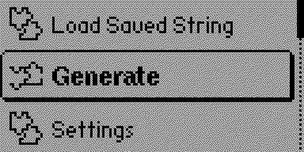
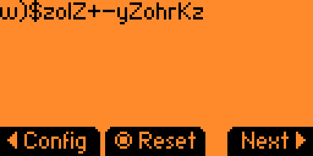
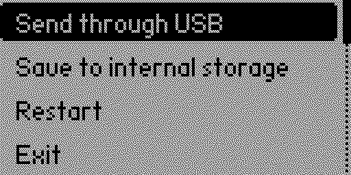

# 🔥 Fire String 🔥

Generate truly random strings from the Flipper Zero using its IR sensor. Capture the infrared bursts from sparking a flame as an unpredictable entropy source. The app also allows saving and loading strings from internal storage or transferring them to external sources via USB.

Inspired by [Flipper, Fire, RNG!](https://github.com/dipdowel/flipper-fire-rng) by dipdowel

Available now on the [Flipper Lab App Store](https://lab.flipper.net/apps/fire_string)

| Main Menu | String Generation | 
| :---:  | :----: |
|  |   |
| Settings | String Export |
|   |  |

## Features

* **IR Sensor Input**: Use the IR sensor to capture unpredictable randomness (e.g., lighter ignition).
* **Fallback Randomness**: Toggle off the IR sensor, relying on the Flipper Zero’s internal entropy sources.
* **Internal Storage**: Save your favorite strings to internal storage and retrieve them later for reuse.
* **USB Output**: Export generated strings directly to any external device that supports USB HID input.

## How It Works

The Fire String generator uses the IR sensor to detect unpredictable infrared noise. The noise is then converted into entropy, ensuring the randomness is derived from real-world physical phenomena rather than predictable algorithms. If you choose to disable the IR input feature, the application switches to using the device’s internal random number generator.

## Usage

* **Generate**: By default, the Fire String generator will receive input from the IR sensor. When generating a string, flick a lighter several inches away from the Flipper Zero's IR sensor to capture IR bursts which are then used to generate truly random strings. It is also possible to gather IR noise from bright sunlight and other random IR sources.

* **Load Saved String**: Load a saved string from the Flipper's internal storage.

* **Settings**: The settings/config menu will allow you to modify the length of the string, the character set, and toggle the IR sensor input on/off. 

* **Save/Export**: When the set number of characters is reached, you may then proceed to the next step which will allow you to save and export the generated Fire String. 

## Supported Character Sets

* Alphabetic, Numeric and Symbols
* Phrases
* Alphabetic and Numeric
* Alphabetic
* Symbols
* Numeric
* Binary

## ⚠️ Disclaimer

Fire is dangerous and can burn things, always handle a flame with caution and care. Never ignite a flame too close to the Flipper or any other flammable objects, always ensure a safe distance is maintained. Never leave a flame unattended. I am not responsible for any damages or harm caused by playing with fire.

While suitable for casual use, avoid using generated strings for secure cryptographic applications. This application was developed as a hobby project for fun and has not undergone rigorous cryptographic testing and should not be used in critical security applications without further verification.

## ❓ Features to consider:

* Send Fire String using Bluetooth HID
* Use raw subghz noise as entropy
* Send Fire String using various other wireless capabilities (for fun?) e.g. NFC, RFID, subghz, infrared

## 🤝 Acknowledgments

[The Flipper Developer Docs](https://developer.flipper.net/flipperzero/doxygen/)

[The Flipper Zero Firmware](https://github.com/flipperdevices/flipperzero-firmware)

[A Visual Guide to Flipper Zero GUI Modules](https://brodan.biz/blog/a-visual-guide-to-flipper-zero-gui-components/)

[flipper-zero-tutorials](https://github.com/jamisonderek/flipper-zero-tutorials)

[Building an app for Flipper Zero](https://instantiator.dev/post/flipper-zero-app-tutorial-01/])

[EFF Dice-Generated Passphrases](https://www.eff.org/dice)

And all the wonderful and helpful people on the Flipper Zero [Discord Server](https://flipperzero.one/discord) 

