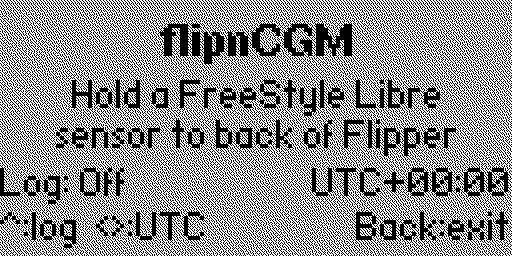
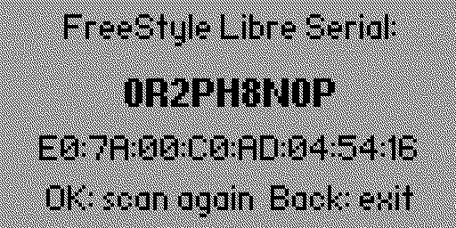

# flipnCGM

A [Flipper Zero](https://flipperzero.one) application that reads Abbott FreeStyle Libre continuous glucose monitor (CGM) sensor serial numbers via NFC and optionally logs them to the SD card.

## Features

- Read FreeStyle Libre 1, 2, and 3 sensor serial numbers over NFC (ISO 15693)
- Displays the decoded 9-character ASCII serial and raw 8-byte UID
- Audio feedback on scan (short chime on success, low beep on unrecognised tag)
- Configurable SD card logging with ISO 8601 timestamps and UTC offset
- Four log levels: **Off**, **Error**, **Info**, **Debug**
- UTC offset persists across app restarts (`/ext/apps_data/flipncgm/settings.ff`)

## Screenshots

| Scanning | Result |
|----------|--------|
|  |  |

## Installation

### Flipper App Catalog

Search for **flipnCGM** in the [Flipper App Catalog](https://lab.flipper.net/apps) and install
directly from the Flipper Mobile App or [lab.flipper.net](https://lab.flipper.net).

### Manual — pre-built FAP

1. Download `flipncgm.fap` from the [latest release](https://github.com/darendarrow/flipnCGM/releases/latest).
2. Copy it to `/ext/apps/NFC/` on your Flipper's SD card.

### Build from source

```bash
# Install ufbt (requires Python 3.8+)
pip install ufbt

# Clone and build
git clone https://github.com/darendarrow/flipnCGM.git
cd flipnCGM
ufbt          # produces dist/flipncgm.fap
ufbt launch   # build and sideload to a connected Flipper over USB
```

## Usage

1. Open **flipnCGM** from the NFC apps menu.
2. Hold a FreeStyle Libre sensor to the **back** of the Flipper Zero.
3. The decoded serial number and raw UID are displayed on screen.
4. Press **OK** to dismiss the result and scan another sensor.
5. Press **Back** (short or long-press) to exit.

### Logging

| Button | Action |
|--------|--------|
| **UP** | Cycle log level: Off → Error → Info → Debug → Off |
| **LEFT / RIGHT** | Adjust UTC offset in 30-minute steps |

Log level and UTC offset are shown on the scanning screen. The UTC offset is
saved automatically and restored the next time the app is opened.

**Log file:** `/ext/apps_data/flipncgm/flipncgm.log`

```
2024-06-01 14:23:45-05:00 [INF] flipnCGM started
2024-06-01 14:23:52-05:00 [INF] CGM read OK - Serial: 0R8FDDJ8J  UID: E0:7A:00:C2:1C:C6:45:11
2024-06-01 14:24:01-05:00 [INF] Non-Libre ISO15693 tag - UID: E0:04:...
2024-06-01 14:24:10-05:00 [ERR] NFC poller error during activation
2024-06-01 14:24:15-05:00 [DBG] Tag detected (scan_enabled was true)
```

Log entries are appended; the file is never truncated by the app. Delete it
manually via the Flipper file manager if it grows too large.

## Technical details

### Serial number decoding

FreeStyle Libre sensors use ISO 15693 NFC tags. The 8-byte UID encodes the
human-readable serial number printed on the sensor packaging.

| UID byte | Example | Meaning |
|----------|---------|---------|
| 0 | `E0` | Fixed — ISO 15693 tag identifier |
| 1 | `7A` | Abbott Diabetes Care manufacturer code |
| 2–7 | variable | 48-bit big-endian encoded serial |

Bytes 2–7 are treated as a 48-bit big-endian integer. Nine groups of 5 bits
(MSB-first) are extracted and each mapped through a 32-character alphabet that
omits **B, I, O, S** to avoid visual ambiguity:

```
0123456789ACDEFGHJKLMNPQRTUVWXYZ
```

### Settings file

`/ext/apps_data/flipncgm/settings.ff` is a standard [FlipperFormat](https://github.com/flipperdevices/flipperzero-firmware/tree/dev/lib/flipper_format)
key-value file:

```
Filetype: flipnCGM Settings
Version: 1
UTC offset minutes: -300
```

## Compatibility

| Sensor | Tested |
|--------|--------|
| FreeStyle Libre 1 | ✅ |
| FreeStyle Libre 2 | ✅ |
| FreeStyle Libre 3 | ✅ (UID format identical) |

## License

[MIT License](LICENSE) — © 2024 Daren Darrow
