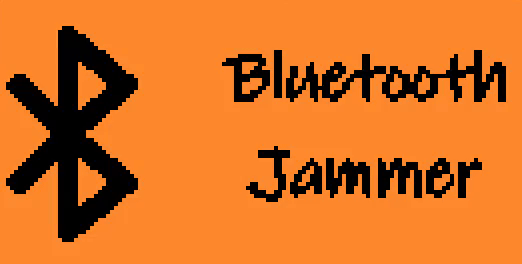
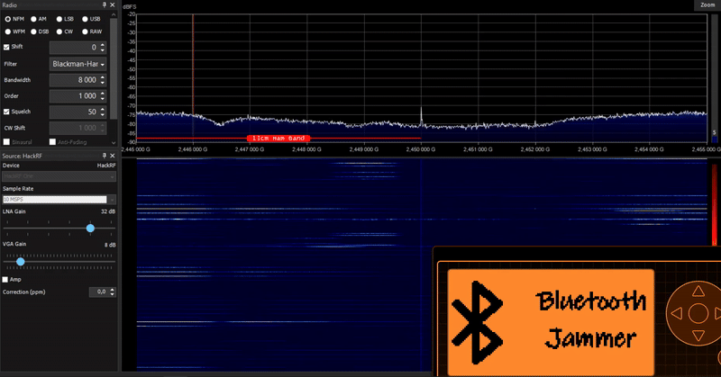

  
  <h1> 🌟 FZ nRF24 Jammer 🌟 </h1>

Welcome to the **FZ nRF24 Jammer** repository! 🎉 Dive into the world of RF interference with this project based on the Flipper Zero and NRF24.

## 📚 Table of Contents
- [🚀 What Can You Do with This?](#-what-can-you-do-with-this)
- [📋 List of Components](#-list-of-components)
- [🧑‍🔧 Let's Get Started with Soldering!](#-lets-get-started-with-soldering)
- [📥 Installing App](#-Installing-App)
- [🎮 App Control ](#-App-Control)
- [🎉 Final Outcome](#-final-outcome)
- [🙏 Acknowledgments](#-acknowledgments)
- [❤️ Support the project](#-support-the-project)
- [🌐 Follow Me for Updates](#-follow-me-for-updates)

-----

## 🚀 What Can You Do with This?
This jammer is based on the **Flipper Zero** integrated with the **NRF24** module. Thanks to its capabilities, you can effectively suppress signals from various technologies, including:
- **Bluetooth** 🔊
- **BLE** 📱
- **Drones** 🚁
- **Wi-Fi** 📶
- **Zigbee**📡

-----

## 📋 List of Components
To bring this project to life, you will need the following components:
1. **NRF24L01+PA+LNA module** 🛠️
2. **16V capacitor** rated at **100µF** 🔋
3. **Step Down Module AMS1117 3.3V**

-----

## 🧑‍🔧 Let's Get Started with Soldering!

<strong>One nRF24</strong>

### HSPI Connection
| **nRF24** | **Flipper Zero GPIO** |
|--------------|-----------------------|
| CE           | B2                    |
| CSN          | A4                    |
| SCK          | B3                    |
| MOSI         | A7                    |
| MISO         | A6                    |
| IRQ          |                       |

### Power Supply Connection
| **AMS1117** | **Flipper Zero GPIO** |
|-------------|-----------------------|
| VIN         | 5V                    |
| GND         | GND                   |

| **nRF24** | **AMS1117** | **capacitor** |
|-----------|-------------|---------------|
| VCC       | OUT         | +             |
| GND       | GND         | -             |

<strong>Two nRF24</strong>

### HSPI Connection
| **nRF24** | **Flipper Zero GPIO** |
|--------------|-----------------------|
| CE           | B2                    |
| CSN          | A4                    |
| SCK          | B3                    |
| MOSI         | A7                    |
| MISO         | A6                    |
| IRQ          |                       |

### VSPI Connection
| **nRF24** | **Flipper Zero GPIO** |
|--------------|-----------------------|
| CE           | C3                    |
| CSN          | C0                    |
| SCK          | B3                    |
| MOSI         | A7                    |
| MISO         | A6                    |
| IRQ          |                       |

### Power Supply Connection
| **AMS1117** | **Flipper Zero GPIO** |
|-------------|-----------------------|
| VIN         | 5V                    |
| GND         | GND                   |

| **nRF24** | **AMS1117** | **capacitor** |
|-----------|-------------|---------------|
| VCC       | OUT         | +             |
| GND       | GND         | -             |

###### In both configurations (HSPI and VSPI), the same SCK, MOSI, and MISO pins are used. This is not a mistake—SPI interfaces can share clock and data lines, while proper operation is ensured by separate control signals (CSN and CE)

##### Anyone who built the device before version 1.4.0, please add the AMS1117 module to your circuit, without it the nrf24 does not work correctly

-----

## 📥 Installing App

1. Download the app from the **[releases](https://github.com/W0rthlessS0ul/FZ_nRF24_jammer/releases)** section that corresponds to your firmware.
2. Install **[qFlipper](https://flipperzero.one)**
3. In **qFlipper**, go to the "**File manager**" section, and transfer the application downloaded from **release** to a convenient location on Flipper Zero

-----

## 🎮 App Control 

### 📋 Menu Navigation
- **Up or Right button** short press → Next menu item
- **Down or Left button** short press → Previous menu item
- **OK button** short press → Select menu item
- **Back button** short press → Exiting the app

### 📡 Misc Jammer
- **Up button** short press → Channel +1
- **Up button** long press → Continuous channel +1 (every 100ms)
- **Up button** double press → channel +10
- **Up button** triple press → channel +100
- **Down button** short press → Channel -1
- **Down button** long press → Continuous channel -1 (every 100ms)
- **Down button** double press → channel -10
- **Down button** triple press → channel -100
- **Right button** short press → Switch jamming mode
- **Left button** short press → Switch jamming mode
- **OK button** short press → Select channel
- **Back button** short press → Back to the last selected subject

> **Back button** short press → stops active attacks

-----

## 🎉 Final Outcome

### App Appearance

### Normal Spectrum

### Bluetooth Jam Spectrum

### Drone Jam Spectrum

### Wi-Fi Jam Spectrum

### BLE Jam Spectrum

### Zigbee Jam Spectrum

-----

## 🙏 Acknowledgments

- [huuck](https://github.com/huuck) - **original author of the FlipperZeroNRFJammer**

-----

## ❤️ Support the project

If you would like to support this project, please consider starring the repository or following me! If you appreciate the hard work that went into this, buying me a cup of coffee would keep me fueled! ☕ 

**BTC Address:** `bc1qvul4mlxxw5h2hnt8knnxdrxuwgpf4styyk20tm`

**ETH Address:** `0x5c54eAb2acFE1c6C866FB4b050d8B69CfB1138Af`

**LTC Address:** `LbdzCsYbxuD341raar6Cg1yKavaDq7fjuV`

**XRP Address:** `rKLLPzoBGfqY3pAQPwTFPRYaWjpHSwHNDw`

**ADA Address:** `addr1qyz2aku0ucmxqnl60lza23lkx2xha8zmxz9wqxnrtvpjysgy4mdcle3kvp8l5l7964rlvv5d06w9kvy2uqdxxkcryfqs7pajev`

**DOGE Address:** `DBzAvD62yQUkP4Cb7C5LuFYQEierF3D3oG`

Every donation is greatly appreciated and contributes to the ongoing development of this project!

---

## 🌐 Follow Me for Updates
Stay connected to receive the latest updates:

