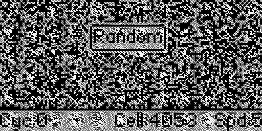
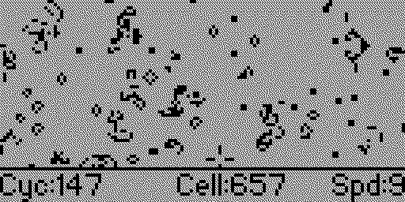
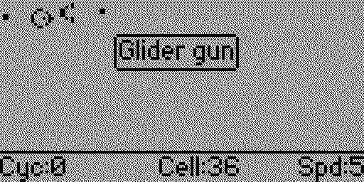
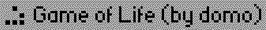

# Flipper Zero Game of Life

## Description

A very basic implementation for Conway's "Game of Life" on Flipper Zero.

## Screenshot

## Status

WORK IN PROGRESS WITH KNOWN BUGS:

- Temporary grid has to be cleared before using which shouldn't be needed
- Some odd behaviour with the first line (Glider doesn't move back in correctly when leaving the lower side)

Roadmap:

- Detect end
- Add startup screen
- Speed up fastest mode
- Codecosmetic

## Features

- Switch between fullscreen and Info-Line (with ok button)
- Adjustable speed (with up and down keys)
- Init with different modes (with right and left keys)
  - Random
  - Blinker
  - Glider
  - Glider gun
  - Pentomino
  - Diehard
  - Acorn
- Show current count of living cells
- Show current number of cycles

## Usage

Open Program via "Apps" -> "Games"

- The "return" button ends the program
- The "ok" button toggles fullscreen mode
- The "up" and "down" buttons adjust the speed
- The "right" and "left" buttons reset the cells to a random pattern

## Background

<https://en.wikipedia.org/wiki/Conway%27s_Game_of_Life>

## License

MIT License, see "License.txt".

## Installation

- Install [ufbt](https://github.com/flipperdevices/flipperzero-ufbt)
- Clone Project into local Projectfolder
- Attach Flipper Zero via USB
- Run "ufbt launch" within local Projectfolder

## Author

By domo
