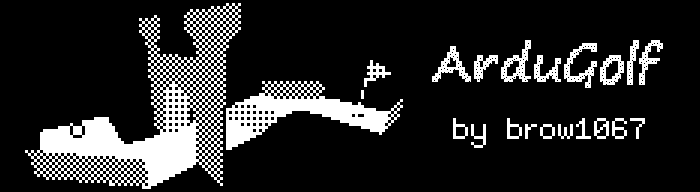
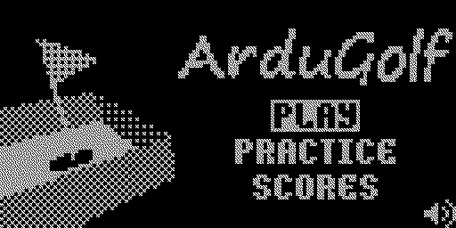
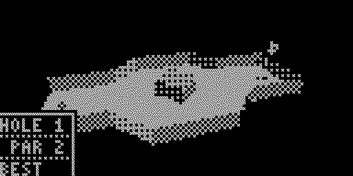
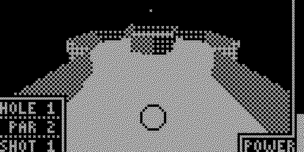
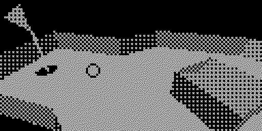

# FlipperGolf



**ArduGolf** is a 3D minigolf game with solid ball physics, ported to the **Flipper Zero** handheld device.  
Play through **18 holes**, plan your shots, bounce off walls, and use slopes to finish each course in as few strokes as possible.

## Features


* 3D gameplay
* Good ball physics
* 18-hole minigolf course
* Controls adapted for Flipper Zero

## Screenshots
|                                             |                                             |
| ------------------------------------------- | ------------------------------------------- |
|  |  |
|  |  |
|  |  |

## Build Instructions

To compile the game, you will need the **Flipper Zero firmware source code** and the required build toolchain.

### 1. Clone the Firmware Source Code

Make sure you have enough free disk space, then clone the firmware repository with all submodules:

```bash
git clone --recursive https://github.com/flipperdevices/flipperzero-firmware.git
```

### 2. Prepare the Build Environment

Build the base firmware using the **Flipper Build Tool (fbt)** to verify that your environment is set up correctly:

```bash
./fbt
```

### 3. Install and Build the Game

1. Copy the game source code directory into the firmware’s user applications folder:

```
./flipperzero-firmware/applications_user/
```

2. Build the application (`.fap` file) using the following command:

```bash
./fbt fap_ardugolf && mv mv build/f7-firmware-D/.extapps/ardugolf.fap ./
```

After a successful build, the resulting application file can be found in the `build/` directory.
Copy `catacombs.fap` to your **Flipper Zero SD card**.

## Original Project

**tiberiusbrown**
[ArduGolf](https://github.com/tiberiusbrown/arduboy_minigolf.git)