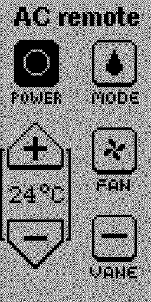
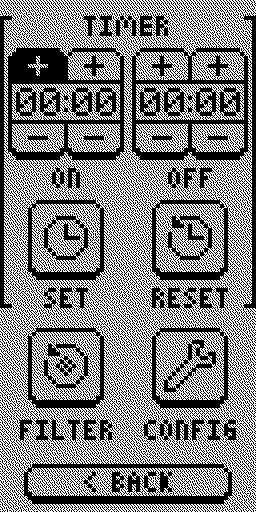
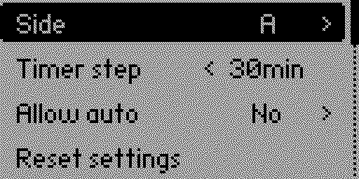

# Hitachi AC Remote User Manual

## Main screen

The main screen that contains the most common controls.

### Power button

Select the Power () button and press OK to toggle the AC on and off.

Once the button is pressed, the Power button changes to  to indicate that the AC is powered on. Press the button again in that state to power the AC off.

### Mode button

Select the Mode () button and press OK to toggle the running mode of the AC.

The remote will cycle through Cooling (), Dehumidifying (), Fan () and Heating () mode.

> [!NOTE]
> If `Allow auto` is set to `Yes` in the settings, the Auto mode () will also be available before the Heating () mode.

### Fan button

Select the Fan () button and press OK to change the fan speed.

Supported fan speed are Low (), Medium () and High (). Note that the higher mode (Hi2) is not yet supported due to lack of samples. Feel free to contribute if you have access to a remote that supports it.

### Louver button

Select the Louver () button and press OK to change the tilting angle of the louvers.

There are 7 angles. After all 7 angles, the swing mode will be enabled and the button icon will be changed to .

> [!NOTE]
> Not all indoor units support this function. 

### Temperature buttons

Select the Temperature buttons ( and ) and press OK to set the target temperature. Temperature ranges between 17°C and 30°C (double inclusive).

### Timer screen button

Select the Timer screen button () and press OK to switch to the Timer screen.

## Timer screen

The secondary screen that contains timer control and several other less common controls.

### Timer control

Select the control buttons (/) and press OK to set the timer. Timer ranges between 0 and 4095 minutes (68:15).

> [!NOTE]
> This app supports setting both the ON timer and the OFF timer to a non-zero value, and can tick both of them down at the same time. The official remote however never sets both simultaneously, and the indoor unit I have seems to ignore the ON timer value completely when both are set. Setting both timers at the same time at your own risk as it may not behave as the IR protocol implies.
>
> Feel free to let me know if you found an indoor unit that is able to take both values at the same time, and document the timer behavior so I could update the timer behavior of this app to reflect it.

### Timer set

Press the Set button () to start the timer. When timer is running, you cannot change the remaining time.

Once the timer is running, the Set button changes to . Press it again to pause the timer. This will cancel the timer on the AC side, and pause the timer on the app side. In this state, it is possible to use the control buttons (/) to change the remaining time. The changed value will not persist across a timer reset.

If the timer is paused, the Set button changes to . Press it would tell the AC to start the timer again at the minute displayed on the screen. For example, if you paused the timer when it has 4 minutes and 30 seconds left, the screen will show that there's 5 minutes remaining (00:05). Pressing resume at this time will start the timer of 5 minutes on the AC side.

Long-press the Set button enters the Test mode. In this mode, the on timer will be automatically cleared, and the AC will start running with the current mode and temperature settings, with the off timer set to the user defined value, or 120 minutes (02:00) if it was unset. Pressing the Reset button leaves the Test mode. Any timer change done by the Test mode switching does not persist across a timer reset either.

### Timer reset

Press the Reset button () to stop the timer, and restore the timer values to before the timer was started.

### Filter reset

Press the Filter button () to reset the filter, or to clear a recoverable error condition on the indoor unit side.

### App configuration

Press the Config button () to configure the app.

## Configuration screen

The configuration screen that allows the user to change the behavior of the app unrelated to how the AC operates.

### Side

Sets the side that the AC unit is operated on. This should be set to the same value as it was set on the AC unit you wish to control.

### Timer step

Change how many minutes the minute timer control buttons increment/decrement the timer value. Default is `30min` which is consistent with the official remote.

### Allow auto

Setting this option to Yes to allow the app to set the AC into auto mode.

### Reset settings

Reset all app settings to a safe default (cooling, 23°C, fan speed low, louver all the way up, both timers unset).
