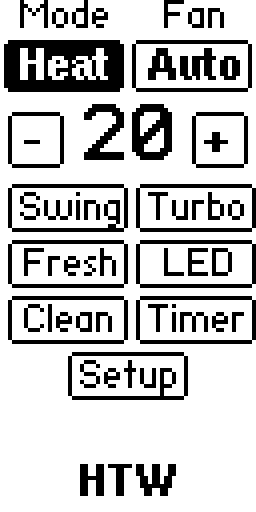

# HTW AC Remote for Flipper Zero

[](https://github.com/sokogen/flipperzero-htw-ac-remote/actions/workflows/ci.yml)

Flipper Zero application for controlling HTW air conditioners via infrared.

## Features

- **Full IR Protocol Support** - Complete implementation of HTW AC IR protocol
- **All AC Modes** - Off, Cool, Auto, Dry, Heat, Fan
- **Fan Speed Control** - Auto, Low, Medium, High
- **Temperature Control** - 17°C to 30°C
- **Toggle Functions** - Swing, Turbo, Fresh, LED, Clean
- **Timer Scheduling** - Auto ON/OFF timers from 0.5h to 24h (34 steps)
- **Settings Persistence** - Save settings to SD card between sessions
- **Vertical Orientation** - Optimized for one-handed use

## Screenshots

| Main Screen | Timer | Settings |
|:-----------:|:-----:|:--------:|
|  |  |  |

## Building

### Prerequisites

- [ufbt](https://github.com/flipperdevices/flipperzero-ufbt) - Flipper Zero build tool

### Install ufbt

```bash
pip install ufbt
```

### Build

```bash
cd htw_ac_remote
ufbt
```

The compiled `.fap` file will be in `dist/htw_ac_remote.fap`

### Deploy to Flipper

Connect your Flipper Zero via USB and run:

```bash
ufbt launch
```

Or manually copy `dist/htw_ac_remote.fap` to your Flipper's SD card:
```
/ext/apps/Infrared/htw_ac_remote.fap
```

## Usage

### Main Screen

- **Mode** - Press OK to cycle through modes (Off → Cool → Auto → Dry → Heat → Fan)
- **Fan** - Press OK to cycle fan speed (Auto → Low → Med → High)
- **Temperature** - Use [-] and [+] buttons to adjust (17-30°C)
- **Toggle Buttons** - Press OK to send toggle command (Swing, Turbo, Fresh, LED, Clean)
- **Timer** - Open timer configuration menu
- **Setup** - Open settings menu

### Navigation

- **Up/Down** - Move between rows
- **Left/Right** - Move between buttons in a row
- **OK** - Activate/select
- **Back** - Return to previous screen or exit

### Timer Menu

Configure auto ON/OFF timers:
- Use Left/Right to adjust time value
- Press OK to send timer command to AC
- Available times: 0.5h, 1h, 1.5h ... 10h, 11h ... 24h

### Settings Menu

- **Save state** - When ON, settings are saved to SD card and restored on next launch

## File Structure

```
htw_ac_remote/
├── application.fam          # App manifest
├── htw_ac_remote.c          # Main app entry point
├── htw_ac_remote.h          # App structures
├── htw_ir_protocol.c        # IR protocol encoder
├── htw_ir_protocol.h        # Protocol constants and API
├── htw_state.c              # State management and persistence
├── htw_state.h              # State structures
├── htw_ac_remote.png        # App icon (10x10)
├── HTW_AC.ir                # IR signal library (150 commands)
├── views/
│   ├── htw_main_view.c      # Main screen UI
│   ├── htw_main_view.h
│   ├── htw_timer_view.c     # Timer configuration UI
│   ├── htw_timer_view.h
│   ├── htw_setup_view.c     # Settings UI
│   └── htw_setup_view.h
└── docs/
    ├── ARCHITECTURE.md      # System architecture
    ├── PROTOCOL.md          # IR protocol specification
    └── screenshots/         # App screenshots
```

## IR Protocol

HTW AC uses a pulse-distance encoded protocol:

- **Carrier**: 38 kHz
- **Frame**: 48 bits (6 bytes), transmitted twice
- **Encoding**: LSB-first within each byte

See [docs/PROTOCOL.md](docs/PROTOCOL.md) for detailed protocol documentation.

## License

MIT License

## Acknowledgments

- Flipper Zero team for the amazing device and SDK
- HTW for making interesting IR protocols to reverse engineer
