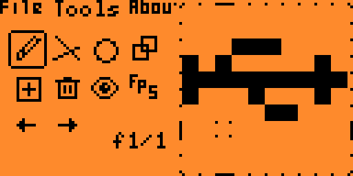
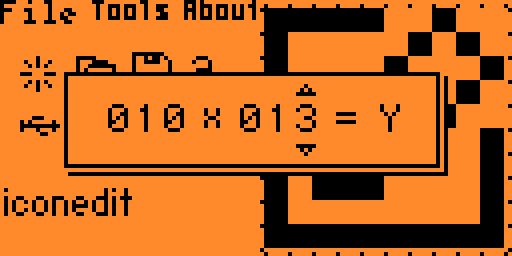
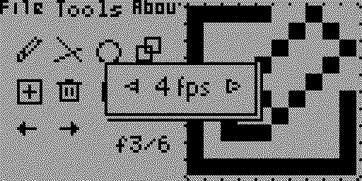
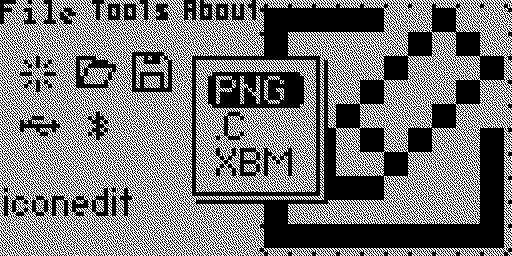
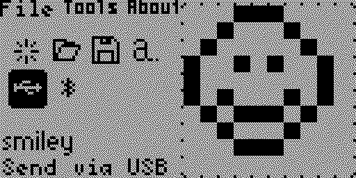

# IconEdit


## Icon editor for the FlipperZero

Create images and animated icons up to 128x64 in size directly on the Flipper! Easily preview how your images, icons, and animations will look directly on the device. Significantly improves your development workflow by eliminating the need to copy images to your build folders, rebuild, and re-launching your app after every image edit.

| Edit mode | Create new icon with custom size |
:-----:|:-----:
 | 
Change animation frame rate | Save as PNG, .C, or XBM
 | 

> All in-app icons were created with IconEdit!

## Features

* Pixel level editing
* Draw lines, circles, and rectangles
* Scrollable canvas (if image has a dimension greater than 32px)
* Create animated icons: insert/duplicate and delete frames, change frame rates
* Open `.png` files
* Save your icons as `.png`, `.xbm`, and even in a C source file format for direct use in your code!
  * Files are saved in the `apps_data/iconedit` folder on the SD card
  * Multiple numbered `.png` and `.xbm` files are created for animations
  * Simply copy the saved `.png` files from your SD card to your application's `images` folder to be included in your next `.fap` build
* Even better, directly transfer C source file representations of the icons over USB to your IDE!
* Preview of your icon, including animation playback
  * Play / pause animations
  * Change Zoom level during playback
  * Frame by Frame control

## Menu Overview

* File
  * New Icon - prompts to select icon dimensions (max size 128x64)
  * Open Icon - select existing .PNG file from SDCard for editing
  * Save Icon - Save as PNG, .C source file, or XBM formats. Multiple files are created for PNG and XBM for each frame
  * Rename Icon - change the name used for filenames and C source variable names
  * Send via USB - Sends C source text via USB to your active text editor
  * Send via BT - not yet implemented, but will be the same as above, just via BT
* Tools
  * Draw pixel - Draw/erase individual pixels
  * Draw line - Click to start a line, move cursor to end, click to commit. Back to cancel.
  * Draw circle - Click to mark circle center, move cursor to expand circle, click to commit. Back to cancel.
  * Draw rectangle - Click to mark a corner, move cursor to define rect, click to commit. Back to cancel.
  * Duplicate frame - Duplicates the current frame and inserts it immediately after current frame
  * Delete frame - Deletes the current frame
  * Play/View - Plays the current animation or views the current single frame
    * Up/Down scales the view
    * OK pauses animations
    * Left/Right steps through frames when paused
    * Back returns to editing
  * FPS - Change the Frame Rate for the animation (Default = 4fps)
  * Left/Right - Navigate between frames of animation
* About

## Saving as C source code

Here, we have a smiley face icon and have named our icon `smiley`. This name is used when defining the Icon variables in code.



To send your image as C source code, select File / Send via USB (or Send via BT). Selecting this will establish the USB (or BT) connection and you will be asked if you are "Ready to send". This means you should have your editor open and your mouse cursor in the place where you want the code to appear. Click OK to send. You should see something like the following in your editor:

```c
#include <gui/icon_i.h>
const uint8_t _I_smiley_0[] = { 0x38, 0x00, 0x44, 0x00, 0x82, 0x00, 0x29, 0x01, 0x01, 0x01, 0x45, 0x01, 0xba, 0x00, 0x44, 0x00, 0x38, 0x00, 0x00, 0x00};
const uint8_t* const _I_smiley[] = {_I_smiley_0};
const Icon I_smiley = {.width=10,.height=10,.frame_count=1,.frame_rate=4,.frames=_I_smiley};
```

Then, in your application code, you would use the Icon as normal:

```c
canvas_draw_icon(canvas, x, y, &I_smiley);
```

## Planned (or not) features

* Send to PC via BlueTooth
* Add more user feedback/status/error indicators
* Pen size / Line Width
* Fill Tool
* Copy/Paste region
* Faster cursor movement for large images
* Open / Save more file types?
* Asset Pack creation?

## Copyright / Licensing

This project would not be possible without the efforts and source from the following projects:

* [pngle](https://github.com/kikuchan/pngle) - reads and uncompresses PNG files using miniz
* [png](https://github.com/dangee1705/png) - write uncompressed png files

<a href="https://www.buymeacoffee.com/rdefeo" target="_blank"></a>
