# LightMessenger

**[LAB401](https://lab401.com)**'s **LightMessenger** by **[tixlegeek](https://cyberpunk.company)** is an additional hardware module designed for the **[Flipper Zero](https://flipperzero.one/)**. It allows users to display messages and images in the air using [POV](https://en.wikipedia.org/wiki/Persistence_of_vision) on an array yof RGB Leds. With a resolution of 16 pixels in height, users can program text or bitmap images and display them with a simple hand movement.

This module offers convenient functionality for those who want to customize their Flipper Zero with a POV light display. Its integration with the Flipper Zero is straightforward, and it is designed for easy use, providing an additional option for users looking to extend the capabilities of their device.

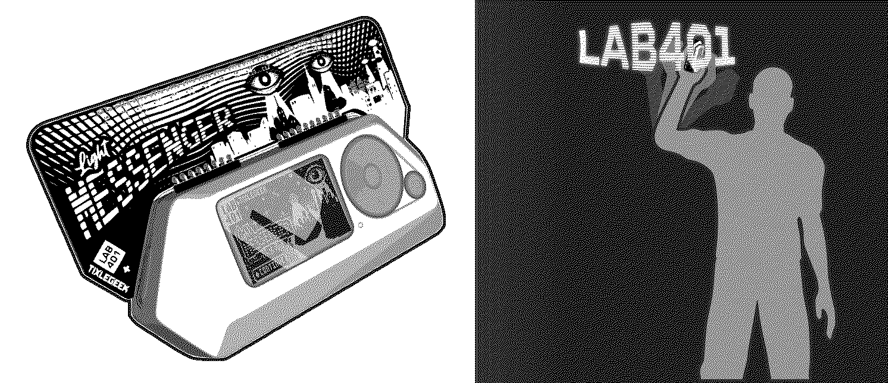

## How it works?

This modules embeds an i2c **accelerometer**(LIS2XX12), and an array of **16 RGB Leds** (SK6805). The accelerometer detects every steps of a swipe motion, and allows the flipper Zero to flash the RGB led array at tight timing, resulting as persistence-of-vision based display.

## How to use

Plug the device on the GPIO header of the flipper zero, then download an install the latest firmware's version on your flipper zero.
Once everything is installed, navigate to **/Apps/GPIO/401LightMessenger** to launch the application.

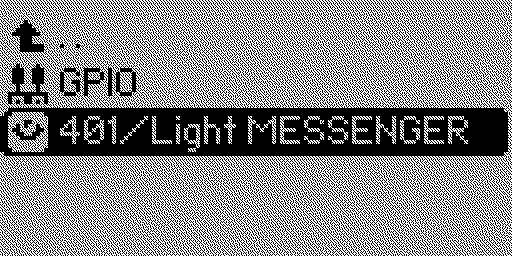

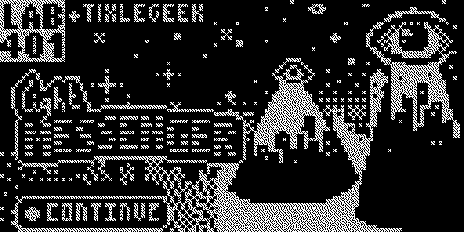

Press any key to enter the main menu. From here, you can set and display text, draw images, and configure the module.


### Text

Entering the "**Text**" application, you're prompted with a text-input, allowing you to set your own custom text.

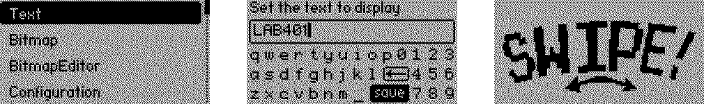

Select "save" to save your text. The module should flash once, and the text "Swipe" appears on the screen.

### Bitmap

Entering the "**Bitmap**" application, you're invited to select a bitmap file to be displayed.

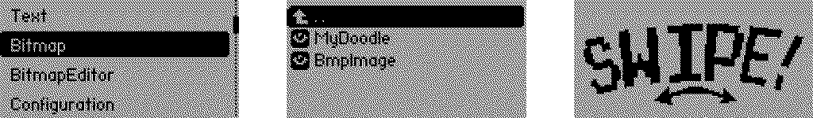


Only 1bpp bitmaps, with a hight of 16px can be displayed. Once selected, the text "Swipe" appears on the screen.


### Bitmap Editor

Entering "**BitmapEditor**", you have two options: Create a new doodle, or edit one you've already created/imported.

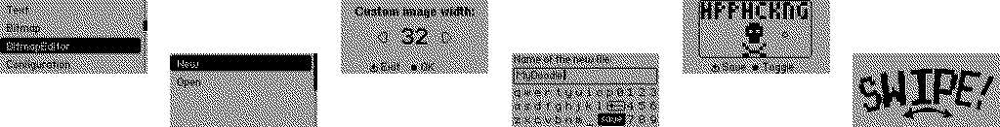

#### New bitmap

When selecting "New", you shall enter the width of the doodle you want to draw.

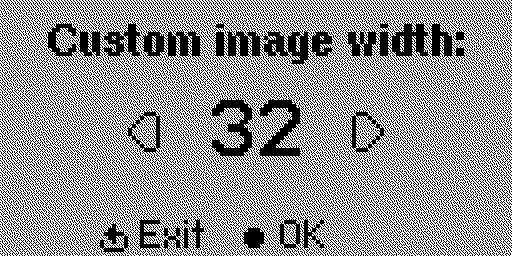

Choose the desired width by using left and right arrows, then press OK.
You'll then have to choose a name for the new file.

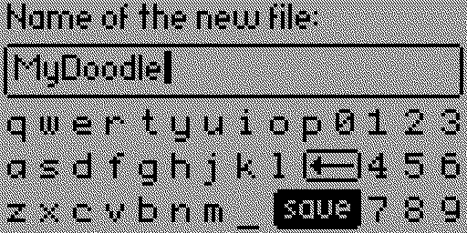

When done, select "**save**". To draw, just move the cursor using the arrows, and toggle pixels by pressing the "**Ok**" button. To save, press "**Return**".

**V1.3:** If you press longer on "**Ok**", then "**Hold**" will be activated, continuously drawing by flipping underlying pixels. No more Ok button smashing.

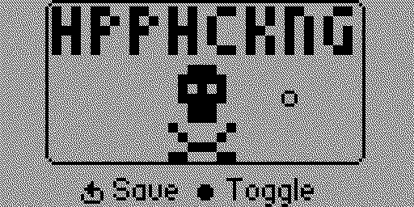

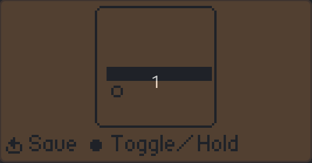

#### Edit bitmap

The bitmap editor allows you to modify any bitmap files that meet the app's requirement.

#### v1.4 - Bitmap Animations

Starting from version 1.4, you can display animations thanks to [@jamisonderek in his latest pull request](https://github.com/lab-401/fzLightMessenger/pull/23). To create an animation, simply name your frames following this pattern: `name_x.bmp`, where `x` is a number between 0 and 9. Here's a quick tool to automatically resize, crop, and convert GIF animations.

##### Using the Script:

1. Download [convertFzLM.sh](https://raw.githubusercontent.com/lab-401/fzLightMessenger/refs/heads/main/401lightMessengerApp/convertFzLM.sh).

2. Grab a cool GIF. For this example, we'll use a short GIF sequence:

   

3. Use the script to convert the image into a BMP sequence:

   ```bash
   $ ./convertFzLM.sh pacman-video-game.gif # (-i to invert colors)
   [*] Frame 0 ← index 0
   [*] Frame 1 ← index 1
   [*] Frame 2 ← index 2
   [*] Frame 3 ← index 3
   [✓] Done. 4 frame(s) written to 'pacman-video-game' (true 1bpp BMPv1, no dithering)
   ```

​	This should give you this: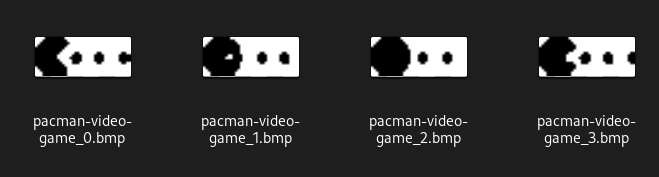

4. Using **QFlipper**, copy the directory in ```SD Card/app_assets/401_light_msg```

> [!NOTE]
>
> A Flipper Zero reboot may be necessary after closing QFlipper.

5. On lightMessenger app, go to **Configuration** and set Word by word " to **Slow** ,**Medium** or **Fast**
6. Open "pacman/pacman_0.bmp" as **Bitmap**, and swipe
7. You may need to squint a little to see it

### FlashLight

With this amount of ultra-bright leds, it would have been sad to not propose a nice flashlight mode. You can access it by selecting the "**FlashLight**" mode.
 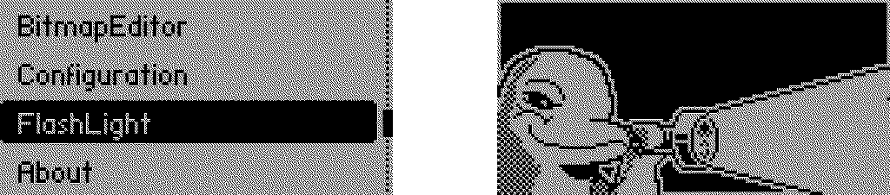

### Configuration

You can customize some aspects of the LightMessenger by entering "**Configuration**".


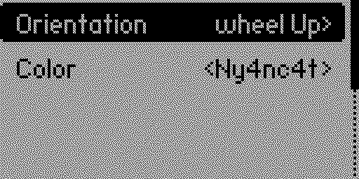

#### Orientation

The orientation allows to choose between "Wheel Up" and "WheelDown". Select the one you're the most comfortable with.

#### Color

Multiple color shaders are available:

- Single colors (R3d, 0r4ng3, Y3ll0w, Gr33n, Cy4n, Blu3, Purpl3)
- Animated (Ny4nC4t, R4inb0w, Sp4rkl3, V4p0rw4v3, R3dBlu3)

## Swipe

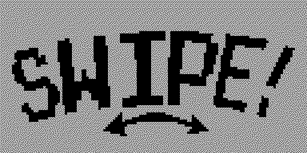

When "**Swipe!**" shows up, things get serious. It's time to grab **firmly** your flipper zero, and wave it in the air. **Be aware of people/stuff around you!**
The display is based on [PoV](https://en.wikipedia.org/wiki/Persistence_of_vision), so it's effect shows best in a dark/mood lighting condition. It may take a bit to really master the correct swipe motion

> [!TIP]
>
> It's not about speed, it's about consistency!


You can also photobomb if you build up enought skill.


## Troubleshooting

### It doesn't work?

If you're having trouble getting the LightMessenger to work, try this:

1. Disconnect the LightMessenger from the Flipper Zero.
2. Restart the Flipper Zero by holding **Back + Left** for 3 seconds.
3. Reconnect the LightMessenger and launch the application again.

### It works, but it's not reliable

The LightMessenger relies on physical interaction and may take some practice to master.

You don’t need to be fast—just focus on making **consistent** motions while keeping the LightMessenger in a vertical position.

During the first three swipes, the LightMessenger calibrates your movements, so no light will be emitted during this phase.

### My arm hurts now

Remember, it's not about speed—it's about consistency. Take your time, experiment, and practice until swiping feels natural.


## Contributing

Contributions are welcome! Do not hesitate to submit your own pull requests if you  want to add more features to LightMessenger. It's simple:

- Fork this repository.
- Create a branch with a descriptive name that reflects its purpose (e.g., "add-color-scheme" or "fix-LED-bug").
- Ensure that your code follows [FlipperZero's contributing guidelines](https://github.com/flipperdevices/flipper-application-catalog/blob/main/documentation/Contributing.md) for the application catalog, and [FlipperZero's code of conduct](https://github.com/flipperdevices/flipperzero-firmware/blob/dev/CODE_OF_CONDUCT.md).
- When you're sure, create your pull-request.
- Please submit **one PR per improvement/contribution** so that we can merge them quickly and efficiently.
- Have fun and let your creativity shine!

Of course, we may not be able to merge every color scheme, and we are  obliged to make some production choices. But don't let that stop you  from sharing your work with us and the world!

## Development

### Build

1. Install [git](https://git-scm.com/downloads).
2. Install [ufbt](https://github.com/flipperdevices/flipperzero-ufbt?tab=readme-ov-file#installation) - requires Python 3.8 or newer.
3. Connect Flipper Zero to your computer using a USB cable. Be sure qFlipper, lab.flipper.net and other serial port applications are **not** running. Make sure no applications are running on the Flipper Zero.
4. Run the following commands:
```sh
git clone https://github.com/lab-401/fzLightMessenger
cd fzLightMessenger/401lightMessengerApp
ufbt launch
```

- NOTE: Build outputs are found in the **dist** directory.
- If you get `[ERROR] Error: could not open port : PermissionError(13, 'Access is denied.', None, 5)` verify that no other applications are running. If needed press Back+Left to reboot the Flipper Zero.
- If you are not on Official firmware, you may need to update your [index-url](https://github.com/jamisonderek/flipper-zero-tutorials/wiki/UFBT#switching-target-firmware).

### Hardware

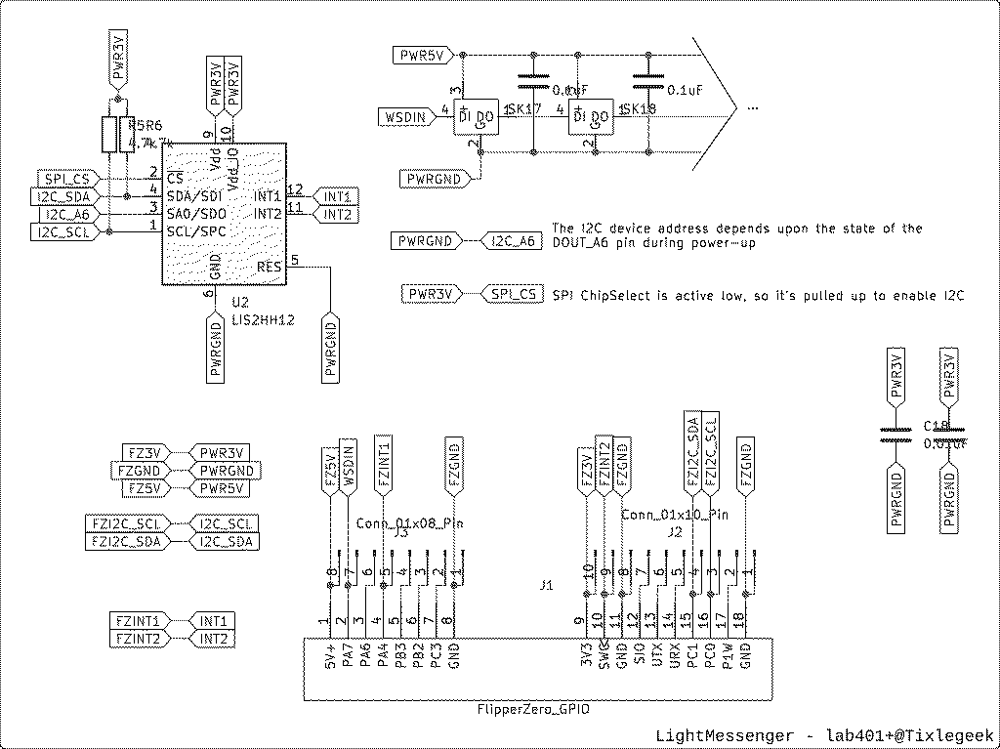

The Light Messenger has 16-LEDs (SK6805). The **[SK6805](http://www.normandled.com/upload/201912/SK6805SIDE-G%203512%20LED%20Datasheet.pdf)** are independent programmable RGB LEDs, with 8-bit for each of the red, green and blue channels. They are connected in series (chained data-in/data-out). The leftmost LED is the first one. You can use the provided [drivers/sk6805.h](401lightMessengerApp/drivers/sk6805.h) to control the LEDs.
- Pin **+5V** goes to the VCC pin of the SK6805 LED.
- Pin **PA7** goes to the data in pin of the first (left-most) SK6805 LED.
- Pin **GND** goes to the GND pin of the SK6805 LED.

The **[LIS2DH12](https://www.st.com/resource/en/datasheet/lis2dh12.pdf)** is a 3-axis femto accelerometer. It has two independent programmable interrupt generators for motion detection. It is connected to the Flipper Zero I2C bus using an 8-bit address of 0x30 `LIS2DH12_I2C_ADD_L`. You can use the provided [drivers/lis2dh12_reg.h](401lightMessengerApp/drivers/lis2dh12_reg.h) and [drivers/lis2dh12_wrapper.c](401lightMessengerApp/drivers/lis2xx12_wrapper.h) to access the LIS2DH12 features.
- The **3V3** pin connects to the **VCC** pin of the LIS2DH12.
- The **GND** pin connects to the **GND** pin of the LIS2DH12.
- The **PC1** pin connects to the **SDA** of the LIS2DH12.
- The **PC0** pin connects to the **SCL** of the LIS2DH12.
- The **PA4** pin connects to **Int1** on the LIS2DH12.
- The **SWC** pin connects to **Int2** on the LIS2DH12.

### Data Formats

The configuration file is stored in `SD Card/apps_assets/401_light_msg/config.json`. The file of the format is JSON.

The image files are stored as 1-bit BMP images, using a `.bmp` file extension. Compression must be disabled. The height of the image must by 16 pixels. The file must not exceed 500 bytes.

### Adding a new configuration entry

When you add a new feature to the Light Messenger, you should try to make it configurable for the user. You should also try to make the default behavior work the same as before your feature was introduced.

To add a new configuration entry:
- Update the [401_config.h](401lightMessengerApp/401_config.h) file:
   - Add a new property to the `Configuration` structure.
   - Define a new `LIGHTMSG_DEFAULT_{name}` with a default setting. Typically indexes are used instead of values.

- Update the [401_config.c](401lightMessengerApp/401_config.c) file:
   - Add an entry in `config_default_init` to initialize your property.
   - Add an entry in `config_to_json` to serialize your property.
   - Add an entry in `json_to_config` to deserialize your property.


> [!NOTE]
>
> For backward compatiblity, you will need to handle your property missing & should NOT reject the previous config.json file.

- Update the [401LightMsg_config.h](401lightMessengerApp/401LightMsg_config.h) file:
   - Add your new `extern const {type} lightmsg_{name}_value[];` to hold the values for your property.
   - Add your new `extern const char* const lightmsg_{name}_text[];` to hold the labels to display to the user.


> [!NOTE]
>
> If you are updating the list, append if possible, so users values will be preserved.

- Update the [401LightMsg_config.c](401lightMessengerApp/401LightMsg_config.c) file:
   - Define your `lightmsg_{name}_value` and `lightmsg_{name}_text` variables.
   - Implement an `on_change_{name}` function, for when the user changes the value of your property.
   - Update `app_config_alloc` to do a `variable_item_list_add` with your new property.

You can then access your configuration value using the following...
```c
AppContext* app = (AppContext*)ctx; // Main app struct
AppData* appData = (AppData*)app->data;
Configuration* light_msg_data = (Configuration*)appData->config;
uint8_t value = listmsg_{name}_value[light_msg_data->{name}]; // Replace {name} with your feature name.
```
