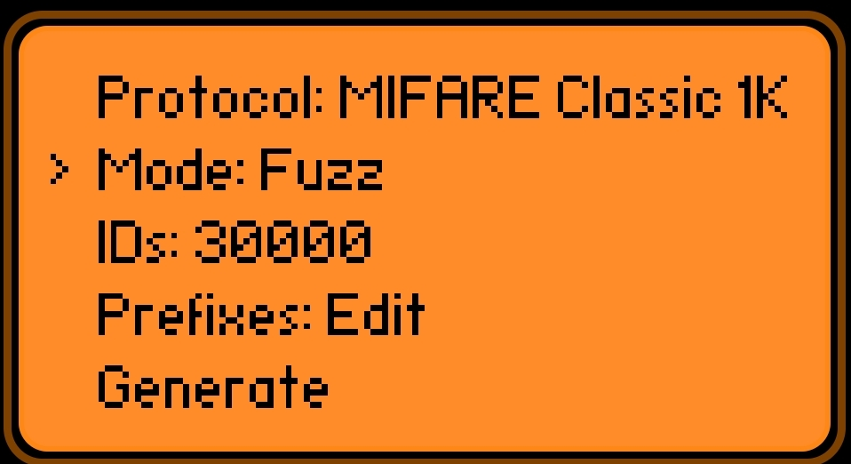
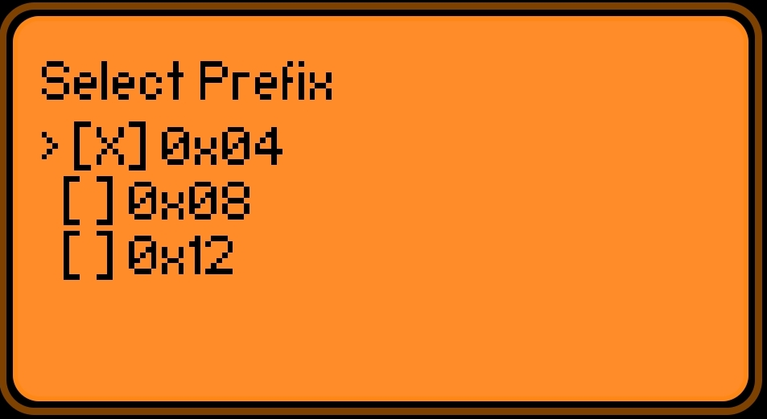
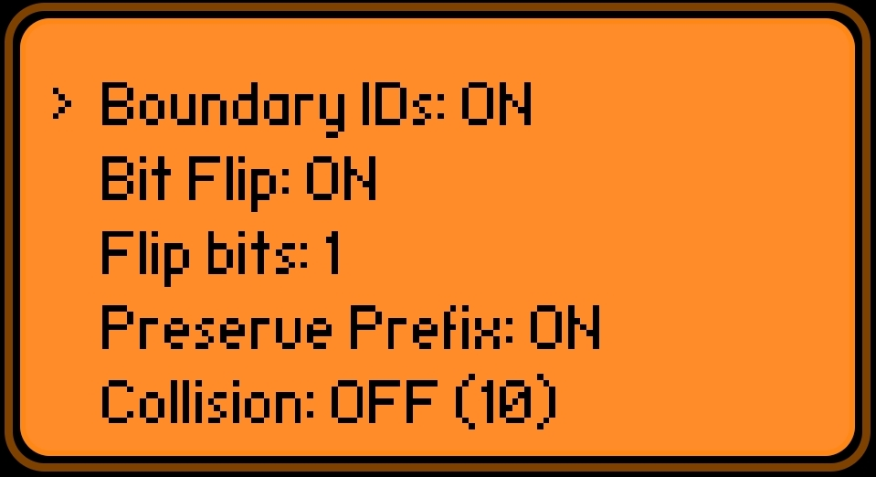

# 📟 ListEM — Advanced UID List Generator for Flipper Zero

**ListEM** is a Flipper Zero application that generates large, customizable UID dictionaries for **RFID**, **NFC**, and **iButton** protocols **directly on your Flipper!**.

I decided to build it as a native Flipper app for **flexibility, portability, and ease of use on the GO!**.  
ListEM brings advanced list generating features (previously done via my Python scripts) straight onto the Flipper Zero.
Now with **Fuzzing Mode / Bit Mutation engine!** A real, usable reader testing FuZZ engine!

---


## 🆕 What’s New in v1.4

- **Structured Mode (NEW)**
  - UID modeling using segmented generation (Facility + Card)
  - Tail patterns for better bruteforce efficiency

- **Structured Randomization Option**
  - Switch between:
    - Sequential structured (default)
    - Randomized structured (anti pattern detection & wide coverage)

- **Engine Upgrade**
  - Prefix × Sequence × Tail generation
  - Better coverage of UID distributions
  - More efficient brute force lists

- General improvements & code cleanup

---

## 📸 Screenshots

<p align="center">
  
  
  
  
  
</p>

---

## ✨ Features

### 🔌 Protocol Support (28 total)

**RFID**
- EM4100, HID Prox, Indala, IoProx, PAC/Stanley, Paradox, Viking, Pyramid, Keri, Nexwatch, H10301, Jablotron, Electra, IDTeck, Gallagher

**NFC**
- MIFARE Classic 1K, MIFARE Classic 4K, MIFARE Ultralight, DESFire EV1, iCLASS, FeliCa

**iButton**
- Dallas DS1990, Cyfral, Metacom, Maxim iButton, Keypad/Access Control, Temperature iButton, Custom iButton

---

### 🧬 Manufacturer Prefix Support

- Generate IDs:
  - With **no prefix** (fully randomized)
  - With **one or multiple selected prefix**
  - If **no prefix is selected** → IDs are fully random
  - If **one or more prefixes are selected** → only those prefixes are used
  - Selected prefixes are:
    Applied correctly to all generating modes

---

### 🎛️ Generating Modes

#### 🎲 Random Mode
 - Fully random ID generation
 - Optional manufacturer prefix injection
 - Ideal for discovery and bruteforce testing


#### 🔢 Sequential Mode
 - Configurable **start value**
 - Configurable **step size**
 - Optional manufacturer prefix injection
  - Useful for ordered UID ranges and predictable badge patterns
 - Optional **per-prefix independent enumeration**
 - Optional **reverse enumeration**
  - Safely counts downward without underflow
  - Useful for backward UID ranges and legacy systems
  
Ideal for:
 - Ordered UID ranges
 - Predictable badge numbering schemes
 - Legacy access systems


#### 🧪 Fuzz Mode (Advanced lists for Fuzzing) 🔥
Designed for **reader fuzzing and robustness testing**

Fuzz Mode can generate:
 - Boundary values (all zeros, all ones, AA / 55 patterns)
 - Bit flip mutations (configurable bit count)
 - Prefix preserving fuzzing (optional)
 - Collision Fuzzing  (Configurable collision rate)

Ideal for:
 - Parser stress testing
 - Reader edge case discovery
 - Unexpected behavior detection
 - Caching and UID de-duplication logic
 
 **✔ Configurable via submenu**

| Boundary on/off
| Bit flip on/off
| Flip count adjustable
| Prefix preserve on/off
| Collision on/off (10) <- adjustable count

**This is legitimate fuzzing, not just “random junk”!**


#### 🧬 Structured Mode (NEW 🔥)
A smart generator that produces structured ID lists optimized for efficient bruteforce and fuzzing.

It follows patterns like:
Vendor/Type:Facility:Card Number:Tail

Example: 04 | 12 34 | 00 01 / A1 | 00 7F | 12 34
         
This allows to:
 - Explore UID ranges more efficiently
 - Match common access control system patterns
 - Improve bruteforce success rate compared to random or linear generation

Structured Mode can generate: 
 - Segmented UID modeling (facility + card split)
 - Combinatorial tail engine
 - Multi prefix support

**Structured Variants:**
 - **Sequential**
   - Explores dense UID ranges efficiently
   - Ideal for systems with predictable numbering

 - **Randomized**
   - Shuffles traversal of structured space
   - Useful for bypassing detection and widening coverage


---

## 📁 Output Structure

Generated files are saved automatically to corresponding folder:

- `/ext/lfrfid_fuzzer/ListEM`
- `/ext/mifare_fuzzer/ListEM`
- `/ext/ibutton_fuzzer/ListEM`

### 📄 Output filenames include:
- Protocol name
- Generation mode (`random`, `sequential`, `fuzz`, `structured`)
- Selected prefixes (or `noprefix`)

Example:
```
EM4100_fuzz_A0-C0.txt
```

---

## 🕹️ Controls

| Button | Action |
|------|------|
| ⬆️ / ⬇️ | Navigate menu |
| ⬅️ / ➡️ | Change values (hold for fast scroll) |
| **OK** | Select / Enter submenu |
| **Generate** | Start list generation |
| **Back** | Go back / Exit app |
  
  - Click or Hold **⬅️ / ➡️** to change:
  - Sequential start / step
  - Fuzz bit count
  - Toggle submenu options with **OK**

---

## ⚠️ Disclaimer

**USE ONLY ON AUTHORIZED EQUIPMENT**  
This tool is intended for **testing, research, and educational purposes**.

---
Developed by **Clawzman**  

## 🔗 Source

https://github.com/Clawzman/Flipper_ListEM
