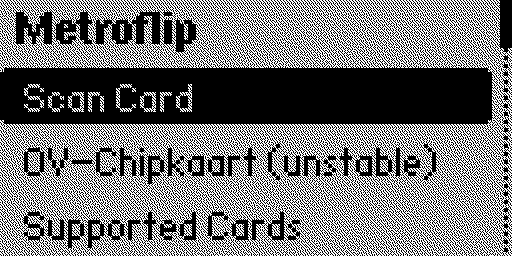

# Metroflip
Metroflip is a multi-protocol metro card reader app for the Flipper Zero, inspired by the Metrodroid project. It enables the parsing and analysis of metro cards from transit systems around the world, providing a proof-of-concept for exploring transit card data in a portable format. 

# Author
[@luu176](https://github.com/luu176)

# Discord Community Server 

Please join the server https://discord.gg/NR5hhbAXqS if you have any questions for me.
---



# Setup Instructions

## Using a pre-built release: Stable (Recommended) or Beta (Newer updates, less stable)
1. Download the appropriate `metroflip.fap` file from the [Releases section](https://github.com/luu176/Metroflip/releases).
2. Drag and drop the `metroflip.fap` file into the `apps` folder on your Flipper Zero's SD card.

## Manual Build Instructions
To build Metroflip manually, follow these steps:

1. **Install Git**  
   Download and install Git on your Windows computer.  
   Run the first command to download the app:  

**Either**:
Stable Release (recommended): 
```git clone https://github.com/luu176/Metroflip.git```

**OR**:
Beta (newer updates but not fully tested): 
```git clone --single-branch --branch dev https://github.com/luu176/Metroflip.git```

2. **Navigate to the Project Folder**  
Run the second command to enter the app folder:  

```cd Metroflip```

3. **Install Python**  
Download and install Python from the [official website](https://www.python.org).  

4. **Install UFBT**  
Run the third command to install UFBT:  

```pip install ufbt```

5. **Update and Build the Project**  
Run the following commands in order to build the app:  

```ufbt update```
```ufbt fap_metroflip```

6. **Connect Your Flipper Zero**  
Ensure your Flipper Zero is connected via USB and close the qFlipper application (if it’s open).  

7. **Launch the Build**  
Run the final command to launch the app on your flipper:  

```ufbt launch```

---

# Metroflip - Card Support TODO List

This is a list of metro cards and transit systems that need support or have partial support.

## ✅ Supported Cards

| **Card / Agency**  | **City / Country**                           | **Card Type**     |
|--------------------|----------------------------------------------|-------------------|
| **Bip!**           | 🇨🇱 Santiago de Chile, Chile                  | MIFARE Classic    |
| **Charliecard**    | 🇺🇸 Boston, MA, USA                           | MIFARE Classic    |
| **Clipper**        | 🇺🇸 San Francisco, CA, USA                    | MIFARE DESFire    |
| **Intertic**       | 🇫🇷 France, About 21 Cities / Companies       | ST25TB            |
| **ITSO**           | 🇬🇧 United Kingdom                            | MIFARE DESFire    |
| **Metromoney**     | 🇬🇪 Tbilisi, Georgia                          | MIFARE Classic    |
| **myki**           | 🇦🇺 Melbourne (and surrounds), VIC, Australia | MIFARE DESFire    |
| **Navigo**         | 🇫🇷 Paris, France                             | Calypso           |
| **nol**            | 🇦🇪 Dubai, UAE                                | MIFARE DESFire    |
| **Opal**           | 🇦🇺 Sydney (and surrounds), NSW, Australia    | MIFARE DESFire    |
| **Opus**           | 🇨🇦 Montreal, QC, Canada                      | Calypso           |
| **Rav-Kav**        | 🇮🇱 Israel                                    | Calypso           |
| **RENFE**          | 🇪🇸 Spain                                     | MIFARE Classic    |
| **SmartRider**     | 🇦🇺 Perth, WA, Australia                      | MIFARE Classic    |
| **Suica**          | 🇯🇵 Japan                                     | FeliCa            |
| **Troika**         | 🇷🇺 Moscow, Russia                            | MIFARE Classic    |
| **Trt**            | 🇨🇳 Tianjin, China                            | MIFARE Ultralight |
| **Octopus**        | 🇭🇰 Hong Kong                                 | FeliCa            |
| **Ventra**         | 🇺🇸 Chicago, IL, USA                          | MIFARE Ultralight |


---

# Credits
- **App Author:** [@luu176](https://github.com/luu176)
- **Info Slaves:** [@equipter](https://github.com/equipter), [@TheDingo8MyBaby](https://github.com/thedingo8mybaby), [@ry4000](https://github.com/ry4000), [@WillyJL](https://github.com/WillyJL), 
- **Bip! Parser:** [@rbasoalto](https://github.com/rbasoalto), [@gornekich](https://github.com/gornekich)
- **Charliecard Parser:** [@zacharyweiss](https://github.com/zacharyweiss)
- **Clipper Parser:** [@ke6jjj](https://github.com/ke6jjj)
- **Intertic Parser (21 Cities):** [@luu176](https://github.com/luu176), [@gentilkiwi](https://github.com/gentilkiwi)
- **ITSO Parser:** [@gsp8181](https://github.com/gsp8181), [@hedger](https://github.com/hedger), [@gornekich](https://github.com/gornekich)
- **Metromoney Parser:** [@Leptopt1los](https://github.com/Leptopt1los)
- **myki Parser:** [@gornekich](https://github.com/gornekich)
- **Navigo Parser:** [@luu176](https://github.com/luu176), [@DocSystem](https://github.com/docsystem)
- **Opal Parser:** [@gornekich](https://github.com/gornekich)
- **Opus Parser:** [@DocSystem](https://github.com/docsystem)
- **Rav-Kav Parser:** [@luu176](https://github.com/luu176)
- **RENFE Parser:** [@BocamoCM](https://github.com/BocamoCM)
- **Suica Parser:** [@zinongli](https://github.com/zinongli)
- **Troika Parser:** [@gornekich](https://github.com/gornekich)
- **TRT Parser:** [@luu176](https://github.com/luu176), [@zinongli](https://github.com/zinongli)
- **Octopus Parser:** [@zinongli](https://github.com/zinongli)
- **nol Parser:** [@zinongli](https://github.com/zinongli)
- **Ventra Parser:** [@hazardousvoltage](https://github.com/hazardousvoltage), [@FatherDivine](https://github.com/FatherDivine)

---

### Special Thanks
Huge thanks to [@equipter](https://github.com/equipter) & [@ry4000](https://github.com/ry4000) for helping out the Discord community!
