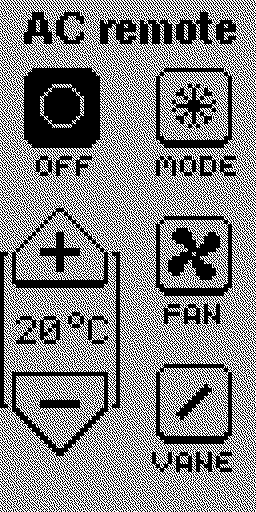

# Mitsubishi AC Remote

Mitsubishi Electric AC remote control for Flipper Zero.



Available to download on the Flipper App Catalog [here](https://lab.flipper.net/apps/mitsubishi_ac_remote)
## Building
```shell
# Clone repository
git clone https://github.com/achistyakov/flipperzero-mitsubishi-ac-remote.git
cd mitsubishi_ac_remote

# Build the application
ufbt build

# Build and launch the application
ufbt launch
```
