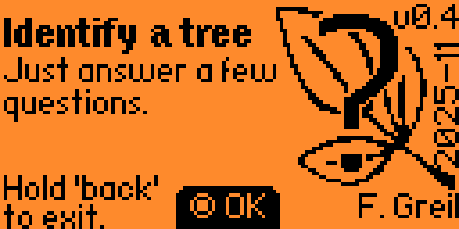

# mitzi-tree-ident

**Goal:** Identify a tree by answering questions on your Flipper Zero. 

## Sketch of user flow
In case there is only one question to answer, the user flow would roughly be the following
* **Splash Screen:** Press OK to go to start, hold 'back' for exiting application
* **Menu Screen:** Use Up/Down to navigate, OK to select
* **Content Screens:** Left for previous

## Future Enhancements
What comes next
- Adding more question levels, e.g. for bark characeristics
- Internationalization: German language support, ... 
- Add regional filtering (European vs. North American trees)

## Version history
See [changelog.md](changelog.md)
