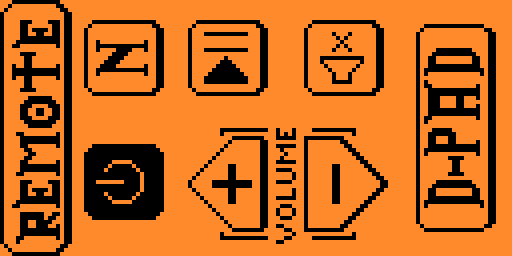

# Netflix TV Remote for Sony BRAVIA 4K VH2

Infrared remote control app for Netflix on Sony BRAVIA 4K VH2 TV.  
Death Note-themed graphical interface.

---

## Features

- Buttons for: Netflix, Play/Pause, Mute, Power, Volume Up/Down.  
- D-pad for navigation (arrows + OK + Back).  
- 2x4 grid UI with custom icons.  
- Transmits Sony BRAVIA specific SIRC/SIRC15 infrared codes.

---

## UI Structure

- Grid of 2 rows × 4 columns of buttons.  
- Selected icons highlighted with dark theme.  
- D-pad mode activated via button in last column.

---

## Infrared Codes (IR)

| Function   | Protocol   | Code       |
|------------|------------|------------|
| Netflix    | SIRC15     | 0x1A 0x7C  |
| Play/Pause | SIRC15     | 0x97 0x1A  |
| Mute       | SIRC       | 0x01 0x14  |
| Power      | SIRC       | 0x01 0x15  |
| Volume Up  | SIRC       | 0x01 0x12  |
| Volume Down| SIRC       | 0x01 0x13  |
| Up Arrow   | SIRC       | 0x01 0x74  |
| Down Arrow | SIRC       | 0x01 0x75  |
| Left Arrow | SIRC       | 0x01 0x34  |
| Right Arrow| SIRC       | 0x01 0x33  |
| OK (Enter) | SIRC       | 0x01 0x65  |
| Back       | SIRC15     | 0x97 0x23  |

---

## Usage

- Navigate with arrow keys and select with OK.  
- Press OK on the D-pad button to enter directional navigation mode.  
- Long press Back to exit the app or D-pad mode.  
- In D-pad mode, arrow keys send corresponding IR directional commands.

---

## Preview

### Main Screen

### D-pad Screen

---

## Notes

Developed for infrared remote control with a minimalist GUI and Death Note theme, optimized for Sony BRAVIA 4K VH2.  
Not compatible with other TV models or brands without modifying IR codes.

---

## License

This project is licensed under the GPL-3.0 license. See the [LICENSE](LICENSE) file for details.
