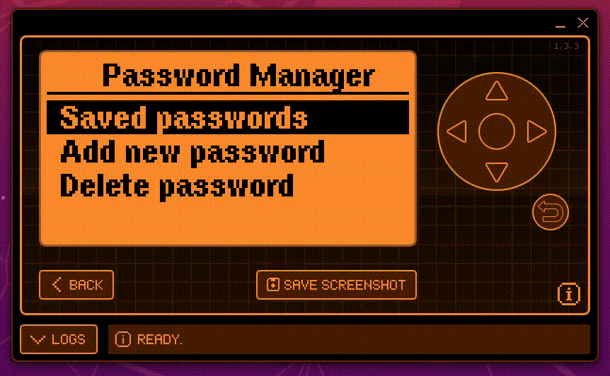

# Password Manager

Use you flipper zero as a password manager and authenticator!      
The flipper stores your usernames and password and can write them on your PC acting as a keyboard!

## How does it work
- Add new credentials:
    - The flipper asks you to insert the website name, the username and the password
    - Credentials are stored into a file in the flipper
- See saved credentials:
    - The flipper shows a lists of website names
    - If OK is clicked, the flipper will write on the PC ```username + /t + password + /n```
        - *Perfect for web forms!!!*
        - (If the username is not set, it will write only ```password + /n```)
- Delete credentials:
    - The flipper shows a lists of website names
    - If OK is clicked, the flipper will remove the selected line from the credentials file

### Storage
Credentials are stored as ```service,username,password``` in a .txt file.    
```\``` and ```,``` needs to be escaped as ```\\``` and ```\,``` if you handle the file manually.

## Add new password


## Web login


## Show passwords


## Delete passwords


