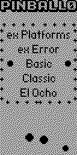
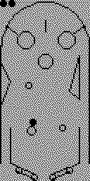
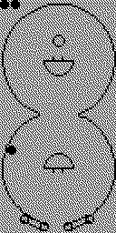
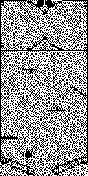

# Pinball0 (Pinball Zero)
Play pinball on your Flipperzero!

This is a BETA release - like, I'm surprised it works! You may encounter crashes and/or memory leaks.

> The default tables and example tables may / will change

## Screenshots

## Features
* Realistic physics and collisions
* User-defined tables via JSON files
* Portals!
* Bumpers, flat surfaces, curved surfaces
* Rollover items
* Fancy animations (-ish)

## Controls
* **Ok** to release the ball
* **Left** and **Right** to activate the left and right flippers
* **Back** to return to the main menu or exit
* **Up** to "bump" the table if the ball gets stuck

I find it easiest to hold the flipper with both hands so I can hit left/right with my thumbs!

## Tables
Pinball0 ships with several default tables. These tables are automatically deployed into the assets folder. Tables are simple JSON which means you can define your own! Your tables should be stored in the data folder. **The default tables may change over time.**

### File Format
Table units are specified at a 10x scale. This means our table is **630 x 1270** in size (as the F0 display is 64 pixels x 128 pixels). Our origin is in the top-left at 0, 0.

The JSON can include comments - because why not!

> **DISCLAIMER:** The file format may change from release to release. Sorry. There is some basic error checking when reading / parsing the table files. If the error is serious enough, you will see an error message in the app. Otherwise, check the console logs. For those familiar with `ufbt`, simply run `ufbt cli` and issue the `log` command. Then launch Pinball0. All informational and higher logs will be displayed.

#### balls : list of objects
Every table needs at least 1 ball, otherwise it will fail to load.

* `"position": [ X, Y ]`
* `"velocity": [ VX, VY ]` : optional, defaults to `[ 0, 0 ]`
* `"radius" : N` : optional, defaults to `20`

#### flippers : list of objects
* `"position": [ X, Y ]` : location of the pivot point
* `"side": S` : valid values are `"LEFT"` or `"RIGHT"`
* `"size": N` : optional, defaults to `130`

You can have more than 2 flippers! Try it!

#### bumpers : list of objects
* `"position": [ X, Y ]`
* `"radius": [ N ]` : optional, defaults to `40`

#### rails : list of objects
* `"start": [ X, Y ]`
* `"end": [ X, Y ]`
* `"double_sided": bool` : optional, defaults to `false`

The "surface" of a rail is "on the left" as we move from the `"start"` to the `"end"`. This means that when thinking about your table, the outer perimiter should be defined in a counter-clockwise order. Arriving at a rail from it's revrese side will result in a pass-through - think of it as a one-way mirror.

#### arcs : list of objects
* `"position": [ X, Y ]`
* `"radius" : N`
* `"start_angle": N` : in degrees from 0 to 360
* `"end_angle": N` : in degreens from 0 to 360
* `"surface": S` : valid values are `"INSIDE"` or `"OUTSIDE"`

Start and End angles should be specified in **counter-clockwise** order. The **surface** defines which side will bounce/reflect.

#### rollovers : list of objects
* `"position": [ X, Y ]`
* `"symbol": C` : where C is a string representing a single character, like `"Z"`

When the ball passes over/through a rollover object, the symbol will appear. Only the first character of the string is used.

#### portals : list of objects
* `"a_start": [ X, Y]`
* `"a_end": [ X, Y]`
* `"b_start": [ X, Y]`
* `"b_end": [ X, Y]`

Defines two portals, **a** and **b**. They are bi-drectional. Like rails, their "surface" - or in this case, their "entry surface" - is "on the left" from their respective start to end direction. You can't "enter" a portal from it's reverse side, you will pass through.

#### lives : int
* `"lives": N` : optional, defaults to 1

The number of starting lives/balls.

#### lives_position : list of int
* `"lives_position": [ X, Y ]` : where to draw the number of remaining lives
