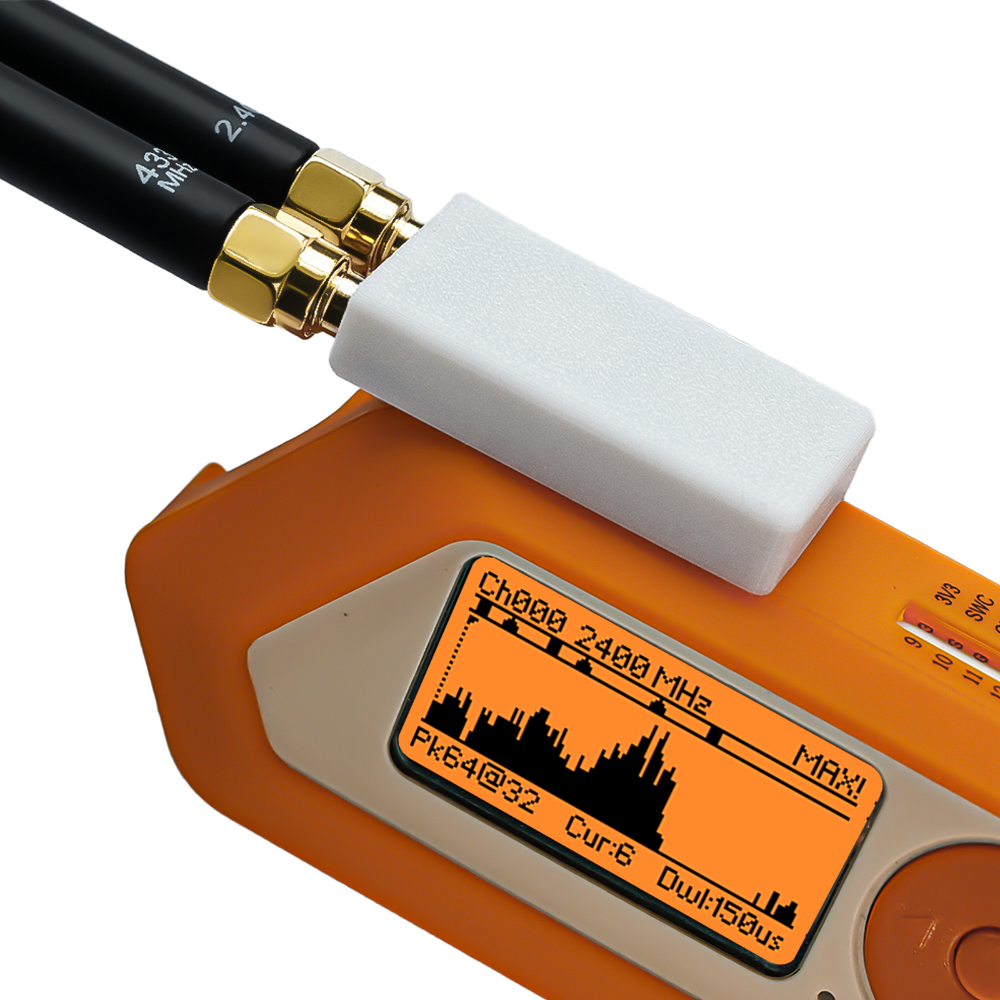
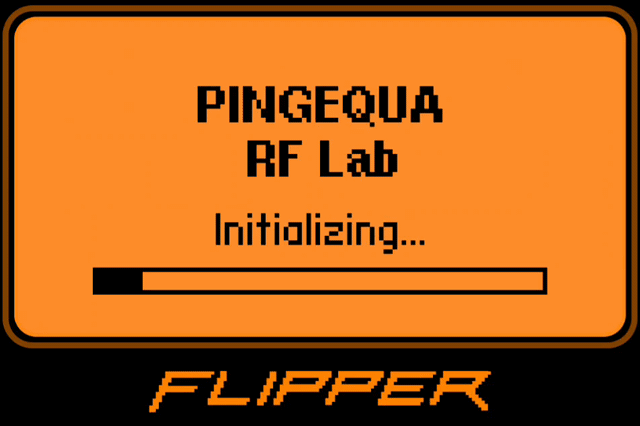
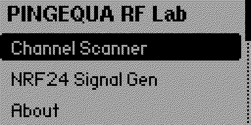
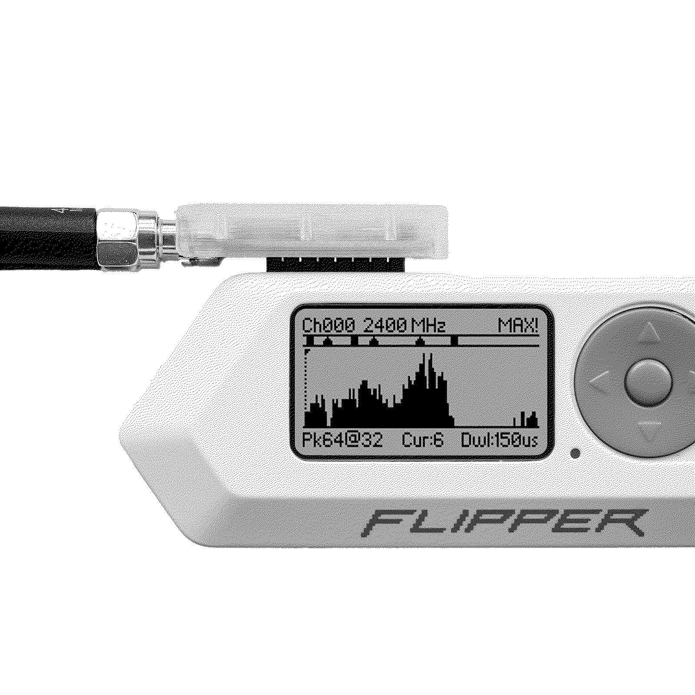
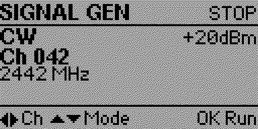
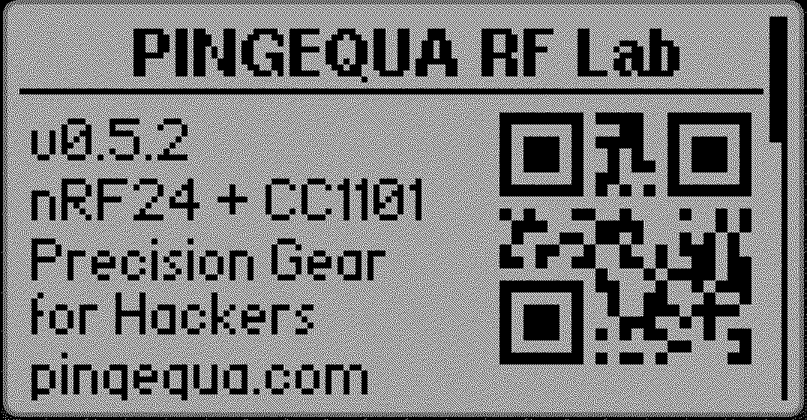
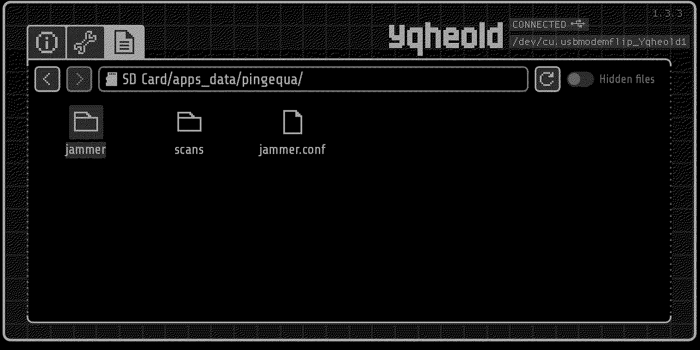
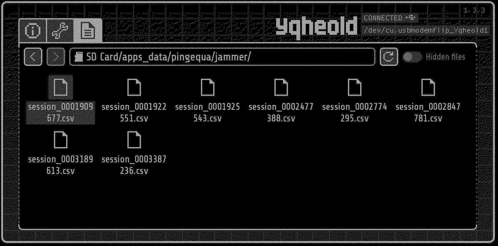

<div align="center">

<table>
  <tr>
    <td align="center" width="50%">
      <a href="https://www.pingequa.com/products/flipper-zero-nrf24-cc1101-2-in-1-rf-devboard?utm_source=github&utm_medium=readme&utm_campaign=rflab&utm_content=banner">
        
      </a>
      <br><sub><b>The Hardware</b> · 2-in-1 NRF24 + CC1101</sub>
    </td>
    <td align="center" width="50%">
      
      <br><sub><b>Live Demo</b> · Scanner · Signal Gen · About</sub>
    </td>
  </tr>
</table>

# PINGEQUA RF Lab

### Plug-and-play across every firmware.

**2.4 GHz spectrum analyzer + NRF24 jammer for Flipper Zero, designed for the [PINGEQUA 2-in-1 RF Devboard](https://www.pingequa.com/products/flipper-zero-nrf24-cc1101-2-in-1-rf-devboard?utm_source=github&utm_medium=readme&utm_campaign=rflab&utm_content=hero).**

[](https://flipperzero.one/)
[](https://github.com/pingequalab/rf-lab/releases/latest)
[](#firmware-compatibility)
[](dist/)
[](LICENSE)
[](https://www.pingequa.com/products/flipper-zero-nrf24-cc1101-2-in-1-rf-devboard?utm_source=github&utm_medium=readme&utm_campaign=rflab&utm_content=badge)

[**🛒 Get the Hardware**](https://www.pingequa.com/products/flipper-zero-nrf24-cc1101-2-in-1-rf-devboard?utm_source=github&utm_medium=readme&utm_campaign=rflab&utm_content=cta_top) · [**📦 Download FAP**](../../releases) · [**📖 Quickstart**](docs/QUICKSTART.md) · [**❓ FAQ**](docs/FAQ.md)

</div>

---

## What It Does

An open-source Flipper Application Package (FAP) that turns Flipper Zero plus the PINGEQUA 2-in-1 RF Devboard into:

- **2.4 GHz spectrum analyzer** — 126 channels real-time with WiFi 1/6/11 + BLE 37/38/39 band markers, max-hold, microsecond dwell tuning, cursor inspection, **CSV scan export** (long-press OK, v0.5.0+)
- **NRF24 jammer with 7 modes** (v0.4.0+):
  - CW Custom · BLE Adv · **BLE React** (RPD reactive — first on Flipper NRF24) · WiFi 1/6/11 (pilot-aware OFDM) · ALL 2.4G
  - Real-device verified to disconnect BLE devices and 2.4 GHz WiFi within room range
  - **Auto session log** + **mode/channel persistence** (v0.5.0+)
- **Human-readable export filenames** (v0.5.2+) — `scan_<date>_<time>_ch<peak>.csv` / `jam_<date>_<time>_<mode>_<dur>s.csv`. Sorting by name = sorting by time.
- **On-device About screen** (v0.5.2+) — three pages, Up/Down to navigate, with scannable QR codes for the shop and GitHub repo so visitors can land on the right page with their phone.
- **Plug-and-play across firmware** — Momentum, Unleashed, RogueMaster, Xtreme, and Official Flipper firmware. No firmware-specific patching.
- **Clean exit** — other Flipper apps (Sub-GHz Read, NFC, Bad-USB) keep working perfectly after you exit

---

## How It Compares

| Feature | PINGEQUA RF Lab | Legacy NRF24 scanner apps |
|---|:---:|:---:|
| Built for dual-chip 2-in-1 boards | ✅ | ❌ Single-chip designs only |
| Plug-and-play across all major firmware | ✅ | ⚠️ Often firmware-specific tweaks needed |
| Clean co-existence with Flipper Sub-GHz / NFC apps | ✅ | ❌ Frequently break other apps until reboot |
| Max-hold spectrum-analyzer mode | ✅ | ❌ Rare |
| WiFi 1/6/11 + BLE 37/38/39 frequency markers | ✅ | ❌ |
| Adjustable dwell time (130–2000 µs) | ✅ | ⚠️ Usually fixed |
| Cursor channel inspection with live readout | ✅ | ❌ Rare |
| NRF24 jammer (7 modes incl. RPD reactive + WiFi pilot-aware) | ✅ | ❌ Usually CW only, separate app |
| RPD-driven reactive BLE jamming | ✅ | ❌ |
| WiFi pilot-aware OFDM jamming (Clancy 2011) | ✅ | ❌ |
| CSV scan export for analysis | ✅ | ❌ |
| Continuous active development | ✅ | ⚠️ Often abandoned |
| Compact FAP size | ✅ ~44 KB | varies |
| Open source MIT license | ✅ | varies |

---

## Screenshots

<table>
  <tr>
    <td align="center" width="50%">
      <br>
      <sub><b>Main Menu</b><br>Scanner · Signal Gen · About</sub>
    </td>
    <td align="center" width="50%">
      <br>
      <sub><b>Channel Scanner</b><br>126-ch live RPD spectrum, max-hold</sub>
    </td>
  </tr>
  <tr>
    <td align="center" width="50%">
      <br>
      <sub><b>NRF24 Signal Gen</b><br>7 TX modes — CW shown</sub>
    </td>
    <td align="center" width="50%">
      <br>
      <sub><b>About</b> (v0.5.2)<br>On-device QR to shop &amp; GitHub</sub>
    </td>
  </tr>
</table>

---

## Install

### 1. Mount the board (hardware)

> ⚠️ **Always power off Flipper before inserting or removing the board** — hot-swapping the SPI bus can damage either chip.

1. **Power OFF** your Flipper Zero (hold `Back` ~2 seconds → Power off)
2. Insert the PINGEQUA 2-in-1 board onto the **LEFT GPIO headers** (the 18-pin row on the top-left edge)
3. **Power ON** Flipper

### 2. Install the app (software)

**qFlipper drag-and-drop** (recommended):
1. Download `pingequa_rf_toolkit.fap` from [Releases](../../releases) or [`dist/`](dist/)
2. In qFlipper: drag into `/ext/apps/GPIO/`
3. On Flipper: `Apps → GPIO → PINGEQUA RF Lab`

Works on every modern firmware — **no additional setup required**.

**ufbt sideload** (build from source):
```bash
pip install --user ufbt
ufbt update --channel=dev
git clone https://github.com/pingequalab/rf-lab
cd rf-lab
ufbt launch
```

---

## Usage

Launch from `Apps → GPIO → PINGEQUA RF Lab`. Main menu offers **Scanner**, **Jammer**, or **About** (v0.5.2+).

### Scanner
- ← / → moves the cursor (long-press = ±5 channels)
- ↑ / ↓ adjusts dwell time (short = ±10 µs, long = ±50 µs)
- OK pauses / resumes
- **Long-press OK exports current scan to CSV** at `/ext/apps_data/pingequa/scans/scan_<ts>.csv` (v0.5.0+). Top-right shows `SAVED!` for ~1 sec.
- Back returns to main menu
- When any bar saturates → automatic **MAX HOLD** mode (display freezes for analysis). Press OK to clear and rescan.

### Jammer (v0.4.0 — 7 modes)
- ↑ / ↓ cycles through 7 modes:
  1. **CW Custom** — single channel CW, ←/→ adjusts ±1 / ±5
  2. **BLE Adv** — blind CW hop {37, 38, 39}
  3. **BLE React** ★ — RPD-driven reactive jam (listens, jams on detection — 1st on Flipper NRF24)
  4. **WiFi 1** — pilot-aware OFDM jam (4 pilots, +7.5 dB efficient per Clancy 2011)
  5. **WiFi 6** — same for WiFi channel 6
  6. **WiFi 11** — same for WiFi channel 11
  7. **ALL 2.4G** — full-band CW sweep
- ← / → adjusts CW Custom channel (no-op in other modes)
- OK starts / stops
- Back returns to main menu — **session auto-logs** to `/ext/apps_data/pingequa/jammer/session_<ts>.csv` (mode, duration, chunks, reactive jam count) and **mode/channel persists** for next launch (v0.5.0+).
- Real-device verified: BLE devices and 2.4G WiFi can be disconnected within room range.

### Data Export (v0.5.0+)

The app writes research-grade data to your Flipper SD card. Open with qFlipper, Excel, Numbers, or `pandas.read_csv` (skip `#` comment lines):

**Filenames embed RTC wall-clock + summary** (v0.5.2+) so sorting by name in qFlipper = sorting by time, and the filename itself tells you what's inside without opening it:

```
/ext/apps_data/pingequa/
├── jammer.conf                                        ← Last jammer mode + channel (auto-restored)
├── scans/scan_<YYYY-MM-DD>_<HHMMSS>_ch<peak>.csv      ← e.g. scan_2026-05-15_143022_ch42.csv
└── jammer/jam_<YYYY-MM-DD>_<HHMMSS>_<mode>_<dur>s.csv ← e.g. jam_2026-05-15_143530_BLEreact_19s.csv
```

When the RTC isn't set, filenames fall back to a boot-tick form (`scan_boot<tick>_ch<peak>.csv`) so you never see `1970-01-01` garbage names.

<table>
  <tr>
    <td align="center" width="50%">
      <br>
      <sub>Data directory in qFlipper's file manager</sub>
    </td>
    <td align="center" width="50%">
      <br>
      <sub>Each Back-from-Jammer creates one session CSV</sub>
    </td>
  </tr>
</table>

**Scanner CSV** contains all 126 channel hits, peak channel, dwell, sweep count, and wall-clock datetime.
**Jammer session CSV** (v0.5.2+ schema) carries `datetime`, `mode`, `engine`, derived `target_freq_mhz`, and `scene_duration_s` — with conditional `cw_channel` / `reactive_jams` only when the mode actually produces those values. No more redundant or misleading fields.

Detailed walkthroughs: [docs/QUICKSTART.md](docs/QUICKSTART.md), [docs/UI_GUIDE.md](docs/UI_GUIDE.md), [docs/USE_CASES.md](docs/USE_CASES.md).

---

## Using Pingequa Hardware with Other Apps

The PINGEQUA 2-in-1 board works with this official FAP **and** with third-party apps and Flipper's built-in radio tools — but the dual-chip layout uses non-default SPI pins, so other apps need a one-time setup.

### Third-party NRF24 apps (NRF24 Sniffer, Mousejack, etc.)

The Pingequa NRF24 chip is wired to the **Extra 7** SPI bus (rather than the conventional pin set). On **Momentum** firmware:

1. From the main menu, navigate to **`Settings → Protocols → GPIO Pins`** (path may read `START → PROTOCOLS → GPIO PINS` on some menu variants)
2. Set **NRF24 SPI** to **`Extra 7`**
3. Launch your third-party NRF24 app normally

> Some third-party apps hard-code different pin assignments and may show partial incompatibility. The official PINGEQUA RF Lab app (this one) handles routing transparently — **no setup needed**.

### Official Sub-GHz app with Pingequa CC1101

To use Flipper's built-in **Sub-GHz Read / Read External** through the longer-range Pingequa CC1101:

1. Open **Sub-GHz** from the main menu
2. Go to **`Radio Settings → Module`**
3. Select **`External`**
4. Use Sub-GHz normally — it now routes through the Pingequa CC1101

> The `External` option is exposed on Momentum, Unleashed, and RogueMaster. Official Flipper firmware (OFW) has a similar `Read External` mode but no settings UI — use as-is.

If you don't see `External`, see [docs/HARDWARE.md](docs/HARDWARE.md) for firmware-specific notes.

---

## Hardware

> ### 🛒 [PINGEQUA Flipper Zero NRF24+CC1101 2-in-1 RF Devboard](https://www.pingequa.com/products/flipper-zero-nrf24-cc1101-2-in-1-rf-devboard?utm_source=github&utm_medium=readme&utm_campaign=rflab&utm_content=hardware_block)
>
> The only officially supported hardware. One module gives your Flipper both 2.4 GHz (nRF24L01+) and Sub-GHz (CC1101) chips, software-switched. No jumpers, no rewiring.

Other NRF24 boards may partially work but are unsupported. See [docs/HARDWARE.md](docs/HARDWARE.md).

---

## Firmware Compatibility

| Firmware | Status |
|---|:---:|
| Momentum (mntm-dev) | ✅ Primary build target |
| Unleashed | ✅ Compatible |
| RogueMaster | ✅ Compatible |
| Official Flipper firmware (API ≥ 87.1) | ✅ Compatible |
| Xtreme | ✅ Compatible |

---

## Roadmap

| Version | Status | Headline |
|---|:---:|---|
| v0.2.0 | ✅ | Channel scanner, max-hold, WiFi/BLE markers |
| v0.3.0 | ✅ | NRF24 jammer (CW + Sweep), main menu |
| v0.4.0 | ✅ | RPD reactive BLE jam, WiFi pilot-aware OFDM, 7 jammer modes |
| v0.5.0 | ✅ | CSV scan export, jammer session log, settings persistence |
| v0.5.1 | ✅ | OFW compatibility — single-handle SPI arbiter, all firmwares |
| v0.5.2 | ✅ | Readable export filenames, jammer log redesign, About screen + QR codes |
| **v0.5.3** | ✅ | **In-app rename: transmit feature now displays as "Signal Generator" (neutral, instrument-grade naming)** |
| v0.6.x | 🔜 next | **Shaped by community feedback** — candidates: cross-chip dual-band sweep (nRF24 2.4 GHz + CC1101 Sub-GHz in one view), spectrum CSV export, custom scan presets. [Tell us what you want](../../issues/new?template=feature.yml) |
| v1.0.0 | planned | Polished release, full documentation set, Catalog submission |
| v1.5.0 | concept | Companion mobile viewer over Bluetooth |
| v2.0.0 | concept | Unified UI bridging NRF24 + CC1101 |

[Vote on the roadmap](../../issues) · [Request a feature](../../issues/new?template=feature.yml)

---

## Documentation

| Doc | For |
|---|---|
| [Quickstart](docs/QUICKSTART.md) | First-time users — 5 minutes to first scan |
| [UI Guide](docs/UI_GUIDE.md) | Every pixel of the screen explained |
| [Hardware](docs/HARDWARE.md) | Pin map, firmware compatibility |
| [Use Cases](docs/USE_CASES.md) | 10 real-world scenarios |
| [FAQ](docs/FAQ.md) | Common questions |
| [Troubleshooting](docs/TROUBLESHOOTING.md) | Error decoding, hardware diagnostics |
| [Build](docs/BUILD.md) | ufbt setup, contributor build steps |

---

## Legal Notice

PINGEQUA RF Lab includes opt-in **transmit features (NRF24 Jammer)** — the Channel Scanner is passive listen-only, but the 7 Jammer modes actively transmit on 2.4 GHz at up to +20 dBm. Active RF emission in the unlicensed 2.4 GHz band is regulated (FCC §15 in the US, ETSI EN 300 328 in the EU, equivalent elsewhere).

You are responsible for compliance with your local regulations. Use only on hardware and networks you own or have authorization to test. The authors accept no liability for misuse.

Full disclosure: [SECURITY.md](SECURITY.md).

---

## Support

- **Issues**: [GitHub Issues](../../issues)
- **Email**: [support@pingequa.com](mailto:support@pingequa.com)
- **Hardware**: [pingequa.com](https://www.pingequa.com/?utm_source=github&utm_medium=readme&utm_campaign=rflab&utm_content=footer_store)
- **YouTube**: [@PINGEQUA](https://www.youtube.com/@PINGEQUA)

---

## License

[MIT](LICENSE) © 2026 PINGEQUA. PINGEQUA® is a trademark.

---

<div align="center">

<sub><b>Precision Gear for Hackers.</b></sub><br>
<sub>Made for the PINGEQUA 2-in-1 RF Devboard ·
<a href="https://www.pingequa.com/?utm_source=github&utm_medium=readme&utm_campaign=rflab&utm_content=footer_brand">PINGEQUA</a></sub>

⭐ **Star the repo if PINGEQUA RF Lab saves you time.**

</div>
