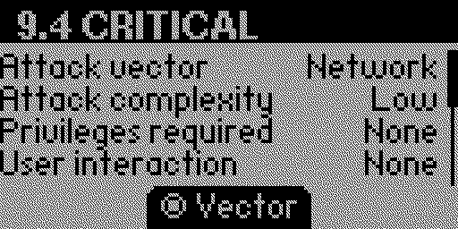
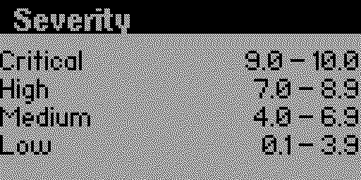
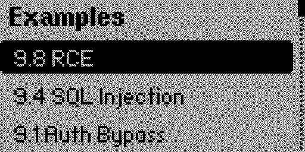
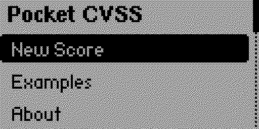

# Pocket CVSS

<p align="center">
  <a href="https://lab.flipper.net/apps/pocket_cvss"></a>
  <a href="https://www.first.org/cvss/v3.1/specification-document"></a>
  <a href="https://github.com/vavkamil/pocket-cvss/releases"></a>
  <a href="https://github.com/vavkamil/pocket-cvss/actions/workflows/build.yml"></a>
  <a href="https://github.com/vavkamil/pocket-cvss/actions/workflows/ci.yml"></a>
  <a href="https://github.com/vavkamil/pocket-cvss/stargazers"></a>
</p>

Pocket CVSS is a native Flipper Zero app for offline CVSS v3.1 Base scoring and
learning.

Calculate CVE severity offline, browse example vectors, and check CVSS score
ranges in a Flipper-friendly layout.

<table align="center">
  <tr>
    <td></td>
    <td></td>
  </tr>
  <tr>
    <td></td>
    <td></td>
  </tr>
</table>

## Features

- Guided CVSS v3.1 Base scoring, fully offline
- Instant score, severity, and canonical vector
- Built-in examples for common vulnerability classes
- Severity reference for quick checks
- Compact screens designed for Flipper navigation

## Build

```bash
ufbt
```

## Run On Flipper

```bash
ufbt launch
```

## Test

Tests cover scoring, CVE vectors, and built-in examples:

```bash
cc -std=c11 -Wall -Wextra -Isrc tests/cvss31_test.c src/cvss31.c -o /tmp/pocket_cvss_tests
/tmp/pocket_cvss_tests
```

## Development

```bash
ufbt format
ufbt lint
```
