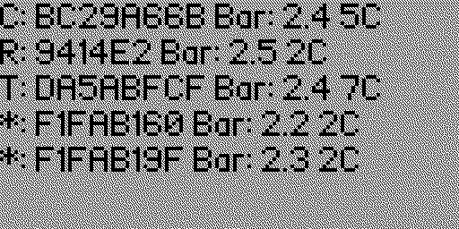

ProtoViewTPMS is a modification of the version in the [Momentum Apps](https://github.com/Next-Flip/Momentum-Apps) bundle included in the [Momentum Firmware](https://github.com/Next-Flip/Momentum-Firmware) distribution. This is based on the (as far as I am aware) [original version](https://github.com/antirez/protoview) by GitHub user [antirez](https://github.com/antirez).

If you are unfamiliar with ProtoView, please click through to the [original version](https://github.com/antirez/protoview) for details. This version adds an extra history page for TPMS detections, one line per TPMS identifier with pressure and temperature values. It's not pretty, but it works. ProtoView continuously analyzes signals, there is no need to clear out the regular ProtoView page to "make room" for a new signal to be detected, you can leave the app on the list screen and it will populate as signals come in.

## Disclaimer

I am not a C developer, and I don't know Flipper development. I managed to patch this together by a lot of googling, because I desperately wanted this functionality. With searches showing years worth of people requesting similar functionality, there seemed to be no option other than trying to figure it out.

I have made no changes to the signal logic or other ProtoView features (well, unless inadvertently). I do not have the competency to add support for TPMS transmitters that are not already supported by ProtoView, so please don't ask.

## Screenshots

<table>
  <tr>
    <td></td>
    <td></td>
  </tr>
</table>

## Basic usage

The new page is located two clicks to the right of the regular startup page. Until tyres are detected, it will show a few lines of information.

The list can contain a maximum of 30 tyres, with 6 displayed on each screen. Up and down will scroll through the pages. Long OK will clear the history. Short OK will attempt to read the favorites file, and long UP will switch between filtered and unfiltered mode (see below). New readings for tyres already in the list, will update the existing entry.

## Favorites file

There is support for reading a file containing tyre IDs of particular interest to you (read: I park near other cars and needed this feature to keep track). A maximum of 16 IDs are supported (I figured summer and winter tyres for two cars should be sufficient for most). The file format requirements are as follows:

* A single line of data
* Case sensitive (write exactly what is displayed in ProtoView)
* Tyre IDs separated by commas
* End the list with a semicolon
* No spaces between Tyre IDs and commas or semicolon
* There needs to be a line feed at the end, so hit enter before saving

Example:
```
TD4D546,G532548,T553456;
(technically you should be able to do whatever you like after the first line, just make sure there is at least a blank second line)
```

The filename must be tyrelist.txt and placed in apps_data\protoviewtpms on the SD card. There is no requirement for this file to exist, if you don't need it don't make one.

IDs located in this file will be prefixed with an asterisk instead of "ID" in the list. Holding UP will switch to filtering mode, with only detected tyre IDs that are present in the file being displayed.

I attempted to make the file read automatically on startup, but the natural places for me to put it was all in the main event loop and that caused viewport locking. I didn't want to spend time on trying to move it out of the loop, so instead it is read by a single OK click. This can be done at any time, if tyres have already been detected and placed in the list they will be checked and updated accordingly if they exist in the file.

## Compilation

You should be able to compile this by installing [uFBT](https://github.com/flipperdevices/flipperzero-ufbt) and running the command `ufbt` in the root of the source folder. `ubft launch` should compile, install and launch.

If you get a "compiled for too new version" type warning on starting the app, `ufbt update --branch=1.3.4` should put your uFBT on the branch matching Momentum 011.
