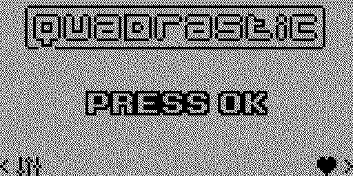
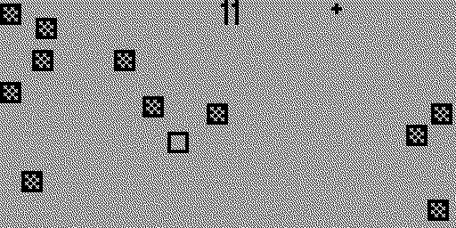
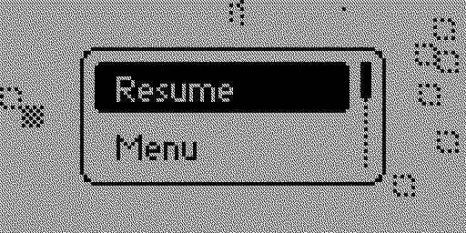
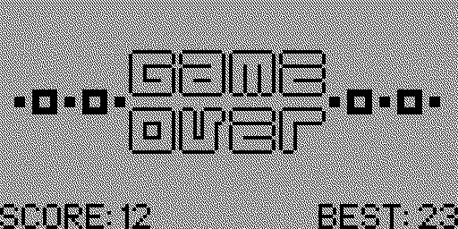
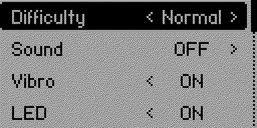

# Flipper Zero Quadrastic Game

**Quadrastic** is a simple addicting game inspired by the [Arduboy game](https://community.arduboy.com/t/quadrastic-secure-the-point-avoid-the-enemies) of the same name. This, in turn, was based on a popular PSP homebrew game called [Squarez](https://www.gamebrew.org/wiki/Squarez_PSP). Squarez itself drew inspiration from Ball, a game created by Nicolay Edin and Axel Hammarback, which was originally inspired by Eskiv, a game developed by Jean-François Geyelin.

## Screenshots







## Building the game

### Cloning source code

Make sure you clone the source code with submodules:

``` sh
git clone https://github.com/ivanbarsukov/flipperzero-quadrastic.git --recurse-submodules
```

### Building

Build the game using [micro Flipper Build Tool](https://pypi.org/project/ufbt/):

``` sh
ufbt
```

You can now run the application (actually, the build step is not needed, it will be built and then launched):

``` sh
ufbt launch
```
