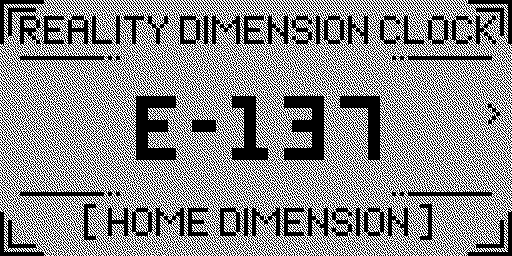
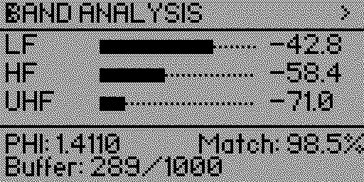
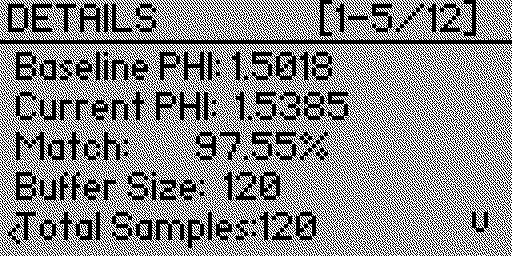
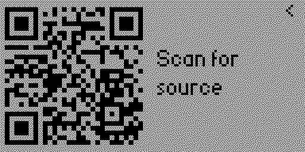
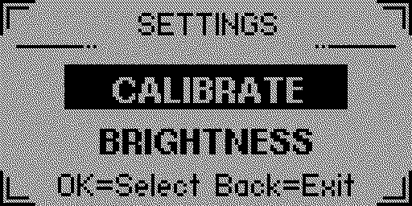
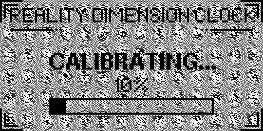
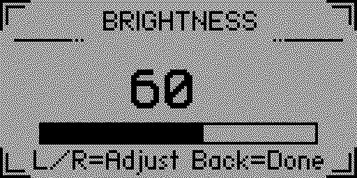

# Reality Dimension Clock v4.1

> Dimensional stability monitoring using real CC1101 multi-band RSSI analysis



[](https://flipperzero.one/)
[](../../releases)
[](https://github.com/Eris-Margeta/flipper-apps/releases?q=reality-clock)
[]()

## Download

**[⬇️ Download Latest Release](https://github.com/Eris-Margeta/flipper-apps/releases?q=reality-clock)** - Get the `.fap` file and copy to `/ext/apps/Tools/` on your Flipper.

## Theoretical Basis

This application is based on the theoretical framework that fundamental physical constants (vacuum permittivity ε₀, vacuum permeability μ₀, and the speed of light c) determine electromagnetic propagation characteristics across frequency bands.

If these constants were to change (as theorized in dimensional shift scenarios), the ratios between signal propagation at different frequencies would deviate from their baseline values.

**The Dimensional Stability Index (Φ)** is calculated as:

```
Φ = (R_LF/HF) / (R_HF/UHF) = (S_LF × S_UHF) / (S_HF²)
```

Where (using real CC1101 SubGHz radio measurements):
- **LF** = 315 MHz band (Lower SubGHz reference)
- **HF** = 433.92 MHz band (Mid SubGHz anchor)
- **UHF** = 868.35 MHz band (Upper SubGHz reference)

In a stable dimension, Φ should remain constant. Version 3.0 uses **real RSSI measurements** from the Flipper's CC1101 radio across all three bands.

## Features

- **Real Multi-Band Analysis**: Measures actual RSSI across three SubGHz frequency bands using CC1101 radio
- **Adaptive Baseline**: EMA-based tracking that adapts to your "current reality"
- **Real-Time Monitoring**: Continuous dimensional stability tracking with 1000-sample rolling buffer
- **Internal Temperature Sensor**: STM32 ADC die temperature monitoring
- **Drift Detection**: Shows stability percentage based on baseline tracking quality
- **Brightness Control**: Adjustable screen brightness (0-100%)
- **QR Code Info Screen**: Quick access to source code repository
- **Optional SD Logging**: CSV data export for analysis (compile-time flag)
- **Status Classification** (based on stability, not fixed baseline):
  - **HOME**: >98% stability - Your current dimension, rock solid
  - **STABLE**: 95-98% stability - Within normal parameters
  - **DRIFT**: 90-95% stability - Minor fluctuations detected
  - **FOREIGN**: <90% stability - Significant deviation from baseline tracking

## Screens

Navigate between screens using LEFT/RIGHT:

1. **Home** - Main display with E-137 dimension code and status
   

2. **Bands** - Real-time band analysis (LF, HF, UHF) with signal bars
   

3. **Details** - Scrollable technical details (UP/DOWN to scroll)
   

4. **Info** - QR code linking to GitHub repository
   

## Controls

| Button | Action |
|--------|--------|
| OK | Open settings menu |
| LEFT/RIGHT | Navigate screens |
| UP/DOWN | Scroll details / Adjust brightness |
| BACK | Exit application |

## Settings Menu

Press OK to access the settings menu:



- **CALIBRATE** - Recalibrate the dimensional baseline
  

- **BRIGHTNESS** - Adjust screen brightness (0-100%)
  

## Known Issues

**Brightness Flicker (Fixed):** Brightness used to flicker before I discovered a way to correctly control it. If you experience some flickers or weird behavior, report it as an issue.

## Display

```
    REALITY CLOCK

    PHI: 0.8234

      STABLE

    Drift: +0.42%

  LF:42 HF:51 UHF:60
```

## Technical Implementation

**Hardware Used:**
- **CC1101 SubGHz Radio**: Real RSSI measurement across three frequency bands (315 MHz via antenna path 2, 433.92 MHz via antenna path 1, 868.35 MHz via antenna path 3)
- **STM32 Internal ADC**: Die temperature sensor with 64x oversampling
- **1000-Sample Rolling Buffer**: Per-band circular buffers for stability

**Measurement Process:**
1. Band Switching: `furi_hal_subghz_set_frequency_and_path()` configures CC1101
2. RX Mode: Radio switched to receive mode
3. Stabilization: 500μs delay for RSSI to settle
4. RSSI Read: Direct `furi_hal_subghz_get_rssi()` call
5. Idle: Radio returned to idle between measurements
6. Buffer: Raw values added to 1000-sample rolling buffer
7. PHI: Calculated from buffer averages using normalized dB conversion

**Adaptive Baseline (EMA):** Unlike previous versions with fixed baselines, v3.0 uses Exponential Moving Average:

```
baseline_new = α × current + (1-α) × baseline_old
```

- Slow EMA (α=0.05): Long-term baseline, ~200 sample adaptation
- Fast EMA (α=0.15): Short-term trend, ~50 sample adaptation

This means **wherever you are becomes "home"** over time. The device measures stability relative to your current reality, not a fixed reference point.

**What This Actually Measures:** The device measures how consistently electromagnetic signals propagate across different frequencies. In our dimension, this ratio is stable. Environmental factors (RF interference, temperature, movement) cause small variations that the adaptive baseline tracks. A true dimensional shift would cause the ratio between bands to change in ways the baseline cannot track - that's what triggers FOREIGN status.

## Building

```bash
cd apps/reality-clock
poetry run ufbt           # Build only
poetry run ufbt launch    # Build + install + run
```

## Technical Details

| Property | Value |
|----------|-------|
| Target | Flipper Zero |
| App Type | External (.fap) |
| Category | Tools |
| Stack Size | 8KB |
| Version | 4.1 |
| Sensor Mode | Real Hardware (CC1101 + ADC) |
| Frequency Bands | 315 / 433.92 / 868.35 MHz |
| Buffer Size | 1000 samples per band |
| Sample Rate | 5Hz (calibration) / 1Hz (normal) |

## Academic Paper

See [paper.html](paper.html) for the full theoretical framework and experimental design.

## How It Works (For Real)

This application performs **real electromagnetic measurements** using the Flipper Zero's CC1101 SubGHz radio. It measures RSSI (Received Signal Strength Indicator) at three different frequencies and calculates a ratio (PHI) that should remain constant if physical constants are stable.

The readings you see are genuine RF measurements from your environment. The "dimensional stability" metric reflects how consistently this ratio maintains itself over time. Environmental factors (RF interference, nearby electronics, movement, temperature) will cause natural variations - the adaptive baseline system accounts for this.

While framed as a "dimensional detector," what you're actually observing is the consistency of electromagnetic propagation characteristics in your local environment. It's real physics, real measurements, and genuinely interesting data - the interdimensional framing is just for fun.

## License

MIT License - see [LICENSE](../../LICENSE)

## Author

**Eris Margeta** ([@Eris-Margeta](https://github.com/Eris-Margeta))

## App Catalog Submission

**Ready Items:**
- [x] `manifest.yml` - Catalog manifest file (needs commit hash)
- [x] `README.md` - Full documentation
- [x] `changelog.md` - Version history
- [x] `application.fam` - App metadata
- [x] `icon.png` - App icon
- [x] `paper.html` - Academic paper
- [x] `screenshots/` - 7 screenshots (screenshot1-7.png)

**Note:** Update `manifest.yml` to replace `PENDING_COMMIT_HASH` with actual commit SHA after pushing.

## Tested Firmware

| Firmware | Version | Status |
|----------|---------|--------|
| Official Flipper | 1.43 | ✅ Works |
| Momentum | mntm-012 | ✅ Works |
| Unleashed | - | ❓ Not tested |
| RogueMaster | - | ⛔ Not supported (firmware too unstable) |

---

Part of [flipper-apps](https://github.com/Eris-Margeta/flipper-apps) monorepo.
